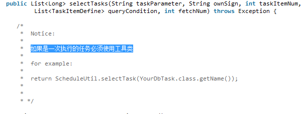
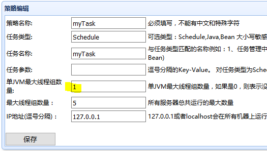
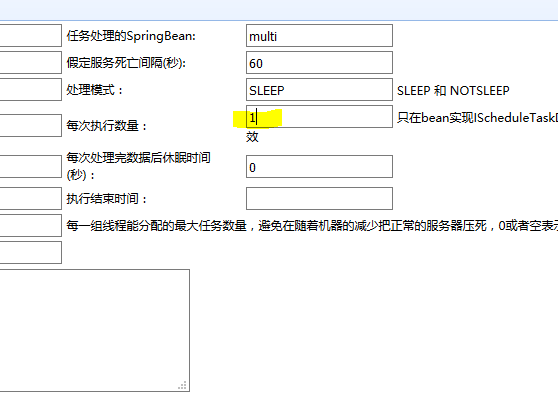

# 分布式调度平台实战经验

## 概述

这里的分布式调度平台是淘宝开源项目，maven 依赖为

```markup
<dependencies>
  <dependency>
      <groupId>com.taobao.pamirs.schedule</groupId>
      <artifactId>tbschedule</artifactId>
      <version>3.2.13-RC08</version>
  </dependency>
</dependencies>
```

## 一次性执行的任务

 一次性执行的任务，文档指出，必须使用工具类来获取任务，如下



那么我们看下这个工具类的源码，是如何获取任务的

```java
public synchronized static  List<Object> selectTask(String uuid) {
    ArrayList<Object> list=new ArrayList<Object>();
    TaskInfo info = initTaskInfo(uuid);
    if(info.nextFlag){
            list.add(info.getCount());
    }
    return list;
}
```

解析

* 传入参数是类名，根据类名拿到一个`TaskInfo`实例`info`
  * 如果`info`的`nextFlag`为`true`，就返回一个`List`，该`List`仅有一个元素，该元素是一个整数
  * 否则就返回一个空的`List`


由于返回的 List 仅有一个元素，所以在调度平台的【**任务管理】**里，配一个线程就够了，再多的线程也用不上


那么我们再看一下如何根据类名来拿到`TaskInfo`实例，`initTaskInfo(uuid)`

```java
private static Map<String, TaskInfo> nextFlagMap = new java.util.concurrent.ConcurrentHashMap<String, TaskInfo>();

......

private static TaskInfo initTaskInfo(String uuid){

    TaskInfo info = nextFlagMap.get(uuid);
    if(info==null){
        info=new TaskInfo();
        info.setCount(1);
        info.setNextFlag(true);
        nextFlagMap.put(uuid, info);
    } else {
        if(!info.nextFlag){
        info.setCount(info.count+1);
        }
        info.setNextFlag(!info.nextFlag);
    }
    return info;
}
```

解析

* 以类名作为`key`，到`map`里去取`value`
  * 如果`map`里没有`value`，那么就`new`一个`TaskInfo`，并且设定`nextFlag`为`true`，放到`map`里去，返回该`TaskInfo`
  * 如果`map`里已经有`value`了：如果`nextFlag`为`false`，`count`加`1`，反转`nextFlag`；返回该`TaskInfo` 


这里一定要注意，调度策略必须配置为 **一个** 线程组，如下图




如果如上图将线程组设为 2 会怎样？ 

* 调度平台用 2 个线程，执行 selectTasks 
  * 线程 1，创建 TaskInfo，由于 nextFlag = true，返回一个 List，包含了一个数字
  * 线程 2，从 map 里获取到该 TaskInfo，将 nextFlag 反转（即改为 false），这样返回的就是一个空 List 
  * 由于线程 1 返回的 List 不为空，当 execute 执行完，selectTasks 会继续调用
    * 从 map 里获取到的 TaskInfo，将 nextFlag 反转（即改为 true），这样会导致返回一个包含了一个数字的 List
  * 由于线程 2 返回的 List 为空，该线程不会继续调用 selectTasks
  * 由于线程 1 返回的 List 不为空，当execute执行完，selectTasks 会继续调用
    * 从 map 里获取到的 TaskInfo，将 nextFlag 反转（即改为 false），返回一个空 List
    * 由于线程 1 返回的 List 为空，该线程不会继续调用 selectTasks

结论：本该是一次执行的任务，实际执行了2次

## execute 方法

```java
public interface IScheduleTaskDealSingle<T> extends IScheduleTaskDeal<T> {
/**
* 执行单个任务
* @param task Object
* @param ownSign 当前环境名称
* @throws Exception
*/
public boolean execute(T task,String ownSign) throws Exception;
```

execute 返回一个 boolean 值，不过并没有什么卵用，看了一下调用 execute 的代码，如下

```java
try {//运行相关的程序
  startTime =scheduleManager.scheduleCenter.getSystemTime();
  if (this.isMutilTask == false) {
        if (((IScheduleTaskDealSingle) this.taskDealBean).execute(executeTask,scheduleManager.getScheduleServer().getOwnSign()) == true) {
            addSuccessNum(1, scheduleManager.scheduleCenter.getSystemTime()
                    - startTime,
                    "com.taobao.pamirs.schedule.TBScheduleProcessorSleep.run");
        } else {
            addFailNum(1, scheduleManager.scheduleCenter.getSystemTime()
                    - startTime,
                    "com.taobao.pamirs.schedule.TBScheduleProcessorSleep.run");
        }
    } else {
        if (((IScheduleTaskDealMulti) this.taskDealBean)
                .execute((Object[]) executeTask,scheduleManager.getScheduleServer().getOwnSign()) == true) {
            addSuccessNum(((Object[]) executeTask).length,scheduleManager.scheduleCenter.getSystemTime()
                    - startTime,
                    "com.taobao.pamirs.schedule.TBScheduleProcessorSleep.run");
        } else {
            addFailNum(((Object[]) executeTask).length,scheduleManager.scheduleCenter.getSystemTime()
                    - startTime,
                    "com.taobao.pamirs.schedule.TBScheduleProcessorSleep.run");
        }
    } 
}catch (Throwable ex) {
    if (this.isMutilTask == false) {
        addFailNum(1,scheduleManager.scheduleCenter.getSystemTime()- startTime,
                "TBScheduleProcessor.run");
    } else {
        addFailNum(((Object[]) executeTask).length, scheduleManager.scheduleCenter.getSystemTime()
                - startTime,
                "TBScheduleProcessor.run");
    }
    logger.warn("Task :" + executeTask + " 处理失败", ex);                
}
```

* 貌似只影响成功数和失败数的统计，并不会影响任务是否继续被执行。 
* 另外，如果 execute 抛出异常，最终会以 warn 级别输出日志，但也不会影响任务继续被执行 


仅针对 Sleep 模式


## IScheduleTaskDealMulti

这个接口每次接收多个 task 进行处理

实际上，如果将每次执行数量设为 1，`IScheduleTaskDealMulti`和`IScheduleTaskDealSingle`就没有区别了



## 能不能使用多线程/异步

调度平台可以通过配置使用多线程来执行任务。那么我们能否在自己的业务代码里使用多线程/异步呢？

我们看下调度平台是如何执行任务的

1. 执行 selectTasks，获得一个 Task 的列表
2. 对 Task 列表里的每一个 Task，都执行 execute
3. 当列表里的所有 Task 都 execute完毕，重复执行 1
4. 直到 1 返回 null，或者一个空的 Task 列表

我们注意到步骤 1 里获得 Task 列表，其实是依赖后续步骤的 execute 结果的。所以整个调度流程是要等到 Task 列表里的所有 Task 都被执行完才会调用 selectTasks 获取下一批 Task

如果我们在 execute 里使用了多线程（或异步操作），就会导致调度平台认为该 Task 已执行完，从而提前调用 selectTasks 获取下一批任务，这样很有可能会获取到正在执行中的 Task

结论

1. 对于依赖 selectTasks 来获取Task列表并分配的任务，不要在 execute 里使用多线程/异步
2. 而对于一次性执行的 Task，可以在 execute 里使用多线程，如果不是通过 new Thread 的方式而是通过线程池的方式来实现的多线程，要确保在任务结束后释放线程池资源（实际上这是很难做到的）

