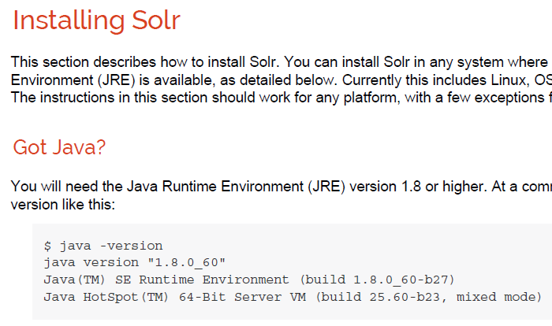
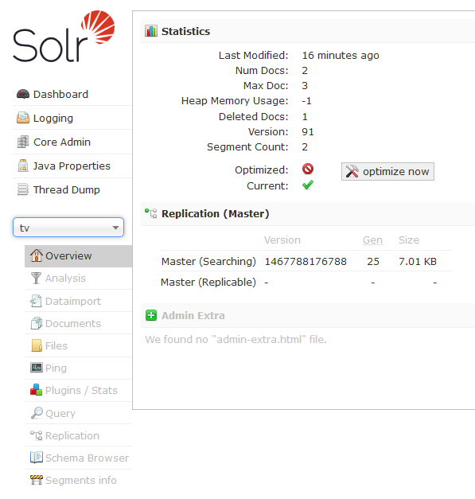
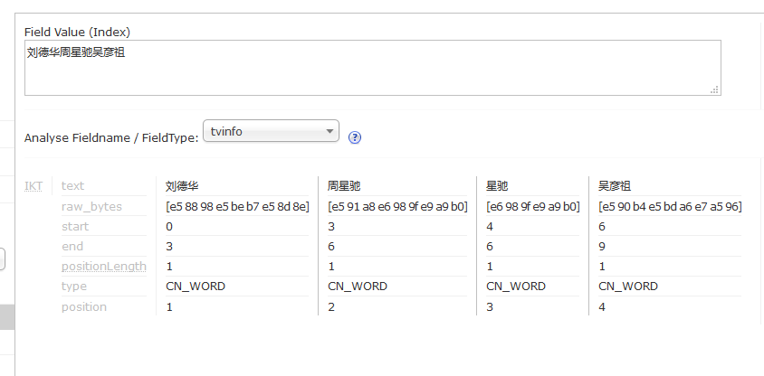
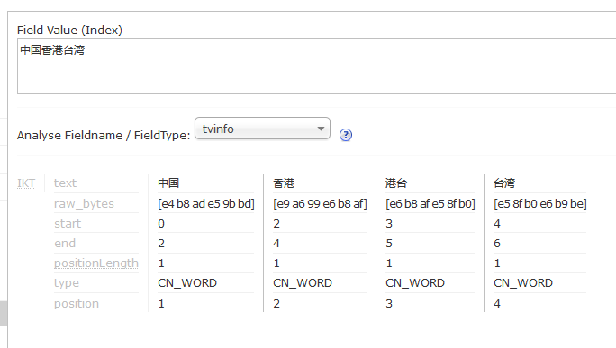
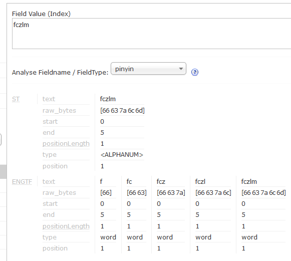
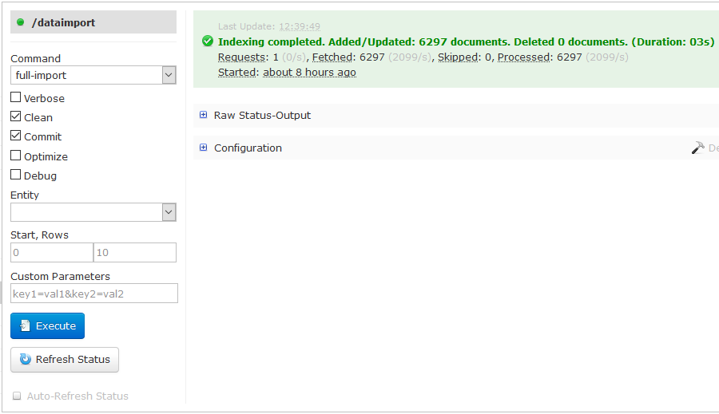

# FlymeTV 全局搜索实践

## solr 环境搭建

### solr 版本选择

截至本文编写，Apache Solr 最新版本已经是 6.1.0，要求 JRE 1.8+，如下图



为此只能使用 Apache Solr 5.0+ 版本，浏览 [solr 下载目录](http://archive.apache.org/dist/lucene/solr/)，当前最新的 5.0+ 版本为 [5.5.2](http://archive.apache.org/dist/lucene/solr/5.5.2/)

### 下载安装

```bash
# 下载 solr 5.5.2
wget http://archive.apache.org/dist/lucene/solr/5.5.2/solr-5.5.2.zip

# 解压到 /data 目录
unzip solr-5.5.2.zip -d /data

# 目录名修改为 solr
mv /data/solr-5.5.2 /data/solr
```

### 创建 core

solr 的 core，类似 mysql 的数据库，对于 FlymeTV 的全局搜索业务，我们建一个名为 tv 的 core，如下

```bash
# 启动 solr
/data/solr/bin/solr start

# 创建 tv core
/data/solr/bin/solr create -c tv
http://localhost:8983/solr/admin/cores?action=CREATE&name=tv&instanceDir=tv

{
  "responseHeader":{
    "status":0,
    "QTime":2693},
  "core":"tv"}
```

### 配置

core tv 创建好以后，solr 会自动创建其目录，本文例子该目录位于 /data/solr/server/solr/tv，进入目录后有2个子目录

* conf：配置目录
* data：数据目录

进入配置目录，看下有哪些文件

```bash
# ll
total 148
-rw-r--r--. 1 root root  4041 Jun 21 11:45 currency.xml
-rw-r--r--. 1 root root  1386 Jun 21 11:45 elevate.xml
drwxr-xr-x. 2 root root  4096 Jun 21 11:45 lang
-rw-r--r--. 1 root root 54490 Jun 20 20:52 managed-schema
-rw-r--r--. 1 root root   329 Jun 21 11:45 params.json
-rw-r--r--. 1 root root   894 Jun 21 11:45 protwords.txt
-rw-r--r--. 1 root root 62113 Jun 21 11:45 solrconfig.xml
-rw-r--r--. 1 root root   795 Jun 21 11:45 stopwords.txt
-rw-r--r--. 1 root root  1148 Jun 21 11:45 synonyms.txt
```

#### **修改 solrconfig.xml**

schema.xml 是 solr 的字段定义文件，灰常之重要

默认情况下，solr 管理 schema.xml，不允许手动修改。为了能自定义 schema.xml，需要先对 solrconfig.xml 进行修改：这是通过`<schemaFactory/>`来指定的，只需要启用`ClassicIndexSchemaFactory`，并停用`ManagedIndexSchemaFactory`即可

```markup
<schemaFactory class="ClassicIndexSchemaFactory"/>

<!--
<schemaFactory class="ManagedIndexSchemaFactory">
  <bool name="mutable">true</bool>
  <str name="managedSchemaResourceName">managed-schema</str>
</schemaFactory>
-->
```

找到 solrconfig.xml 中的 `AddSchemaFieldsUpdateProcessorFactory`元素，将其注释：这样就无需在 schema.xml 里定义 `booleans` 等字段类型，且可以避免程序抛出 `“This IndexSchema is not mutable”` 异常

```markup
<!--
   <processor class="solr.AddSchemaFieldsUpdateProcessorFactory">
      <str name="defaultFieldType">strings</str>
      <lst name="typeMapping">
        <str name="valueClass">java.lang.Boolean</str>
        <str name="fieldType">booleans</str>
      </lst>
      <lst name="typeMapping">
        <str name="valueClass">java.util.Date</str>
        <str name="fieldType">tdates</str>
      </lst>
      <lst name="typeMapping">
        <str name="valueClass">java.lang.Long</str>
        <str name="valueClass">java.lang.Integer</str>
        <str name="fieldType">tlongs</str>
      </lst>
      <lst name="typeMapping">
        <str name="valueClass">java.lang.Number</str>
        <str name="fieldType">tdoubles</str>
      </lst>
    </processor>
-->
```

找到 solrconfig.xml 里的 `<initParams>` 元素，如下，将`_text_` 修改为 `tvinfo`：这里定义的是更新，查询等操作的默认字段，修改为 `tvinfo`，这个字段将在 schema.xml 里定义。

这个修改不是必须的，如果这里不做修改的话，需要在 schema.xml 里定义 `_text_` 字段，否则保存数据到 solr 会出错

```markup
<initParams path="/update/**,/query,/select,/tvrh,/elevate,/spell,/browse">
  <lst name="defaults">
    <!--<str name="df">_text_</str>-->
    <str name="df">tvinfo</str>
  </lst>
</initParams>
```

#### **自定义 schema**

```markup
<?xml version="1.0" encoding="UTF-8" ?>
<schema name="tv" version="1.6">

    <types>
        <fieldType name="string" class="solr.StrField" multiValued="false" sortMissingLast="true" />
        <fieldType name="int" class="solr.TrieIntField" multiValued="false" precisionStep="0" positionIncrementGap="0" />
        <fieldType name="long" class="solr.TrieLongField" multiValued="false" precisionStep="0" positionIncrementGap="0" />

        <!-- 支持中文分词的字段类型 -->
        <fieldType name="text_ik" class="solr.TextField">
            <analyzer type="index" useSmart="false" class="org.wltea.analyzer.lucene.IKAnalyzer" />
            <analyzer type="query" useSmart="true" class="org.wltea.analyzer.lucene.IKAnalyzer" />
        </fieldType>

        <!-- 用于对汉语拼音进行分词的字段类型：仅索引时分词，查询时不分词 -->
        <fieldType name="text_py" class="solr.TextField">
            <analyzer type="index">
                <tokenizer class="solr.StandardTokenizerFactory"/>
                <filter class="solr.LowerCaseFilterFactory"/>
                <filter class="solr.EdgeNGramFilterFactory" minGramSize="1" maxGramSize="16"/>
            </analyzer>
            <analyzer type="query">
                <tokenizer class="solr.StandardTokenizerFactory"/>
                <filter class="solr.LowerCaseFilterFactory"/>
            </analyzer>
        </fieldType>
    </types>

    <fields>
        <!-- 这个字段是必须的 -->
        <field name="_version_" type="long" indexed="true" stored="true" />

        <!-- id 为每个实体的唯一标识 -->
        <field name="id" type="string" required="true" indexed="true" stored="true" />

        <!-- 类型和子类型 -->
        <field name="type" type="int" required="true" indexed="false" docValues="true" stored="true" />
        <field name="subtype" type="int" required="true" indexed="false" docValues="true" stored="true" />

        <!-- 热度 -->
        <field name="heat" type="int" required="true" indexed="false" docValues="true" stored="true" />

        <!-- 实体在魅族的id -->
        <field name="mzEntityId" type="string" required="true" indexed="false" stored="true" />
        <!-- 实体在cp的id -->
        <field name="cpEntityId" type="string" required="true" indexed="false" stored="true" />
        <!-- cp -->
        <field name="cp" type="string" required="true" indexed="false" stored="true" />

        <!-- 全拼 -->
        <field name="nameQuanpin" type="string" indexed="false" stored="false" />
        <!-- 简拼 -->
        <field name="nameJianpin" type="string" indexed="false" stored="false" />

        <!-- 名称：分词和索引，查询时可增加该字段权重提高匹配度 -->
        <field name="name" type="text_ik" indexed="true" stored="true" />

        <!-- 详情/描述 -->
        <field name="desc" type="string" indexed="false" stored="true" />
        <!-- 演员 -->
        <field name="actor" type="string" indexed="false" stored="true" />
        <!-- 导演 -->
        <field name="director" type="string" indexed="false" stored="true" />
        <!-- 地区 -->
        <field name="area" type="string" indexed="false" stored="true" />
        <!-- 包名 -->
        <field name="packageName" type="string" indexed="false" stored="true" />

        <!-- 中文全局搜索实际上是搜索这个字段 -->
        <field name="tvinfo" type="text_ik" indexed="true" multiValued="true" stored="false" />

        <!-- 拼音全局搜索实际上是搜索这个字段 -->
        <field name="pinyin" type="text_py" indexed="true" multiValued="true" stored="false" />

    </fields>

    <copyField source="name" dest="tvinfo" />
    <copyField source="desc" dest="tvinfo" />
    <copyField source="actor" dest="tvinfo" />
    <copyField source="area" dest="tvinfo" />
    <copyField source="director" dest="tvinfo" />
    <copyField source="packageName" dest="tvinfo" />

    <copyField source="nameQuanpin" dest="pinyin" />
    <copyField source="nameJianpin" dest="pinyin" />

    <!-- uniqueKey 字段，必须建索引，即 indexed=true -->
    <uniqueKey>id</uniqueKey>

</schema>
```

#### **启用中文分词**

中文分词采用 [IK Analyzer](http://git.oschina.net/wltea/IK-Analyzer-2012FF)，不过这个版本的 ik analyzer 只能用于 solr 4.x，如果要在 solr 5.x 使用，需要使用 [ik analyzer solr5](https://github.com/EugenePig/ik-analyzer-solr5)，我们需要把源码 clone 到本地编译打包，生成 Ik-analyzer-solr5-5.x.zip

下载该文件到 solr 的dist目录下，解压缩后得到 ik-analyzer-solr5-5.x.jar，然后修改 solrconfig.xml 文件来引入该分词库

```markup
......

<lib dir="${solr.install.dir:../../../..}/contrib/velocity/lib" regex=".*\.jar" />
<lib dir="${solr.install.dir:../../../..}/dist/" regex="solr-velocity-\d.*\.jar" />
<lib dir="${solr.install.dir:../../../..}/dist/" regex="ik-analyzer-.*\.jar" />

......
```

## 验证安装

### core

通过浏览器打开 solr 后台页面来验证，访问地址为 [http://ip:8983/solr](http://ip:8983/solr)



能选择 tv 这个 core，表明配置正常，core 成功被实例化

### 中文分词

选择 Analysis 页面，Field Value \(Index\) 输入 “刘德华周星驰吴彦祖”，Analyse Fieldname / FieldType 选择 tvinfo，点击 Analyse Values



分词结果正常，再试一下“中国香港台湾”



应该说这个分词质量还是挺不错的

### 拼音分词

为了加速拼音查询，使用 Edge N-Gram 过滤器对拼音进行了分词，看下效果，我们输入fczlm\(复仇者联盟\)



可见，分词很成功

## DIH 导入数据

Data Import Handler 是 solr 提供的一个数据导入工具，可以通过简单配置来实现从关系型数据库向 solr 同步数据。这里就尝试一下用 DIH 来把 `MEIZU_TVVIDEO` 数据库的 `T_SH_ALBUM`\(搜狐视频信息\)导入 solr 的 core tv

### 加载 mysql 驱动

要从 mysql 导数据，solr 需要 mysql 的驱动，先将驱动下载到 /data/solr/dist 目录 :注意：使用5.x 的驱动，6.x 的驱动貌似不能正常加载

```bash
cd /data/solr/dist
wget http://maven.meizu.com:8081/artifactory/repo1-cache/mysql/mysql-connector-java/5.1.39/mysql-connector-java-5.1.39.jar
```

然后修改solrconfig.xml，添加如下的配置

```markup
<lib dir="${solr.install.dir:../../../..}/dist/" regex="mysql-connector-java-\d.*\.jar" />
```

### DIH 配置

DIH 需要配置文件来指定从何处、如何导入数据，在 conf 目录下创建一个 dih-config.xml 的文件，内容如下

```markup
<dataConfig>
    <dataSource type="JdbcDataSource" driver="com.mysql.jdbc.Driver"
                url="jdbc:mysql://172.17.21.26:3306/MEIZU_TVVIDEO"
                user="root" password="root" />

    <document>
        <entity name="TvEntity" pk="fid"
                query="SELECT CONCAT('v-sh-',CAST(FALBUMID AS CHAR(20))) AS fid, FALBUM_NAME, 1 AS `type`, 'sohu' AS cp, 0 AS mzEntityId, FALBUMID, 0 heat, CASE FCATE_CODE WHEN 100 THEN 1 WHEN 101 THEN 2 WHEN 106 THEN 3 WHEN 107 THEN 6 WHEN 115 THEN 4 ELSE 0 END AS subtype, FALBUM_DESC, FAREA, FACTOR, FDIRECTOR, FPINYIN, FJIANPIN FROM T_SH_ALBUM WHERE FVIDEOID&lt;&gt;0 AND FIS_SHOW=1 AND FIS_CLIP=0 AND FFEE=0">
            <field column="fid" name="id" />
            <field column="type" name="type" />
            <field column="subtype" name="subtype" />
            <field column="cp" name="cp" />
            <field column="mzEntityId" name="mzEntityId" />
            <field column="heat" name="heat" />
            <field column="FALBUMID" name="cpEntityId" />
            <field column="FALBUM_NAME" name="name" />
            <field column="FALBUM_DESC" name="desc" />
            <field column="FACTOR" name="actor" />
            <field column="FDIRECTOR" name="director" />
            <field column="FAREA" name="area" />
            <field column="FPINYIN" name="nameQuanpin" />
            <field column="FJIANPIN" name="nameJianpin" />
        </entity>
    </document>
</dataConfig>
```

注意

* DIH 支持全量导入和增量导入，这里仅使用了全量导入
* sql 字段 和 solr 字段必须声明映射关系，即使字段名一样
* &lt;，&gt; 需要转义

### 多数据源 DIH

```markup
<?xml version="1.0" encoding="UTF-8" ?>
<dataConfig>
    <!-- 视频 -->
    <dataSource name="ds-video" convertType="true" type="JdbcDataSource"
        driver="com.mysql.jdbc.Driver" url="jdbc:mysql://172.17.21.26:3306/MEIZU_TVVIDEO"
        user="root" password="root" />

    <!-- 应用 & 游戏 -->
    <dataSource name="ds-app" convertType="true" type="JdbcDataSource"
        driver="com.mysql.jdbc.Driver" url="jdbc:mysql://172.17.21.26:3306/MEIZU_TV_STORE"
        user="root" password="root" />

    <document>
        <entity name="sohu-album" dataSource="ds-video" pk="DOCID" transformer="TemplateTransformer"
            query="SELECT CONCAT('v-sh-', FALBUMID) DOCID, FALBUM_NAME, FALBUMID, 
                CASE FCATE_CODE WHEN 100 THEN 1 WHEN 101 THEN 2 WHEN 106 THEN 3 WHEN 107 THEN 6 WHEN 115 THEN 4 ELSE 0 END AS FSUBTYPE, 
                FALBUM_DESC, FAREA, FACTOR, FDIRECTOR, FPINYIN, FJIANPIN FROM T_SH_ALBUM 
                WHERE FVIDEOID!=0 AND FIS_SHOW=1 AND FIS_CLIP=0 AND FFEE=0">

            <!-- 常数值，需要 TemplateTransformer -->
            <field column="type" template="1" />
            <field column="cp" template="sohu" />
            <field column="mzEntityId" template="0" />
            <field column="heat" template="0" />

            <field column="DOCID" name="id" />
            <field column="FSUBTYPE" name="subtype" />
            <field column="FALBUMID" name="cpEntityId" />
            <field column="FALBUM_NAME" name="name" />
            <field column="FALBUM_DESC" name="desc" />
            <field column="FACTOR" name="actor" />
            <field column="FDIRECTOR" name="director" />
            <field column="FAREA" name="area" />
            <field column="FPINYIN" name="nameQuanpin" />
            <field column="FJIANPIN" name="nameJianpin" />
        </entity>

        <entity name="app" dataSource="ds-app" pk="DOCID"
            query="SELECT CONCAT('A-', A.FID) DOCID, A.FID, A.FIDENTIFIER, A.FHOT_SCORE, A.FNAME, A.FPROGRAMID, A.FDESCRIPTION, A.FPINYIN, A.FJIANPIN, 
            CASE V.FSOURCE WHEN 1 THEN 'shafa' ELSE 'putao' END FCP, CASE A.FCATEGORYID WHEN 2 THEN 3 ELSE 2 END FTYPE, 
            A.FCATEGORY2ID FSUBTYPE, V.FVERSION_NAME FVER 
            FROM T_TV_APP_APPLICATION A, T_TV_APP_VERSION V WHERE A.FID=V.FAPPID AND V.FSTATUS=50">
            <field column="DOCID" name="id" />
            <field column="FTYPE" name="type" />
            <field column="FSUBTYPE" name="subtype" />
            <field column="FCP" name="cp" />
            <field column="FID" name="mzEntityId" />
            <field column="FHOT_SCORE" name="heat" />
            <field column="FIDENTIFIER" name="cpEntityId" />
            <field column="FNAME" name="name" />
            <field column="FDESCRIPTION" name="desc" />
            <field column="FPINYIN" name="nameQuanpin" />
            <field column="FJIANPIN" name="nameJianpin" />
        </entity>
    </document>
</dataConfig>
```

说明

* 可以定义多个数据源，每个数据源有一个唯一的名称，在 entity 的属性里指定数据源
* 22，23 行表示该字段值为一个常数，需要 `TemplateTransformer`

### 注册 DIH

配置好 DIH 以后，修改 solrconfig.xml 以注册，只需添加如下的配置即可

```markup
<lib dir="${solr.install.dir:../../../..}/dist/" regex="solr-dataimporthandler-\d.*\.jar" />

<requestHandler name="/dataimport" 
                class="org.apache.solr.handler.dataimport.DataImportHandler">
    <lst name="defaults">
        <str name="config">dih-config.xml</str>
    </lst>
</requestHandler>
```

### 验证

全部配置好以后，重启 solr，然后进入 admin 界面验证 DIH，如下图



在 core tv 下，选择 Dataimport，点击 【execute】即可导入数据

注意：勾选 Clean 会将已存在的文档删除

## Srping Data Solr

使用 spring data solr，在 java 程序里操作 solr，git 仓库地址 /meizu/server/tv-commons

### maven

```markup
<dependency>
    <groupId>org.springframework.data</groupId>
    <artifactId>spring-data-solr</artifactId>
    <version>2.0.2.RELEASE</version>
</dependency>

<dependency>
    <groupId>org.apache.solr</groupId>
    <artifactId>solr-core</artifactId>
    <version>5.5.1</version>
</dependency>
```

### spring 配置

```markup
<?xml version="1.0" encoding="UTF-8"?>
<beans xmlns="http://www.springframework.org/schema/beans"
    xmlns:xsi="http://www.w3.org/2001/XMLSchema-instance" xmlns:context="http://www.springframework.org/schema/context"
    xmlns:solr="http://www.springframework.org/schema/data/solr"
    xsi:schemaLocation="http://www.springframework.org/schema/beans 
                        http://www.springframework.org/schema/beans/spring-beans.xsd 
                        http://www.springframework.org/schema/context 
                        http://www.springframework.org/schema/context/spring-context.xsd 
                        http://www.springframework.org/schema/data/solr
                        http://www.springframework.org/schema/data/solr/spring-solr.xsd">
    <bean id="propertyConfigurer" class="com.meizu.yard.spring.YardPropertiesHolder">
        <property name="locations">
            <list>
                <value>http://yard.meizu.com/conf/tv-commons/global/V1.0</value>
                <value>http://yard.meizu.com/conf/tv-commons/solr/V1.0</value>
            </list>
        </property>
        <property name="order" value="1" />
        <property name="fileEncoding" value="UTF-8" />
        <property name="ignoreUnresolvablePlaceholders" value="true" />
    </bean>

    <context:component-scan base-package="com.meizu.flymetv.commons.solr.service" />

    <solr:repositories base-package="com.meizu.flymetv.commons.solr.repos" />
    <solr:solr-client id="solrClient" url="${solr.server.url}" />

    <bean id="solrTemplate" class="org.springframework.data.solr.core.SolrTemplate">
        <constructor-arg ref="solrClient" />
    </bean>

</beans>
```

### 代码

只需要继承 `SolrCrudRepository` 这个接口，spring data solr 将会自动实现对 solr 进行 CRUD 的操作

## 分组查询

全局搜索需要实现分组查询，即视频，应用，游戏分 3 组，一个查询语句返回 3 组匹配搜索条件的查询。这种需求关系型数据库很难实现，但对于 solr 来说就是小菜一碟了，因为 solr 有强大的 group

### group 参数

group 的参数很多，这里只介绍重要的几个

| 参数 | 类型 | 说明 |
| :--- | :--- | :--- |
| group | boolean | 是否开启 group 查询 |
| group.field | string | 分组字段 |
| group.query | query | 该查询返回一组匹配的文档 |
| group.limit | int | 每组返回多少结果，默认=1 |
| group.offset | int | 针对每组里的文档集合，指定一个初始的偏移量 |

### group.filed

group.field 必须满足如下条件

* 单值\(single-valued\) 
* 索引\(indexed\)或 docValues=true
* string 类型，如 StrField 或 TextField\(貌似 int 也可以\)

### group.query

不指定分组字段，而是指定分组条件，例如将查询结果按价格区间分组

* price&lt;100
* price&lt;=500 and price&gt;=100
* price&gt;500

那么查询可以这么写

```bash
group=true&
group.query=price:[0 TO 99.99]&
group.query=price:[100 TO 500]&
group.query=price:[500.01 TO *]
```

## TODO LIST

* solr 高可用
  * cloud 模式
  * 主从复制
* 查询结果排序
  * 匹配度
  * 热度，热度由业务决定
* 搜索建议

