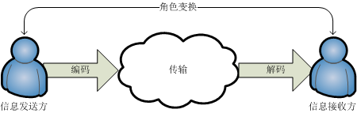

# 沟通漫谈之程序猿篇

## 免责声明

本人并非沟通理论大师。本文内容全系自行领悟，各位读者自行分辨学习，如有因此误入歧途者，本人概不负责。

## 沟通的重要性

显然，沟通的重要性很大程度上取决于工作需要。程序猿的核心竞争力是否包括沟通能力呢？答案是肯定的。

Assert

> 在特定的环境（即本组长所领导的小组）里，不愿意沟通、不擅长沟通的程序猿，是没有竞争力的程序猿，必然避免不了被淘汰的命运。

## 沟通目的

* 表达诉求，例如，产品经理提交一份需求
* 公开信息，例如，面试过程中进行自我介绍
* 获取信息，例如，向对方提出问题
* 提供反馈，例如，回答对方的问题
* 没有目的，例如，纯粹闲聊

职场上的沟通，应该是有目的的，没有目的的沟通，不在本文讨论范围内

## 沟通模型



说明

* 沟通是人与人之间传递信息的行为
* 信息要经过编码，传输，解码的过程，从沟通的一方传递到另一方
* 沟通双方的角色是一直在变换的，既是信息的发送方，也是信息的接收方
* 信息传递过程中，编码，传输，解码中任一个步骤，都影响着沟通的效果

### 如何确定信息的接收方

要把信息发给对的人。假设一下，家里着火了，要不要打120？

我们应该知道

* 自己的岗位
* 自己的工作职责
* 自己在团队中的位置
* 团队里有哪些人关注自己的工作
* 自己的工作对团队里哪些人有影响，什么样的影响。

注意：团队，不仅仅是所在的小组，而应该是小组所在的部门这样一个大团队。包括产品，运营，交互，视觉，测试，运维，等等

### 如何编码

* 编码要考虑信息接收方的解码能力
  * 对方是北方人，你说白话，沟通能有效果吗？
  * 对方是个不懂技术的业务人员，你满口的技术名词，随手就画出个类图，数据流图，对方能理解吗？
* 编码的效率
  * 编码会损失信息：就是你想要表达的意思，和你实际说的话语、写的文字，存在偏差
  * 编码里会有噪音：很简单，说 10 句话里，有 2、3 句话是废话
* 如何提高编码的效率呢？
  * 信息损失几乎是不可避免的，但我们要尽量保证关键信息不会损失
  * 复杂的信息要分解，对信息进行组织，分门别类，这样有利于突出重点和关键；哪怕是简单的信息，列出个 1，2，3来，也更有利于沟通
  * 一图抵万言，善于使用图形来表达信息
  * 善用模版，使用规定的格式，更有利于信息接收方对信息的处理

### 如何传输

* 书面沟通（推荐）
  * 电子邮件
  * 即时通讯工具
  * wiki 或各种云笔记
* 口头沟通（辅助）
  * 沟通效果受到个人表达能力限制
  * 容易被外界干扰
  * 容易遗忘
  * 难以回顾

沟通往往具备时效性，房子都倒了，人已经埋在废墟里，才接到地震预报岂不杯具？

虽然上面更推荐书面沟通，但不可否认，口头沟通（或者电话、视频会议等）具有最高的时效性，相比之下，书面沟通就难以保障时效性了，为此我们应该保证沟通渠道的畅通，并辅以有效的触达手段

* 保障沟通的时效性
  * 沟通渠道要畅通，例如：邮件客户端保持开启并定时扫描新邮件；钉钉保持在线
  * 重要的信息沟通，要求对方提供反馈；未及时反馈的，采用时效性更高的手段（例如，电话，钉钉的 DING）进行沟通

### 如何解码

* 很显然，解码需要具备相应的知识
  * 一篇研究量子物理的论文写的再精彩，不具备相应的知识，也会产生看天书的感觉
* 解码遇到困难，需要及时反馈，和信息发送方进行新一轮的沟通，直到完成解码
* 解码成功，应该确认正确：即将自己的理解反馈给信息的发送方，确认理解正确无误

## 沟通意识

最重要的还是沟通的意识。哪怕沟通技能全部满级，不去沟通也没有任何效果。

简单的说，沟通的意识就是

* 我做的这件事，其方案，计划，进度，风险，结果需要知会其他人吗？
* 是否有人在等待我的反馈呢？我是在事情做完以后再反馈，还是在过程中持续的进行反馈呢？
* 他人试图传递给我的信息，我真的领会了吗？
* 我试图传递给他人的信息，他收到了吗，能领会吗？

上面的问题，我们应该时时自问，而不是麻木的等着别人来问。自问，就是有沟通意识，等着别人来问，就是没有沟通意识。

现在来回顾一篇中学课文

```text
天下事有难易乎？为之，则难者亦易矣；不为，则易者亦难矣。
人之为学有难易乎？学之，则难者亦易矣；不学，则易者亦难矣。  
蜀之鄙有二僧，其一贫，其一富。贫者语于富者曰：“吾欲之南海，何如？”  
富者曰：“子何恃而往？”  
曰：“吾一瓶一钵足矣。”  
富者曰：“吾数年来欲买舟而下，犹未能也。子何恃而往！”  
越明年，贫者自南海还，以告富者。富者有惭色。  
西蜀之去南海，不知几千里也，僧富者不能至而贫者至焉。人之立志，顾不如蜀鄙之僧哉？
```

行动胜于空想，只有意识没有行动是不行滴

## 应对沟通困难

如果遇到不好沟通的对象，该怎么办？例如，对方不愿意参与沟通，或者是不能及时进行反馈。

* 采用正式的沟通渠道，例如通过邮件表达诉求，或组织会议进行沟通
* 请求领导介入

## 总结

* 要有沟通意识 要有沟通意识 要有沟通意识
* 要有行动
* 沟通能力不合格会被淘汰

## 附录

这些沟通行为是“不合格”的沟通行为

* 无沟通意识

  被投诉未及时沟通

* 无对象沟通

  沟通时不指明沟通的对象，例如，群里发言最好是 @具体的人，否则得不到反馈就不能埋怨别人了

* 编码效率低

  被投诉信息无法解码，例如，测试同学投诉发布新版本未做版本说明，pm 投诉任务说明不清晰，

* 沟通渠道不畅

  他人发出的信息未能及时接收到；或自己发出的信息他人未及时收到且未采取措施

* 沟通反馈不及时

  对他人的沟通不做反馈或不及时反馈

* 没有能力解码

  因不具备业务知识导致无法解码他人传递的信息

* 等等 ...

## 回马枪

沟通中要注意几点

### 换位思考

沟通一定要注意换位思考，也就是站在对方的角度来评估自己的沟通行为。

也许你觉得自己还做得不错，但对方未必这么想，如果能换位思考，多多考虑对方需要什么样的沟通，更容易接受什么样的沟通方式，怎样才能更好的理解你的意图，必然能提升沟通的效果。

### 不断学习

学无止境，作为沟通界的新手，甚至是连门槛都没有进入的菜鸟，沟通是需要不断学习的

最简单的学习，应该是从周围的人身上学习。

也许有人天生就善于沟通，但这样的人毕竟是少数，真正的沟通达人必定也是沟通的学霸。同样的一件事，不同的人沟通，效果甚至有天渊之别。我们应该善于发现别人做的好的地方，并虚心的学习他

除此以外，参与专门的沟通培训，阅读专业的沟通书籍，都是简单有效的学习手段。

## 鸣谢

特别鸣谢 `益菌` 同学对本文提出的宝贵意见

