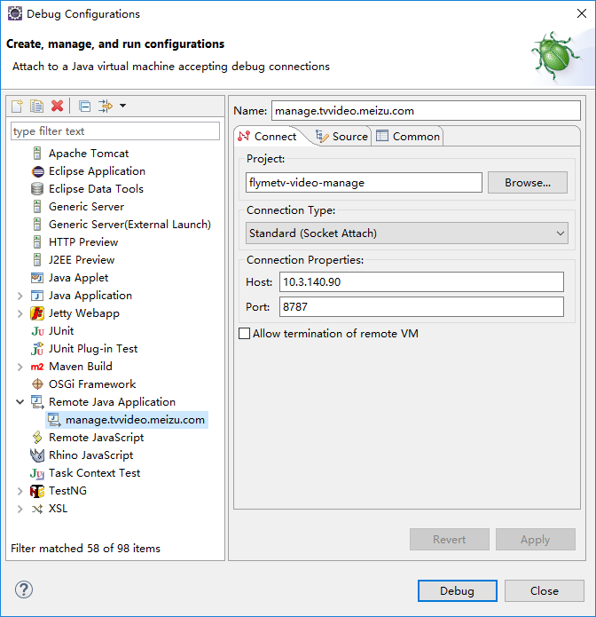
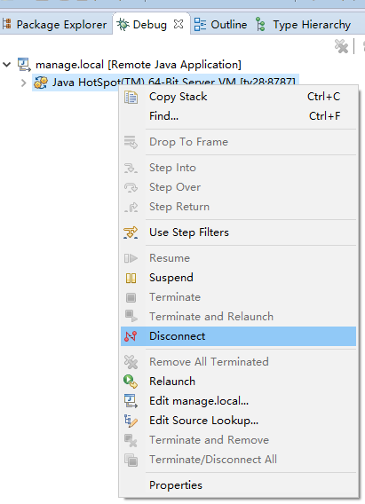

# Jetty 远程调试实战经验

## 概述

开发环境里运行的好好的代码，部署到测试环境，生产环境就是状况百出，这种遭遇大家一定都有过......如果能 debug 一下肯定是很有帮助滴，那么今天就分享一下 jetty 的远程调试

## 打开 jetty 的远程调试支持

jetty 主目录下有个 start.ini，打开这个文件添加如下配置

```bash
-Xrunjdwp:transport=dt_socket,address=8787,server=y,suspend=n
```

如果有必要的话重启一下 jetty

如果是生产环境，需要找运维帮忙开启调试端口

## 配置 eclipse 远程调试

看图......配置好以后，点击【Debug】按钮



## 开始调试

在代码里打好断点，然后就可以快乐的远程调试了

## 停止调试

【Window】-【Show View】-【Debug】，找到你所连接的服务器，在上面点右键，选择“Disconnect”，如图



