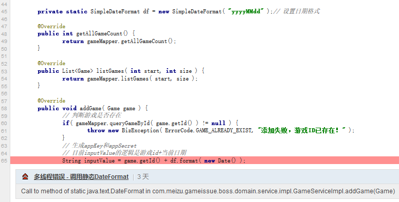

# 简单聊聊线程安全

## 起因

sonar 是一个代码质量管理工具，某天它揭露了代码里这样一个级别为严重的违规



## SimpleDateFormat 源码解析

根据 sonar 的提示，SimpleDateFormat 的 format 方法可能存在线程安全的问题，那么来看下SimpleDateFormat 的源码，看看是否如此

```java
// Called from Format after creating a FieldDelegate
private StringBuffer format(Date date, StringBuffer toAppendTo,
                            FieldDelegate delegate) {
    // Convert input date to time field list
    calendar.setTime(date);

    boolean useDateFormatSymbols = useDateFormatSymbols();

    for (int i = 0; i < compiledPattern.length; ) {
        int tag = compiledPattern[i] >>> 8;
        int count = compiledPattern[i++] & 0xff;
        if (count ##  255) {
            count = compiledPattern[i++] << 16;
            count |= compiledPattern[i++];
        }

        switch (tag) {
        case TAG_QUOTE_ASCII_CHAR:
            toAppendTo.append((char)count);
            break;

        case TAG_QUOTE_CHARS:
            toAppendTo.append(compiledPattern, i, count);
            i += count;
            break;

        default:
            subFormat(tag, count, delegate, toAppendTo, useDateFormatSymbols);
            break;
        }
    }
    return toAppendTo;
}
```

当看到第 5 行代码时，就基本可以认定`SimpleDateFormat.format()`不是线程安全的：在多线程环境下，每次调用 format 方法时，calendar 都会将时间设置为传入的时间，这样如果上一个线程的 format 方法还在执行中，肯定会导致输出的结果不正确

## 如何做到线程安全

那么怎么做才能线程安全呢？

### 不用静态属性

每次需要格式化日期时，new 一个 DateFormat，保证线程安全，我们可以这样“优化”一下

```java
String inputValue = game.getId() + new SimpleDateFormat( "yyyyMMdd" ).format( new Date() );
```

虽然线程安全了，但是这样性能就下降了，如果这段代码频繁的调用，不仅 new 一个 DateFormat 对象的代价有点大，而且频繁的 new 也会导致 gc 的压力增大

### 同步或者加锁

既然`format()`方法线程不安全，那就在调用时采用同步或加锁，例如

```java
private static SimpleDateFormat df = new SimpleDateFormat( "yyyyMMdd" );// 设置日期格式

private static final Lock LOCK = new ReentrantLock();


@Override
public void addGame( Game game ) {
    ......

    LOCK.lock();
    try {
        String inputValue = game.getId() + df.format( new Date() );
    } finally {
        LOCK.unlock();
    }

    ......

}
```

### DateFormat 池

加锁是解决了线程安全的问题，也不会因为 new 出太多的 DateFormat 增加 gc 的负担，但是很显然并发性能大大的降低了，如果在并发性要求较高的场合，还不如 new 一个的性能高呢，那有什么办法再优化一下吗

可以实现一个 DateFormat 池，实现如下功能

* 设定池的大小，在池实例化的同时，实例化一批 DateFormat
* 每个 DateFormat 都有一个状态，表明当前是空闲还是忙，初始状态为空闲
* 当需要格式化日期时，从池里取出一个空闲的 DateFormat，同时将其标记为忙
* 池里的 DateFormat 的 format 方法需要重写，在 format 完成后将其状态标记为空闲

用池的优势很明显：只要设定合适的池大小，就不用担心并发性能；并且也不存在增加 gc 负担的问题；当然池的实现比较复杂，而且池内部也要解决线程安全问题，可以考虑采用一些开源的池框架例如 Apache commons pool 来做

### ThreadLocal&lt;DateFormat&gt;

在引入 ThreadLocal 之前，思考一下这个问题：如果只有一个线程，`format`方法还存在线程安全问题吗？

显然不会，如果只有一个线程，则`format`方法实际上是串行执行的，绝无可能并行执行；那么，如果在多线程环境下，给每个线程都分配一个固定的 DateFormat 来执行`format`方法，显然也不会有线程安全的问题了

ThreadLocal 就是用于这种思路的一个解决方案：为每个使用该变量的线程提供独立的变量副本，所以每一个线程都可以独立地改变自己的副本，而不会影响其它线程所对应的副本。

ThreadLocal 的使用如下

```java
private static final String                  DATE_FORMAT = "yyyy-MM-dd";

private static final ThreadLocal<DateFormat> SDF         = new ThreadLocal<DateFormat>() {

                                                             protected synchronized DateFormat initialValue() {
                                                                 return new SimpleDateFormat(
                                                                         DATE_FORMAT);
                                                             }
                                                         };

        ......

        album.setReleaseDate(SDF.get().parse(show.getReleasedate().substring(0, 10))); // 发布日期
```

## 如何选择

先看每次都 new 一个新对象和 ThreaLocal之间的差别，假设有 1 个线程要执行 n 次 format

* new：n 个实例
* ThreadLocal：1 个实例

但是，如果是 n 个线程，每个线程只执行 1 次 format 呢？

* new：n 个实例
* ThreadLocal：n 个实例

很显然，如果使用 ThreadLocal 的话，线程应该是能复用的，否则和 new 的效果是一样滴

再看加锁和池的差别，主要表现在并发性能方面，加锁实际导致了串行化，不满足高并发的场合

再看下池和 ThreadLocal 的差别

* 并发性能上 2 者都很优秀
* 相对来说 ThreadLocal 的实现更简单，而且完全不需要加锁或同步，而池在管理池内的元素时免不了需要加锁或同步
* 池的复用性最好，而 ThreadLocal 的复用性则完全取决于其宿主线程的复用性

