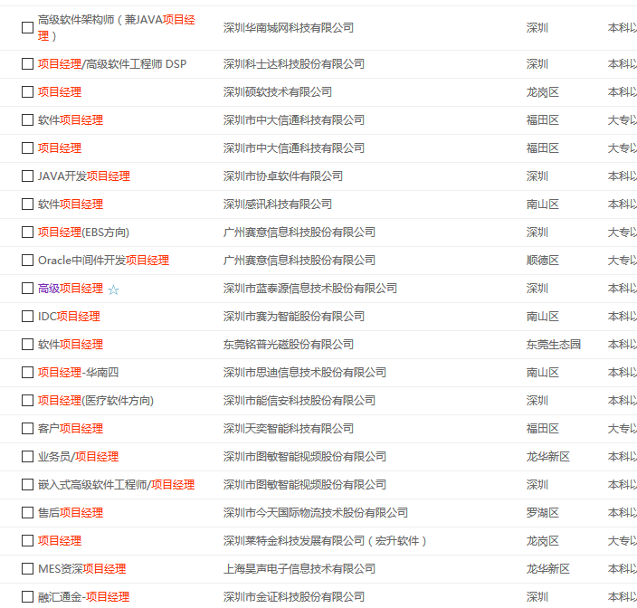
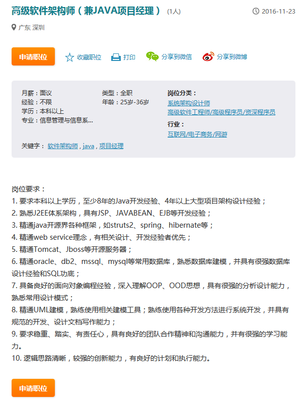
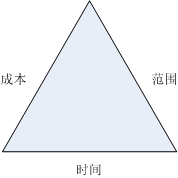

# 随便聊聊项目时间管理

## 免责声明

本人并非项目管理专家。本文内容全系自行领悟，各位读者自行分辨学习，如有因此误入歧途者，本人概不负责。

## 引子

很少的软件企业里有专职 pm \(项目经理\)，大多数情况下，pm 都是程序猿中的佼佼者担任。很多企业招聘 pm 其实是在招高阶的程序猿。例如，在人才热线上搜索一下



看看其中一个职位的要求



这也意味着，程序猿是很有必要学习一些项目管理知识滴；所以，今天我来聊一下项目管理也是很合理滴

## 经典的面试问题

在申请 pm 职位时，程序猿经常都会遇到这样一个问题：如果你在带一个项目，领导\(或甲方\)要求项目提前交付，你会怎么办？

.

.

.

.

.

.

.

.

.

.

.

.

......思考滴分割线......

.

.

.

.

.

.

.

.

.

.

.

.

屌丝程序猿凭经验，很快给出了答案：加班。对面的面试官猥琐的一笑，心里想：苦逼的程序猿，就是 tmd 老实。

有加班之外的答案吗？

## 项目三角形

所谓的项目三角形，是项目成本、范围、时间三要素组成的一个三角形，如下图



这个三角形的意义是什么呢？它意味着如果要改变其中某一个要素，其他要素也会发生变化

* 如果领导要求压缩工期，那么相应的我们应该缩减项目范围
* 如果甲方提出了新的需求，那么相应的项目时间和成本都要增加
* ......

## 质量守恒

```text
领导：这个项目多久能搞定？
你：乐观估计要 2 周
领导：没有那么多时间，1 周行不行？
你：不行啊，领导大人，请看我做的 WBS(工作分解结构)
领导：嗯，我看看。。。什么~！这个设计要 3 天时间，评审都要 1 天？单元测试是啥？居然要 3 天？。。。

领导威严的看着你，仿佛看穿了你磨洋工的小心思

在你满头大汗时，领导发话了：啊，我知道大家很辛苦，但是这个项目很重要。。。~~这样吧，2 天时间做设计~！单元测试先不写了，项目完成后再补嘛~~这样一算，1 周的时间就足够了嘛。。。实在不够滴话。。。
你：明白了，领导大人，我回去重新做个计划，如果有必要我会安排加班滴~~
```

作为一个 pm，遇到这样的外行领导也很无奈吧，根据领导的指示，你最终用 1 周时间完成了原计划需要 2 周的项目，所以，这意味着项目三角形不成立，我们可以在不改变项目范围和成本的前提下压缩项目时间啦？

想必你也能看出来，按领导的安排，项目的质量风险大大提高了，项目工期的压榨是以项目质量的下降作为代价获得的

事实上，当我们谈论项目三角形时，我们有个隐含的前提：项目质量守恒，也就是说，在保证项目质量的前提下，项目的成本，范围，时间之间是存在一个互相牵制的关系滴

## 正确的答案

如果你在带一个项目，领导要求项目提前交付，你会怎么办？

### 正路

* 缩减项目范围：根据优先级排序，将优先级较低的部分放到下期实现
* 增加项目成本：增加人手/部分或全部外包/商业采购/...

### 邪路

* 降低项目质量要求，裁剪质量保障环节，甚至偷工减料，压缩项目工期：将来质量出了偏差，你是要负责任滴

### 其他

* 加班：也算是一个办法，苦逼自己，幸福领导，用得好的话有奇效。。。

## ps

* 项目管理是一项科学，项目时间管理自然也是科学：项目的时间不以人的意志为转移
* 增加投入可以压缩项目时间，但不能无限制的压缩项目时间：正如你投入再多的人力和物力，也不可能让孕妇提早生产
* 如果你的项目时间计划是合理的，那就一定要坚持，不可能无代价的压缩项目时间
* 在做项目计划时，考虑到普遍的对项目时间的压榨，可以预留一些余地

