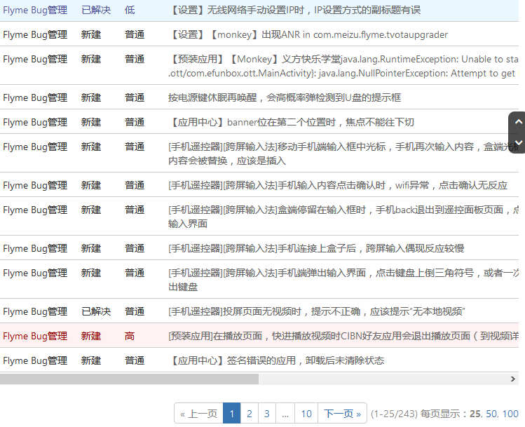
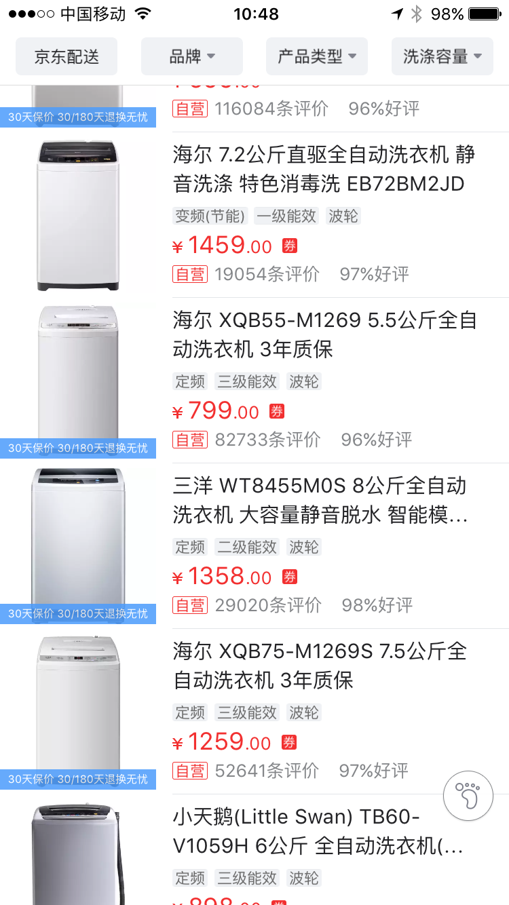
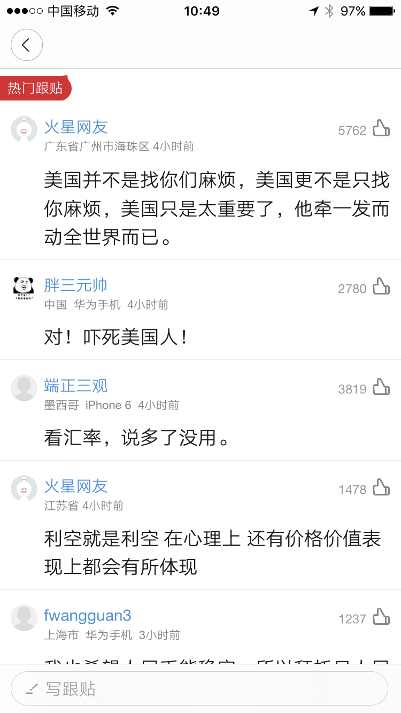

# 移动设备分页显示数据研究

## 概述

互联网上有海量的信息，如何展示这些信息？主流的做法是分页展示，如下是一个典型的页面



值得研究的是页面底部的导航条，这个导航条的信息如下

* 每页显示 25 条记录
* 当前是第 1 页
* 一共有 10 页
* 一共有 243 条记录
* 可以从第一页直接跳转到 第 2，3，10 页

可以说这是最传统也最流行的分页显示样式，所以当我们需要提供分页显示的后台服务时，自然而然的就模仿起来，例如下面的一个接口

youku 节目视频列表接口返回

```javascript
{
    showcats: "电视剧",
    status: "success",
    show_update: false,
    history_tid: "9cd2277647d311e5b692",
    pz: 1,
    pg: 1,
    total: 30
    results: [
        {
            username: "",
            total_pv: 10823895,
            show_videostage: 1,
            pubdate: "2016-08-22 23:48:54",
            tags: "电视剧",
            img_hd: "http://r4.cp31.ott.cibntv.net/0542080857BAA18F6A0A43045856619E",
            is_new: false,
            show_videoseq: 1,
            streamtypes: [
                "hd2",
                "flvhd",
                "hd",
                "3gphd",
                "hd3"
            ],
            pk_video: 423715924,
            show_videotype: "正片",
            total_up: 96528,
            duration: 2674.67,
            limit: 0,
            total_down: 235,
            desc: "美女学霸贝微微是庆大计算机系大二的学生，立志成为游戏工程师的她化名芦苇微微跻身网游高手，因没有在游戏中上传真实照片微微惨遭侠侣真水无香的抛弃。大神肖奈是庆大计算机系大四的学生，化名一笑奈何的他在游戏榜上排名第一。即将毕业的肖奈将要创办自己的游戏公司，在网吧初次看到打游戏的微微后肖奈就被微微所吸引，在游戏中看到真水另娶他人后肖奈主动邀请微微与自己结为侠侣。",
            is3d: 0,
            stg: 1,
            total_comment: 16424,
            img: "http://r4.cp31.ott.cibntv.net/0542080857BAA18F6A0A43045856619E",
            title: "微微一笑很倾城 01",
            userid: "UMzE3OTU5MzkyOA==",
            videoid: "XMTY5NDg2MzY5Ng==",
            total_fav: 0,
            state: 3,
            cats: "电视剧",
            reputation: 9.639591265373667,
            guest: [

            ],
            publicType: 0,
            pay_type: 0
        }
    ],
    access: "allow",
}
```

注意 6，7，8 行

* `pz: 1`：每页显示 1 行数据
* `pg: 1`：当前第 1 页
* `total: 30`：共有 30 条记录

## 移动设备分页体验

先看看京东的商品展示页



再看下网易新闻的评论页



## 移动设备分页与传统分页差异

在移动设备上，交互方式与电脑浏览器完全不同，因此分页展示也有了极大的差异

* 移动设备通过上滑或下拉来加载数据，传统的电脑浏览器通过分页导航条来切换页面
* 移动设备上滑或下拉一定是加载新数据吗？实际上并非如此，所以上滑或下拉并不对应电脑浏览器的切换页面
* 移动设备上不需要显示总页数，用户只需要反复上滑屏幕，若没有更多数据，一般是显示一个提示，甚至不做任何提示
* 移动设备无论上滑还是下拉，加载的总是相邻页的数据，不像电脑浏览器那样，可以直接跳转到任意一页，例如从第一页直接跳转到最后一页
* 移动设备每次加载的数据量是多少？估计谁也不清楚，而且用户也不 care；而电脑浏览器每一页（不包括最后一页）的数据量是一样滴，如果某一页的数据比上一页要少，通常表示这是最后一页

由此，可以总结出下面的表格

| 项目 | 电脑浏览器分页 | 移动设备分页 |
| :--- | :--- | :--- |
| 页与页之间有明显的界限 | 是 | 否 |
| 显示总页数（或总记录数） | 是 | 否 |
| 支持任意跳转 | 是 | 否 |
| 每一页（除最后一页）显示记录数固定 | 是 | 否 |

## 针对移动设备做分页

1. 不查总记录数，直接到数据库获取某一页的数据
2. 由于没有总记录数，客户端不知道当前是否最后一页，所以由服务端告诉客户端
3. 不保证一页有多少数据，这样可以在返回数据之前做过滤，增加服务端灵活性，极端情况下，某一页没有任何数据，但是下一页依然有数据

## why

1. 不查总记录数，就避免了一个数据库的 count 查询，在数据量较大时，该查询往往比较耗时
2. 有利于多数据源的整合，例如，部分数据从本地数据库查询，部分数据从远程接口获取：这种情况下要知道总记录数就必须调用一次接口，问题是分页的情况下，我这一页的数据可能只需要从数据库返回，这尼玛就是白白调用了一次接口，及其影响性能
3. 由于没有查询总记录数，可能导致当前页是最后一页但是刚好数据量和页大小相等，这样会导致客户端多查一页：不过这样对用户体验和服务器压力来说均无影响
4. 当需要删除数据时，不需要重建所有页面的缓存，只需要对缓存命中的那一页进行过滤
   * 某个产品做了个评论功能，由于对评论进行敏感词和广告过滤比较困难，经常需要手工屏蔽某条评论，而该产品的获取评论接口设计，与客户端约定了每页返回 30 条评论，若不足 30 条表示已到最后一页，这也导致该产品无法对评论接口返回的数据做缓存：一旦屏蔽某条评论，刷新缓存非常困难
   * 对于商品展示，考虑到商品因库存原因也存在上下架需求且实时性要求较高，这种对缓存过滤的方式还是很方便的

## 结论

移动设备分页和传统分页存在一些体验上的差异，要善于利用这些差异来提升性能和灵活性。遇到问题要多思考，切忌机械的照搬以往的经验。

## 思考

对于分页显示评论的场合，是不是有一种更高效的分页方案呢？

* 一般分页，都是从前往后分页，但是评论这一类的应用，按时间显示，其显示顺序固定，新的评论总是显示在前面，所以，是不是可以考虑从后往前分页，这样后面的分页可以长期缓存，只需要对前几页的数据进行刷新，同时维护一个指向每一页的 key 的列表
* 从用户体验上来说，实际上就是下拉刷新（请注意：和上滑加载应该是不一样的）

不同的应用场合，考虑不同的实现方案，软件开发没有银弹，技术方案也不是普遍适用的。

