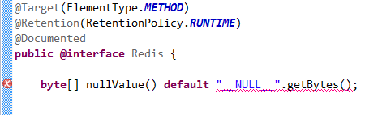

# 自定义注解参数学习

## 起因

当我想给自定义注解的某个参数设一个默认值时，遇到了困难



为毛不能这样设置默认值捏？

## 注解参数

看下注解的文档吧，[annotations](http://docs.oracle.com/javase/1.5.0/docs/guide/language/annotations.html) 里对注解的参数是这样说的

> Each method declaration defines an _element_ of the annotation type. Method declarations must not have any parameters or a throws clause. Return types are restricted to primitives, String, Class, enums, annotations, and arrays of the preceding types. Methods can have _default values_.

渣渣翻译如下

> 每个方法声明定义了该注解类型的一个_元素_，方法声明不能有任何参数或抛出异常。返回类型只限于原始数据类型，字符串，类，枚举，注解，以及他们的数组。方法可以有_默认值_。

看上去我想要设置的默认值是符合规范的，为毛编辑器会提示错误捏？继续研究文档

> Once an annotation type is defined, you can use it to annotate declarations. An annotation is a special kind of modifier, and can be used anywhere that other modifiers \(such as public, static, or final\) can be used. By convention, annotations precede other modifiers. Annotations consist of an at-sign \(@\) followed by an annotation type and a parenthesized list of element-value pairs. **The values must be compile-time constants.**

请注意上面这段话里加粗的部分，看来关键是在这个 _**compile-time constants**_，或曰 _**编译时常数**_ 上，简单的理解就是在这些值编译器就能得到，而不需要解释器通过运行代码来确定

关于 _**compile-time constants**_，推荐一个文章：[Compile Time Constants in Java](http://www.zoopable.com/compile-time-constants-in-java/)，这里摘录一段，讲的是 _**compile-time constants**_ 的基本规则

* They must be declared final
* They are of primitive data types or String
* They must be initialized with their declaration.
* Their value must be constant expression.

渣渣翻译为

* 声明时以 final 修饰
* 原始数据类型或 String
* 声明时就要赋值
* 值必须是个常数表达式

## 所以

那么，下面代码里的 value 是个 _**compile-time constants**_ 吗？

```java
public static final byte[] value = "__NULL__".getBytes();
```

我认为它不是，因为要拿到 value 的值，必须运行解释器来执行 `getBytes()` 方法，而编译时是不会调用解释器滴

## 再深入一点

这个代码里的 value 是不是 _**compile-time constants**_？

```java
public static final int[] value = {1, 2, 3};
```

事实上也不是，虽然有 final 修饰，这个 value 甚至不是常数，因为我们可以通过下面代码轻易的修改它

```java
value[0] = 2;
```

我们验证一下


## 结论

无论是为注解参数设置默认值，还是使用注解时给参数传值，都必须符合注解规范，关键是对 _**compile-time constants**_ 的理解：不可变且编译器确定该值不依赖解释器的执行，若不能理解这一点就会觉得莫名其妙

## 回眸一笑

```java
final String S1 = "tv:" + "album";
final String S2 = S1 + ":video";
final int I = 1 + 2;
```

上面代码定义的常量，是否 _**compile-time constants**_？

