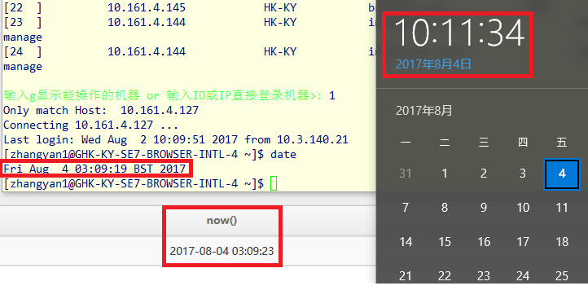
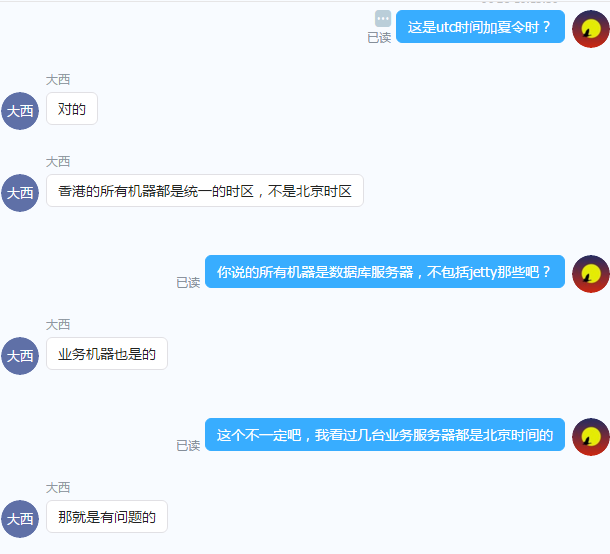

# 海外业务时间处理

## 背景

海外浏览器后台有个业务配置是在一定的时间段内生效的，从数据库里获取生效的配置使用如下的 sql 语句

```sql
-- 查询出当前生效的视频精选
SELECT id FROM video_choice WHERE
    status=1 AND
    effective_time<=NOW() AND expiration_time>=NOW()
```

测试通过以后，发布到灰度环境进行验证，测试同学反馈不能获取当前生效的视频精选

## 原因

先 review 代码，没有头绪；后来发现是生产环境的时间设置问题，如下



可以看到数据库服务器返回的时间，以及业务服务器时间和办公电脑的时间不一致——排除一些操作上的时间差，生产环境机房时间和办公环境（也就是北京时间）相差 7 个小时

## 解决时间不一致问题

### 修改时区设置

首先是想到找 DBA，把数据库时间设置为北京时间，但是被拒绝了


虽然香港也是北京时间，但是用 UTC 貌似也很合理，问题是——北京时间不是和 UTC 时间相差 8 个小时吗？



这个多出来的一小时只能用夏令时来解释了......虽然香港根本就不采用夏令时

### 自己做时区转换

既然机房的时间不能改，那只能自己想办法解决了

最简单的就是直接把 UTC 时间转换为北京时间，但是香港机房这个诡异的夏令时怎么处理？将来在其他国家/地区的机房部署程序，又该如何处理？非常麻烦，搞了半天，没有解决，反而觉得越来越复杂了

### 出乎意料的简单解决方案

网上查了一下，可以在程序启动时传一个时区参数，如下

```bash
java app -D user.timezone=Asia/Shanghai
```

不过，这要修改 jetty 或 launcher 程序启动的脚本，恐怕运维同学不会同意

.

.

.

可以在 java 程序启动后第一时间设置 `user.timezone` 环境变量，如下

```java
System.setProperty("user.timezone", "GMT+08:00");
```

使用 Spring 的注解自动装配的话，只要定义一个类，不用侵入任何代码

```java
@Order(1)
@Component
public class TimeZoneService {

    @PostConstruct
    private void setDefaultTimeZone() {
        System.setProperty("user.timezone", "GMT+08:00");
    }

}
```

注意 `@Order` 注解，它保证了在你的业务代码执行前时区已被设置

这样，无论你的机房在哪个大洲的哪个国家/地区，也无论其时区如何设置，是否采用夏令时，都可以用北京时间来处理时间了

## 后记

### 修改时区并生效

最近一个项目又涉及到时间，发生了新情况：将用户输入的时间转为整数型的时间戳保存到数据库，测试同学发现该时间戳再转换为北京时间后和原输入时间不相等。经过研究后发现，执行如下代码实际上时区调整并没有生效~!

```java
System.setProperty("user.timezone", "GMT+08:00");
```

可以用一个例子来测试一下

```java
public void test() {
    Date date = new Date();
    System.out.println("user.timezone=" + System.getProperty("user.timezone") + ",time=" + date);

    System.setProperty("user.timezone", "GMT+1:00");
    System.out.println("user.timezone=" + System.getProperty("user.timezone") + ",time=" + date);

    TimeZone.setDefault(null);
    System.out.println("user.timezone=" + System.getProperty("user.timezone") + ",time=" + date);
}
```

输出为

```java
user.timezone=,time=Wed Sep 13 15:34:34 CST 2017
user.timezone=GMT+1:00,time=Wed Sep 13 15:34:34 CST 2017
user.timezone=GMT+1:00,time=Wed Sep 13 08:34:34 GMT+01:00 2017
```

也就是说，虽然修改了时区的系统变量，但是并不会导致时区的变更，除非执行 `TimeZone.setDefault(null)` 来强制 java 重新计算时区

### freemarker 的时间格式化

强制时区切换后，又有问题了：用户进入修改界面，时间又变回机房的香港时间，而不是输入时的北京时间了，经过研究，发现页面上展示时间是用的 freemarker 的时间格式化功能，代码如下

```markup
<tr>
    <td>失效时间</td>
    <td>
        <!-- et 是个 java.util.Date 对象 -->
        <input type="text" value="${(et?datetime)!}" name="endTime" id="endTime" onclick="javascript:WdatePicker({dateFmt:'yyyy-MM-dd HH:mm:ss'});">
    </td>
</tr>
```

看来是 freemarker 使用的时区依然是香港机房本地设置，并没有被我们修改时区的代码影响到，那么我们可以通过设置 freemarker 的时区来解决这个问题，在 spring 配置文件里如下配置 freemarker 即可

```markup
...
    <bean
        class="org.springframework.web.servlet.view.freemarker.FreeMarkerConfigurer">
        <property name="templateLoaderPath" value="WEB-INF/views/" />
        <property name="defaultEncoding" value="UTF-8" />
        <property name="freemarkerSettings">
            <props>
                <prop key="date_format">yyyy-MM-dd</prop>
                <prop key="time_format">HH:mm:ss</prop>
                <prop key="datetime_format">yyyy-MM-dd HH:mm:ss</prop>
                <prop key="number_format">0.######</prop>
                <prop key="defaultEncoding">utf-8</prop>
                <prop key="url_escaping_charset">utf-8</prop>
                <prop key="locale">zh_CN</prop>
                <prop key="template_update_delay">36000</prop>
                <prop key="time_zone">Asia/Shanghai</prop>
                <prop key="sql_date_and_time_time_zone">Asia/Shanghai</prop>

            </props>
        </property>

...
```

注意上面代码里 16，17 行

## 结论

要想在不同时区的机房里使用北京时间，只需要修改时区，如下

```java
@Order(1)
@Component
public class TimeZoneService {

    private static final String SHANG_HAI = "Asia/Shanghai";


    @PostConstruct
    private void setDefaultTimeZone() {
        System.setProperty("user.timezone", SHANG_HAI);
        System.setProperty("user.country", "CN");
        System.setProperty("user.language", "zh");
        TimeZone.setDefault(TimeZone.getTimeZone(SHANG_HAI));
    }
}
```

此外，如果你用到了 freemarker，那你需要配置 freemarker 的时区，方法是设置其 time\_zone 参数，以 spring 整合 freemarker 来示例

```markup
...
    <bean
        class="org.springframework.web.servlet.view.freemarker.FreeMarkerConfigurer">
        <property name="templateLoaderPath" value="WEB-INF/views/" />
        <property name="defaultEncoding" value="UTF-8" />
        <property name="freemarkerSettings">
            <props>
                <prop key="date_format">yyyy-MM-dd</prop>
                <prop key="time_format">HH:mm:ss</prop>
                <prop key="datetime_format">yyyy-MM-dd HH:mm:ss</prop>
                <prop key="number_format">0.######</prop>
                <prop key="defaultEncoding">utf-8</prop>
                <prop key="url_escaping_charset">utf-8</prop>
                <prop key="locale">zh_CN</prop>
                <prop key="template_update_delay">36000</prop>
                <prop key="time_zone">Asia/Shanghai</prop>
                <prop key="sql_date_and_time_time_zone">Asia/Shanghai</prop>

            </props>
        </property>

...
```

