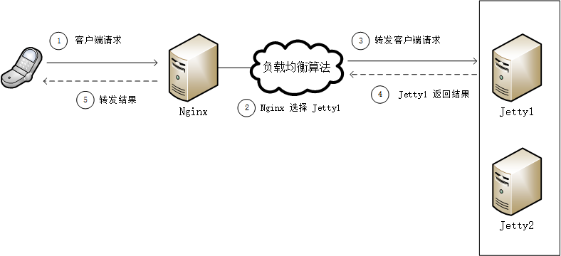
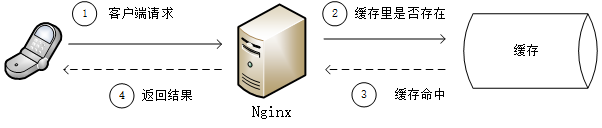
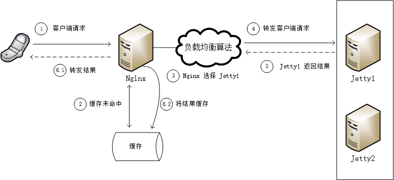

# Nginx 反向代理缓存

之前的项目里一直是用 redis 做缓存，也有些场景是用 java 的 Map/List 等数据结构做本地缓存；这次接手浏览器项目，发现他们用到了 nginx 的缓存，所以就研究了一下 nginx 的缓存配置

## 简单介绍

nginx 一般用来做反向代理和负载均衡，将客户端请求发送到后端的 jetty，并将 jetty 的响应发送给客户端。后端的 jetty 通常不止一个，nginx 根据配置来选择其中一个 jetty，比较常见的选择策略是轮询。示意图如下



启动缓存支持以后，nginx 在将请求转发到 jetty 之前会在缓存里查找结果，如果缓存里存在匹配客户端请求的结果，则直接返回给客户端，不会将请求发送给 jetty；如果缓存没有命中，才会将请求发送给 jetty，接收到 jetty 返回的结果后，会将结果进行缓存以备客户端下次的请求。示意图如下

### 缓存命中



### 缓存未命中



## 最简单的缓存设置

### web 程序

首先我们有个简单的 web 程序，返回当前时间，如下

```java
@Controller
public class TestController {

    @ResponseBody
    @RequestMapping("time.do")
    public Map<String, Long> time() {
        Map<String, Long> map = new HashMap<String, Long>();
        map.put("time", System.currentTimeMillis());
        return map;
    }
}
```

这个接口会返回当前时间，精确到毫秒，正常情况下每次刷新返回的值都应该是不一样的

### nginx 配置

现在配置 nginx 的缓存，首先在 http 小节添加如下配置

```bash
http {
    ...

    # 设置缓存的路径和其他参数
    # proxy_cache_path path [levels=levels] keys_zone=name:size [inactive=time] [max_size=size] [loader_files=number] [loader_sleep=time] [loader_threshold=time];
    # 缓存路径 /data/nginx/cache 缓存结构为 2 层，即该路径下会有 2 层子目录，缓存文件会保存在最下层子目录
    # 缓存的 key 会保存在名为 web_cache 的内存区域，该内存区域大小为 50 m
    # 10 分钟内缓存没有被访问就会过期
    # 缓存文件最多占用 1g 空间
    proxy_cache_path /data/nginx/cache levels=1:2 keys_zone=web_cache:50m inactive=10m max_size=1g;

    # proxy_cache_path 指令必须在 include 指令之前
    include vhosts/*.conf;

    ...
}
```

接下来在 server 小节 的 location / 小节添加如下配置

```bash
location / {
    proxy_store off;
    proxy_redirect off;
    proxy_set_header X-Forwarded-For $proxy_add_x_forwarded_for;
    proxy_set_header X-Real-IP $remote_addr;
    proxy_set_header Host $http_host;
    proxy_pass http://my-server/;

    # 缓存使用前面定义的内存区域
    proxy_cache web_cache;
    # 这个貌似没啥用
    proxy_ignore_headers   Expires Set-Cookie;
    # 对于 200 和 304 的响应码进行缓存，过期时间为 2 分钟，这会覆盖前面定义的 10 分钟过期时间
    proxy_cache_valid 200 304 2m;
    # 设置缓存的 key，这里用到了 nginx 的内嵌变量，表示用整个 url 作 key
    proxy_cache_key  $scheme$proxy_host$request_uri;
    # 在返回的响应里添加响应头 X-Proxy-Cache，其值表示是否命中了缓存，貌似没啥用
    add_header X-Proxy-Cache $upstream_cache_status;
    # 返回的响应头里，设置过期时间为 10 分，貌似没啥用
    expires 10m;
    # 貌似没啥用
    add_header Access-Control-Allow-Origin "http://myserver.net";
    # 貌似没啥用
    add_header Access-Control-Allow-Credentials true;

}
```

## 缓存特定的参数

有的参数每个客户端都不一样，而且该参数的值并不影响返回的结果，如果我们用整个 url 作为缓存的 key，那么 key 的数量就太多了，导致缓存的命中率非常低。

例如，用户手机的 imei 是唯一的，如果 key 包括了 imei，那就会导致每个用户都有一个缓存，这显然不是我们需要的

那么，能不能把某些参数排除在 key 之外呢？答案是肯定滴，看看下面这个 web 程序

```java
@ResponseBody
@RequestMapping("/test/user.do")
public Map<String, String> user(String imei, String sn, String phone, String name) {
    Map<String, String> map = new HashMap<String, String>();
    map.put("imei", imei);
    map.put("sn", sn);
    map.put("phone", phone);
    map.put("name", name);
    return map;
}
```

只用 phone 和 name 参数来构造缓存的 key，可以如下配置

```bash
location / {
    proxy_store off;
    proxy_redirect off;
    proxy_set_header X-Forwarded-For $proxy_add_x_forwarded_for;
    proxy_set_header X-Real-IP $remote_addr;
    proxy_set_header Host $http_host;
    proxy_pass http://my-server/;

    # 缓存使用前面定义的内存区域
    proxy_cache web_cache;
    # 对于 200 和 304 的响应码进行缓存，过期时间为 2 分钟，这会覆盖前面定义的 10 分钟过期时间
    proxy_cache_valid 200 304 2m;
    # 设置缓存的 key，只用 phone 和 name 构造 key
    proxy_cache_key  $host$uri$is_args$arg_phone&$arg_name;

}
```

这次把貌似没用的配置都移除了，要指定某些参数来构造缓存的 key，关键是以下的内嵌变量

* `$is_args`
* `$arg_{name}`

## 缓存特定的接口

有时候不是所有接口都需要被 nginx 缓存，或者缓存的 key 采用不同的规则，可以通过不同的 location 来配置

例如，下面的配置就只对以 /test/ 开头的接口做缓存

```bash
location / {
    proxy_store off;
    proxy_redirect off;
    proxy_set_header X-Forwarded-For $proxy_add_x_forwarded_for;
    proxy_set_header X-Real-IP $remote_addr;
    proxy_set_header Host $http_host;
    proxy_pass http://my-server/;

    # 不缓存 proxy_cache 默认值就是 off，所以也可以省略这一行
    proxy_cache off
}
location /test/ {
    proxy_store off;
    proxy_redirect off;
    proxy_set_header X-Forwarded-For $proxy_add_x_forwarded_for;
    proxy_set_header X-Real-IP $remote_addr;
    proxy_set_header Host $http_host;
    proxy_pass http://my-server/test/;

    # 缓存使用前面定义的内存区域
    proxy_cache web_cache;
    # 对于 200 和 304 的响应码进行缓存，过期时间为 2 分钟，这会覆盖前面定义的 10 分钟过期时间
    proxy_cache_valid 200 304 2m;
    # 设置缓存的 key，只用 phone 和 name 构造 key
    proxy_cache_key  $host$uri$is_args$arg_phone&$arg_name;

}
```

## 缓存的使用

nginx 反向代理缓存看上去很美，只需要配置一下就能达到缓存的效果；相比之下，无论是用 redis 还是本地缓存，都不可避免的要增加开发的工作量——这是不是意味着只要用 nginx 做缓存就行了？

答案是未必，nginx 缓存相比 redis 或其他缓存方案，也存在不足 

1. 缓存和实际数据不同步时，无法更新缓存，只能被动的等待缓存过期
   * 使用 redis 的方案，我们可以直接修改 redis 里的数据来保证缓存数据与实际数据的一致性
2. 性能也许没有优势
   * 第一感会觉得 nginx 缓存的性能肯定比用 redis 更强，但我们应该注意到 nginx 是把缓存的 key 放在内存里，但是缓存的 value 却是保存在磁盘的文件中，那么磁盘的读写速度实际上是没有什么优势的，个人感觉性能比 redis 应该要差很多，尤其是并发量极大的场合
   * nginx 缓存的命中必然会导致磁盘的读取，而未命中则会导致磁盘的写入，这样在高并发的情况下会导致较高的磁盘 IO，实际上会影响整个系统的性能，导致 nginx 所在的服务器全面的性能下降

个人看法，nginx 缓存适合于实时性要求不高，单次传输数据量较大的场合

1. 实时性要求不高，对数据不一致的容忍程度就比较高，这时 nginx 缓存的简单易行的优势还是很明显的
2. 数据量较大，从 nginx 返回应该比较有性能优势，毕竟将很大的数据从后端的 jetty 传输给 nginx，耗用的时间也许会远远超过从缓存里获取数据的时间
   * 当然，这也不一定成立，网络传输速度比硬盘读取速度更快并不是新闻

## 参考资料

* [Nginx 的反向代理缓存](http://www.cnblogs.com/meteoric_cry/archive/2011/05/14/2046263.html)
* [Nginx - 代理、缓存](http://blog.csdn.net/zjf280441589/article/details/51501408)
* [Nginx 文档](http://tengine.taobao.org/nginx_docs/cn/docs/)

