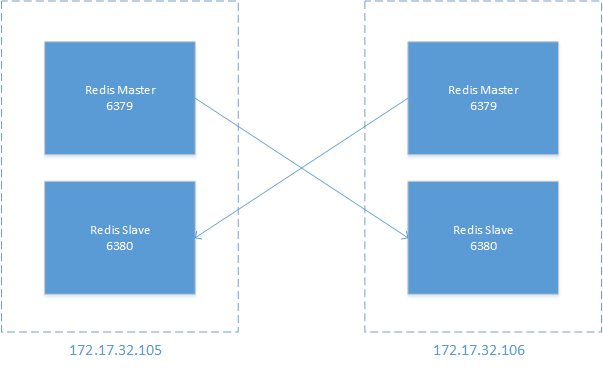

# Redis 集群搭建

## 集群概览

我准备创建一个由 2 个分片组成的 redis 集群，这 2 个分片由 2 台服务器承载，分别是 172.17.32.105，172.17.32.106，每台服务器上运行 2 个 redis 实例，其监听端口分别为 6379 和 6380，其中，6379 为 master，6380 为 slave，通过 redis 自带的主从复制功能进行数据的同步，为了提高可用性，同一个分片的 master 和 slave 不能运行在同一台服务器上，top 结构如下图（图中箭头表示主从复制的方向）



这样的结构可以保证任意一台服务器故障，整个集群依然可以提供服务

## 准备工作

### 组件

* 一个可用的 zookeeper 集群，可以自己搭建，也可以使用公司的开发环境，这里使用公司开发环境

  ```bash
  172.16.190.42:2181,172.16.190.43:2181,172.16.190.44:2181
  ```

* 各个组件的安装包
  * Twemproxy.tar.gz 及 twemproxy 库文件
  * Redis-zoo-watchdog-centos-64.tar.gz
  * redis-2.6.16.tar.gz
* 解释一下
  * twemproxy：这是一个 redis 代理，其主要功能就是在多个 redis 节点和访问者之间做路由分发：访问者不需要自己判断某个 key 该存储到哪一个 redis 节点或者该到哪个节点去获取某个 key 的值——这是一个负载均衡组件
  * watchdog：监控 redis 节点的状态，并在主节点故障时启用从节点——这是一个高可用组件

### zookeeper 节点

redis 集群环境基于 zookeeper，需要先手工创建所需的节点，假定要创建一个名为 icd 的 redis 集群

* /redis/proxy/icd
  * 这个节点是给 twemproxy 使用的，保存的是 proxy 的 ip 和 端口
* /redis/cluster/icd/
  * 这个节点是给 watchdog 使用的，根据 redis 分片数量，在下面创建对应的节点
  * /redis/cluster/icd/redis-0000, /redis/cluster/icd/redis-0001
    * 我们的 redis 集群由 2 个分片组成，所以创建了 2 个 zk 节点，节点下是组成该分片的 master，slave 的连接信息；节点本身还存储了权重信息

```bash
# 使用客户端连接到 zk 集群
/data/zookeeper/bin/zkCli.sh -server 172.16.10.163:2181,172.16.10.96:2181

# 创建 proxy 使用的 zk 节点
[zk: 172.16.10.163:2181,172.16.10.96:2181(CONNECTED) 0] create /redis/proxy/icd ''
Created /redis/proxy/icd

# 创建 watchdog 使用的 zk 节点
Created /redis/proxy/icd
[zk: 172.16.10.163:2181,172.16.10.96:2181(CONNECTED) 1] create /redis/cluster/icd ''
Created /redis/cluster/icd
[zk: 172.16.10.163:2181,172.16.10.96:2181(CONNECTED) 2] create /redis/cluster/icd/redis-0000 ''
Created /redis/cluster/icd/redis-0000
[zk: 172.16.10.163:2181,172.16.10.96:2181(CONNECTED) 3] create /redis/cluster/icd/redis-0001 ''
Created /redis/cluster/icd/redis-0001

# 设置各分片的权重
[zk: 172.16.10.163:2181,172.16.10.96:2181(CONNECTED) 4] set /redis/cluster/icd/redis-0000 {"weight":"0-2047"}
cZxid = 0x9000735f6
ctime = Wed Jun 28 14:07:31 CST 2017
mZxid = 0x900073602
mtime = Wed Jun 28 14:07:49 CST 2017
pZxid = 0x9000735f6
cversion = 0
dataVersion = 1
aclVersion = 0
ephemeralOwner = 0x0
dataLength = 19
numChildren = 0
[zk: 172.16.10.163:2181,172.16.10.96:2181(CONNECTED) 5] set /redis/cluster/icd/redis-0001 {"weight":"2048-4095"}
cZxid = 0x9000735fb
ctime = Wed Jun 28 14:07:40 CST 2017
mZxid = 0x90007360e
mtime = Wed Jun 28 14:08:04 CST 2017
pZxid = 0x9000735fb
cversion = 0
dataVersion = 1
aclVersion = 0
ephemeralOwner = 0x0
dataLength = 22
numChildren = 0
```

### 安装 twemproxy 库文件

解压缩 Twemproxylibso-centos-64.tar.gz

```bash
tar -zxvf Twemproxylibso-centos-64.tar.gz
./libso/
./libso/libzookeeper_mt.so.2.0.0
./libso/libjson.so
./libso/libjson.la
./libso/libjson-c.so
./libso/libzookeeper_st.so.2.0.0
./libso/libzookeeper_mt.la
./libso/libjson_linux-gcc-4.4.7_libmt.a
./libso/libzookeeper_st.la
./libso/libjson.a
./libso/libzookeeper_st.so.2
./libso/libjson-c.so.2.0.0
./libso/libjson-c.so.2
./libso/libzookeeper_mt.a
./libso/libjson-c.a
./libso/libzookeeper_mt.so.2
./libso/libjson_linux-gcc-4.4.7_libmt.so
./libso/libzookeeper_mt.so
./libso/libjson-c.la
./libso/libzookeeper_st.so
./libso/libzookeeper_st.a
```

该操作会解压缩 libso 目录到当前目录下，然后将该目录下所有文件复制到 /usr/include/lib

```bash
cp -rf ./libso/* /usr/include/lib
cp: overwrite `/usr/include/lib/libjson.a'? y
cp: overwrite `/usr/include/lib/libjson-c.a'? y
cp: overwrite `/usr/include/lib/libjson-c.la'? y
cp: overwrite `/usr/include/lib/libjson-c.so'? y
cp: overwrite `/usr/include/lib/libjson-c.so.2'? y
cp: overwrite `/usr/include/lib/libjson-c.so.2.0.0'? y
cp: overwrite `/usr/include/lib/libjson.la'? y
cp: overwrite `/usr/include/lib/libjson_linux-gcc-4.4.7_libmt.a'? y
cp: overwrite `/usr/include/lib/libjson_linux-gcc-4.4.7_libmt.so'? y
cp: overwrite `/usr/include/lib/libjson.so'? y
cp: overwrite `/usr/include/lib/libzookeeper_mt.a'? y
cp: overwrite `/usr/include/lib/libzookeeper_mt.la'? y
cp: overwrite `/usr/include/lib/libzookeeper_mt.so'? y
cp: overwrite `/usr/include/lib/libzookeeper_mt.so.2'? y
cp: overwrite `/usr/include/lib/libzookeeper_mt.so.2.0.0'? y
cp: overwrite `/usr/include/lib/libzookeeper_st.a'? y
cp: overwrite `/usr/include/lib/libzookeeper_st.la'? y
cp: overwrite `/usr/include/lib/libzookeeper_st.so'? y
cp: overwrite `/usr/include/lib/libzookeeper_st.so.2'? y
cp: overwrite `/usr/include/lib/libzookeeper_st.so.2.0.0'? y
```

修改 /etc/ld.so.conf，添加 `/usr/include/lib`\(注意新起一行\)，然后执行 ldconfig

## redis

### 安装

```bash
tar -zxvf redis-2.6.16.tar.gz
mv redis-2.6.16/ redis
cd redis
make
```

### 配置

redis 的配置文件是 redis.conf，为了搭建一个高可用的集群，我们将创建 4 个 redis 节点，分别运行在 2 台服务器上

* 172.17.32.105
  * master\(105\) 节点
  * slave\(106\) 节点
* 172.17.32.106
  * master\(106\) 节点
  * slave\(105\) 节点

现在在 172.17.32.105 上，我们创建 2 个 redis 配置文件，如下

```bash
cp redis.conf redis-master.conf
cp redis.conf redis-slave.conf
```

master 和 slave 的配置文件都从默认的配置文件复制而来，然后修改如下配置即可

```bash
# 当redis作为守护进程运行的时候，它会把 pid 默认写到 /var/run/redis.pid 文件里面，
# 但是你可以在这里自己制定它的文件位置。
pidfile /var/run/redis.pid

# 监听端口号，默认为 6379，如果你设为 0 ，redis 将不在 socket 上监听任何客户端连接。
port 6379

# 指定日志文件的位置
logfile ""

# 设置数据库的数目。
# 默认数据库是 DB 0，你可以在每个连接上使用 select <dbid> 命令选择一个不同的数据库，
# 但是 dbid 必须是一个介于 0 到 databasees - 1 之间的值
databases 16

# 工作目录
# 例如上面的 dbfilename 只指定了文件名，
# 但是它会写入到这个目录下。这个配置项一定是个目录，而不能是文件名。
dir ./

# 主从复制。使用 slaveof 来让一个 redis 实例成为另一个reids 实例的副本。
# 注意这个只需要在 slave 上配置。
#
# slaveof <masterip> <masterport>
```

在 redis 目录下创建 master 和 slave 子目录，分别作为 master 和 slave 的工作目录，然后对于 master 和 slave 的配置，各自修改为如下值

```bash
# master
pidfile /var/run/redis-master.pid
port 6379
logfile /data/logs/redis/redis-master.log
databases 1
dir /data/redis/master/


# slave
pidfile /var/run/redis-slave.pid
port 6380
logfile /data/logs/redis/redis-slave.log
databases 1
dir /data/redis/slave/
slaveof 172.17.32.106 6379
```

172.17.32.106 的操作类似

### 启动

先要创建日志目录

```bash
mkdir /data/logs/redis
```

然后分别先后启动 master 和 slave，注意 master 和 slave 在不同服务器上

```bash
# master
/data/redis/src/redis-server /data/redis/redis-master.conf &
# slave
/data/redis/src/redis-server /data/redis/redis-slave.conf &
```

## watchdog

### 安装

将 Redis-zoo-watchdog.tar.gz 解压缩到 redis-zoo-watchdog 目录下

```bash
mkdir redis-zoo-watchdog
cd redis-zoo-watchdog/
tar -zxvf ../Redis-zoo-watchdog.tar.gz
```

### 配置

修改 zoo-watchdog.conf 配置

```bash
# zookeeper servers list to connect
# zkServersList = "host:port,host:port,...,host:port"

zkServersList = 172.16.10.96:2181,172.16.10.163:2181

# log level (default to DEBUG)
logLevel = DEBUG

# log file
logFile = ./zoo-watchdog.log
```

这个配置文件很简单，不解释了

### 启动

```bash
# 命令格式
./redis-zoo-watchdog.elf -dc redis_ip:redis_port  zk_path
```

我们已经在 zk 上创建了 /redis/cluster/icd/redis-0000 和 /redis/cluster/icd/redis-0001，这 2 个 zk 节点各自保存一组 master 和 slave 的信息，那么要启动运行在 127.17.32.105 上的一组 master & slave，如下

```bash
# 先在 172.17.32.105 上启动 master
/data/redis-zoo-watchdog/redis-zoo-watchdog.elf -f /data/redis-zoo-watchdog/zoo-watchdog.conf -dc 172.17.32.105:6379  /redis/cluster/icd/redis-0000 &
# 后在 172.17.32.106 上启动 slave
/data/redis-zoo-watchdog/redis-zoo-watchdog.elf -f /data/redis-zoo-watchdog/zoo-watchdog.conf -dc 172.17.32.106:6380  /redis/cluster/icd/redis-0000 &
```

现在到 zk 上查一下看看

```bash
[zk: 172.16.10.163:2181,172.16.10.96:2181(CONNECTED) 0] ls /redis/cluster/icd/redis-0000
[172.17.32.106:6380-0000000001, 172.17.32.105:6379-0000000000]
```

## twemproxy

### 安装

```bash
tar -zxvf Twemproxy.tar.gz
```

### 配置

在 conf 目录下已经有一些配置文件了，这里我们创建自己的配置文件 icd.yml

```bash
cd conf
vim icd.yml
```

在 172.17.32.105 上的配置文件内容如下

```bash
alpha:
  listen: 172.17.32.105:22121
  hash: md5
  distribution: modula
  zookeeper_host: 172.16.10.163:2181,172.16.10.96:2181
  zookeeper_path: /redis/proxy/icd/172.17.32.105:22121
  zookeeper_redis_path: /redis/cluster/icd
  auto_eject_hosts: false
  redis: true
  timeout: 1000
  server_retry_timeout: 2000
  server_failure_limit: 2
  servers:
   - 172.17.32.105:6379:0-2047
   - 172.17.32.106:6379:2048-4095
```

### 启动

```bash
# 注意：确保 /data/logs/twemproxy/ 目录存在
/data/twemproxy/nutcracker -c /data/twemproxy/conf/icd.yml -o /data/logs/twemproxy/proxy.log -d -p /data/twemproxy/icd_proxy.pid
```

在 172.17.32.106 上也启动 proxy 后，看下 zk

```bash
[zk: 172.16.10.163:2181,172.16.10.96:2181(CONNECTED) 0] ls /redis/proxy/icd
[172.17.32.105:22121, 172.17.32.106:22121]
```

## 验证

使用你的代码读写几个不同的 redis key，然后分别登录上面的 4 个 redis 节点，感受 proxy 的分发和 redis 的同步复制是否生效

## 参考文档

* Redis集群HA
* Redis单实例HA方案
* [redis.conf配置详细解析](http://www.cnblogs.com/kreo/p/4423362.html)

