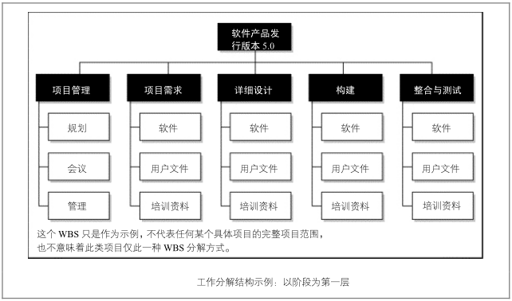
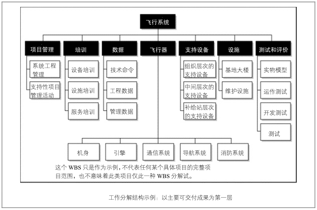

# WBS 介绍

## 免责声明

本人并非项目管理专家。本文内容全系自行领悟，各位读者自行分辨学习，如有因此误入歧途者，本人概不负责。

## 神马是 WBS

WBS，是 e 文 Work Breakdown Structure 的首字母缩写，中文为工作分解结构，是对项目工作进行分解，得到的较小、易管理的组成部分。我在以前的分享里提到过



这个分解工作是项目范围管理的重要一环，而分解工作的成果即 WBS 是项目管理多个领域的必要输入，例如，制定项目计划，申请项目资源，识别项目风险，都需要 WBS

## 项目范围是神马东东

那么，项目范围又是神马？简单的说，项目范围就是我该做什么和我不该做什么

一般来说，对于项目范围的管理，困难在于识别什么是不该做的并且敢于拒绝。

一个项目在实施过程中，经常会遇到需求变更的情况，如果所有的变更都无条件的接收，就很容易导致项目范围蔓延，项目计划也就不再准确，最终导致成本超支，质量下降，计划延误。

项目范围的蔓延，也有可能是项目团队有意为之，这可以被称之为“镀金”：项目团队有意识的做一些项目范围以外的工作，以讨好需求方。。。“镀金”的项目看上去 bling bling 的，却木有实际意义，反而增加了项目的风险

所以，识别什么该做什么不该做就很重要了，这有赖于准确的 WBS

## 怎么做出 WBS

### 依据

* 项目范围说明书
* 项目需求
* 过往的经验教训

### **方法**

将项目工作分解成工作包，而工作包则应该能够比较准确的估算出成本和时间

* 识别和分析项目成果及相关工作
* 确定 WBS 的结构及编排方法
* 自上而下逐层细化
* 为 WBS 的每一部分指定和分配编码
* 核实分解程度是充分必要的

如何进行分解？有多种形式，试举两例

* 项目阶段作为 WBS 的第一层，各阶段的成果作为第二层，如下图

* 主要成果作为第一层，如下图

### 注意

* 工作分解结构中的 _**工作**_ 一词，指的是经过努力取的成果，而非努力本身。可以这么理解：工作一定要有输出，没有输出的工作毫无意义
* 某些子项目可能是需要远期完成，一些信息目前尚不明确，当前无法进行分解
* 创建了 WBS 后，应从最底层将所有工作逐层向上汇总，来确保没有遗漏，也没有增加多余的工作
* 工作包的编码应能反映出其所属的层级

## WBS 的应用

### 制定工作计划

#### **定义活动**

制定工作计划第一步就是定义活动，而其依据就是 WBS

活动是神马：WBS 最底层是所谓的工作包，通常还应该细分为更小的组成部分，即活动——为完成工作包而必须开展的工作；注意，和工作的涵义相对应，活动就是活动，而非活动的成果

所以，这也提示了我们如何创建 WBS：WBS 最底层的工作包是成果，而活动则是为了获取该成果所要做的工作

#### **活动排序**

有的活动可以和其他活动并行执行，而有的活动依赖于其他活动完成，所以制定工作计划的第二步就是对活动进行排序

### 风险控制

项目风险控制的前提是识别出项目所有可能的风险，而 WBS 就是识别风险中的关键依据

