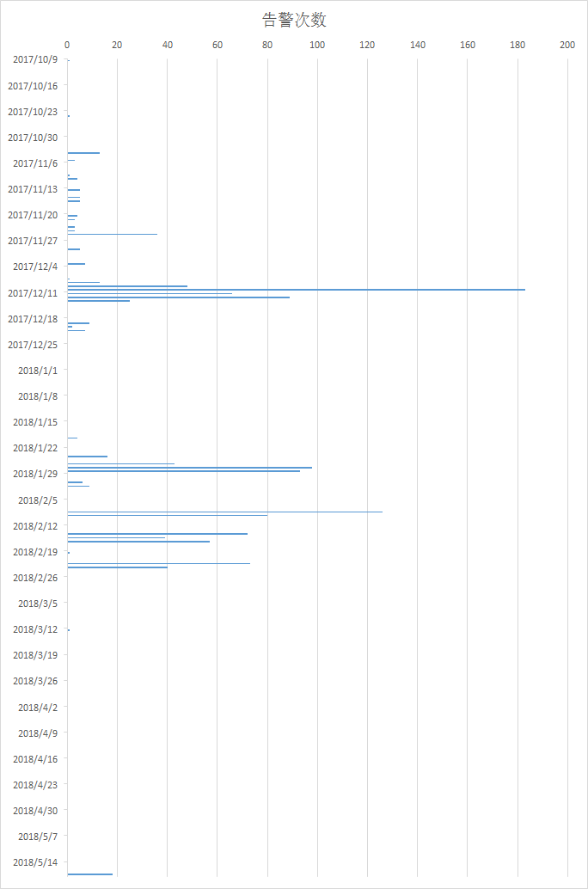
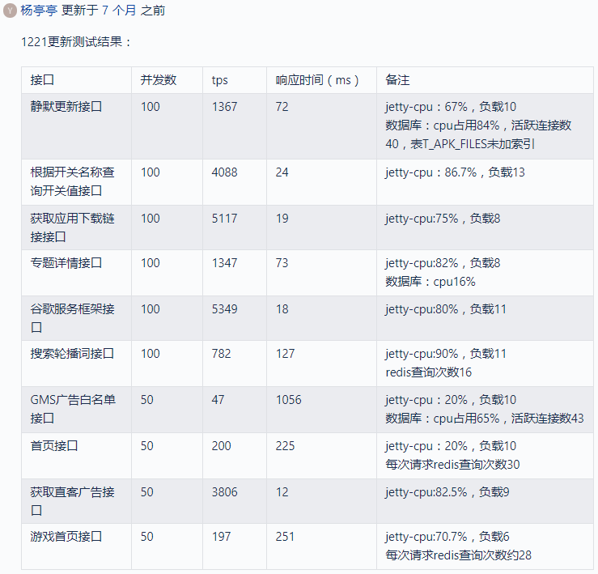
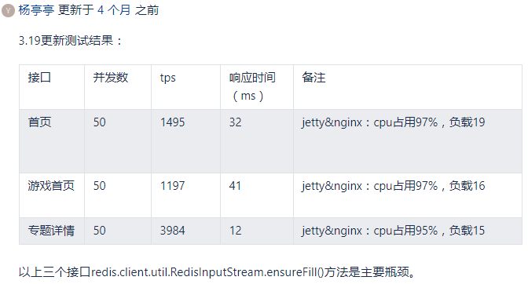
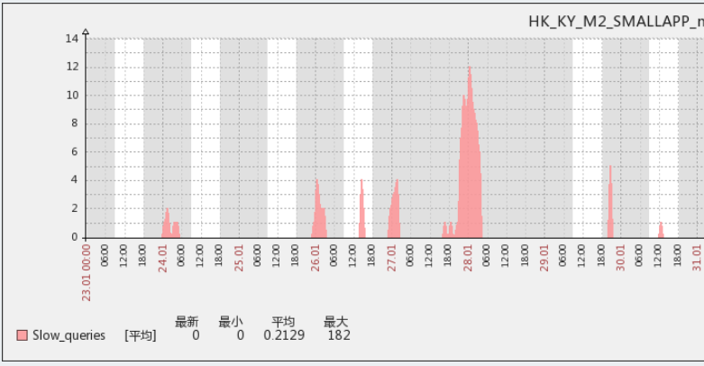
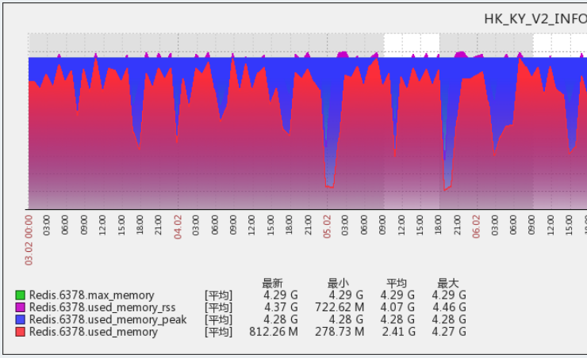
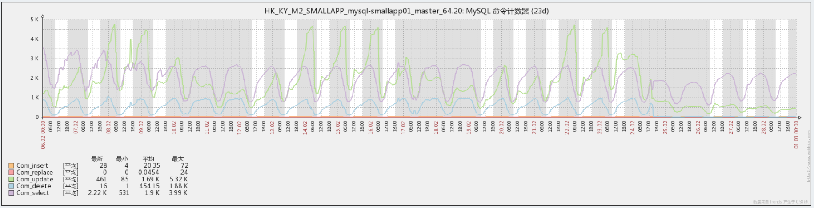

# 海外应用商店后台系统性能优化总结

## 背景

2017 年 2 月至 2018 年 6 月，我在海外业务部负责应用商店和浏览器后台的开发。

这里分享下应用商店后台的性能优化过程和经验总结

## 性能危机

先看下告警统计图（点击可以看大图）



这些告警主要有 2 类，如下

### 可用内存不足

```text
Item : Available Memory
Value : 159.36 MB
IP : 10.161.4.158
Host : GHK-KY-SE16-APPSTORE-INTL-4.158
Host Group: HK-HOTAPPS
Template: Meizu-System
Level : CRITICAL
Create Time: 2018.02.08 04:09:06
Device_Type: V10
```

### 虚拟内存占用过高

```text
Item : Swap used > 60
Value : 62.6 %
IP : 10.161.4.99
Host : GHK-KY-SE7-HOTAPPS-4.99
Host Group: HK-HOTAPPS
Template: Meizu-System
Level : CRITICAL
Create Time: 2018.02.09 05:32:31
Device_Type: V10
```

最后 2018 年 5 月 17 日的告警是磁盘空间不足，这是发布新版本时将日志级别设到了 debug 导致磁盘被日志文件写满，不属于性能问题，如下

```text
Item : Disk Used /
Value : 100 %
IP : 10.161.4.138
Host : GHK-KY-SE7-HOTAPPS-4.138
Host Group: HK-HOTAPPS
Template: Meizu-System
Level : CRITICAL
Create Time: 2018.05.17 11:27:11
Device_Type: V10
```

那么我们的服务器配置是怎样的呢？看下 V10 的物理配置

| 虚拟机模版 | V10 |
| :--- | :--- |
| 配置简述 | 4核，8G，20G系统盘（普通云盘）/100G数据盘（普通云盘） |
| 业务场景 | jetty/nginx/kiev/task/php/java/node/tomcat |
| 云盘类型 | 普通云盘 |
| 备注信息 | 业务虚拟机 |

## 优化思路

互联网后台从业者最头疼的大概就是这种性能问题了，一般来说性能问题是个系统性的问题，要追根溯源的话，至少要从设计阶段开始，对于一个有一定规模的业务系统，性能不足很难定位到某个确定的点。

最理想的情况当然是 jmap，jstack 之类的调优工具定位到代码中的某一行，不过在运维帮忙 dump 过几次内存快照、线程堆栈后，实在也是分析不出来到底是哪里有问题

性能优化没有银弹，我默默安慰自己

接下来我双管齐下

1. 临时方案
   1. 加机器
   2. 当系统可用内存持续下降到特定临界值时，linux 系统会强制杀死耗用内存的进程——也就是我们的 jetty，所以让运维同学写了个脚本，定时检查 jetty 服务器状态，如果服务器挂了就及时拉起来
   3. 修改线上 nginx 配置，临时禁止对特定的接口访问
2. 长期方案：全面优化
   1. 向测试部门提交压力测试申请，试图重现内存耗尽的场景
   2. 分析线上日志，找出性能不足和 pv 之间是否存在关联
   3. 分析线上日志，找出优化的目标
   4. 确定优化目标后，安排代码 review 和优化方案评审，通过评审以后进行版本开发和部署
   5. 对部分接口进行流控

## 优化

### 日志分析

日志分析的目的如下

* 告警和请求量/并发量之间是否存在关联
* 找出优化的目标
  * 按请求量排序，优先优化请求量大的接口
  * 按平均响应时间排序，优先优化响应慢的接口

日志分析的对象是 nginx 的 access log，如何分析可以参考



在分析日志时，我们犯了个错误，这直接导致我们的优化目标没有指向问题成因——就像绝大多数项目的失败都可以从需求阶段找到原因一样，性能问题的解决，最关键的步骤就是原因分析阶段。

### 加机器

分析过日志后，发现告警和日 pv 貌似存在一定的相关性，和运维同学沟通后，决定增加机器，从最初的 3 台服务器，加到 5 台，然后加到 8 台，最后在 18 年春节前加到了 11 台机器

11 台 V10 理论上能承载多大的 pv？我认为单个 V10 能比较轻松的应付 2000 万的 日 pv，那么我们的日 pv 达到了 2 亿以上吗？

我们实际的 pv 是多少呢？这个数据应该要保密的吧，不过我司海外的销量并不算很大，而在海外，应用商店的主流是 google play，我们的应用商店虽然是预装应用且不能卸载，但实际上很多用户都会自行安装 google play，所以我们的实际 pv 是远远低于 2 亿的。

现在回过头来看，加机器这种简单粗暴的办法，根本不能解决问题

春节放假前，为了能过一个不受打扰的春节，运维同学帮我们把机器从 8 台 加到了 11 台，结果呢？从除夕到年初三，每天晚上我的手机都被告警短信刷屏，做了这么多年互联网后台，系统在春节期间不能稳定运行这还是头一次~！春节后优化措施生效，我们分批回收了 6 台机器。实际上，我原先的计划是只保留 4 台机器，后来运维同学说今年申请加机器可能会更困难，让我多留几台机器，所以最终才留下了 5 台机器。

这也说明，性能问题不是简单的加机器可以解决的——如果机器的理论承载能力不能实际达到，那么只能从程序里找原因。

### 流控

另一方面，发现有个接口的 pv 巨大，占到了总 pv 的 70% 还多，这个接口是个应用更新信息接口，由客户端定时访问，功能是向客户端返回其已安装的应用是否存在新版本，并返回新版本的一些信息，诸如版本号，安装包大小，下载地址等

这个接口很难优化

* 平均每个用户安装的应用在 30——50 个之间，多的甚至有上百个，查询这些应用是否有最新版本的 SQL 语句很难优化
* 不同用户的安装列表不同，查询结果缓存后命中率很低
* 如果为每个用户的查询结果进行缓存，也比较困难
  * 内存占用太大
  * 用户的安装列表发生变化，或者应用信息发生更新，都会导致缓存数据的过期

为了解决问题，决定先对这个接口进行限流

* 让运维同学修改 nginx 配置，客户端访问这个接口时直接返回 200
* 修改 nginx 配置是临时方案，开发同学对这个接口进行流控，基本思路就是设定一个处理中的上限值，当上限值达到后，新的请求直接返回，示例如下

  ```java
      ......

      @Value("${appUpdate.maxSize}")
      private int                   maxSize;

      private final AtomicInteger   realSize  = new AtomicInteger(0);

      ......

      {
          int size = realSize.addAndGet(1);
          try {
              if (size <= maxSize) {
                  // 业务处理
                  ......
              } else {
                  // 直接返回
                  resultModel.setReturnCode(BaseCode.SUCCESS);
              }
          } catch (Exception e) {
              ......
          } finally {
              realSize.decrementAndGet();
          }
          return resultModel;
      }
  ```

后续又对其他几个接口进行了流控，流控的对象是用户无感的接口。不过流控并没有解决我们的性能危机——第一个流控版本发布后，系统消停了几天，正当我以为优化成功时，告警短信又不期而至了

### 压力测试

压力测试没有能重现内存耗尽的场景，但压力测试报告暴露了很多问题，指明了后续优化的方向，先看下第一期压测的报告，并未包括所有接口



这个报告的信息量还比较大

* 我们的 TPS 普遍低下，个别接口更是低到发指
* 个别接口的实现逻辑有很大问题，例如首页接口需要查询 30 次 redis
* 某些查询没有用到索引

### code review 和优化方案评审

基于日志分析的结果，后期还参考了压测报告，确定了一个要优化接口的清单，接下来的工作就是对每个接口重复以下工作

1. 对该接口的代码进行评审，找出其中的问题
2. 根据评审意见进行优化方案的设计
3. 优化方案评审
4. 代码实现

这里贴一下优化后的部分压测数据，虽然还是偏低，但对比最初的数据还是有比较大的提升的



### 利用 zabbix

虽然做了一些应该很有效果的工作，但是问题一直没有解决，告警来得还更猛烈了

这时候想起来公司 dba 团队有个 zabbix 监控系统，也许可以从中找到一点头绪。

从 zabbix 监控可以发现 2 个问题

1. 伴随告警的发生，几乎必然会有一个 sql 慢查询的峰值

   

2. redis 的内存占用率一直很高

   

慢查询日志之前也找 dba 拿过，例如前面提到的应用更新信息接口，就是慢查询的大头

这个 redis 的内存占用还是比较奇怪的，我 review 了一些预热缓存的 task，发现个问题

```sql
SELECT
    imei_sn_code
FROM
    INSTALLED_RECORD
GROUP BY imei_sn_code
```

这是一个预热用户已安装应用的 task，所有向客户端返回应用列表的接口，都需要用到这里的数据来过滤掉该用户已经安装过的应用。

一般来说预热工作是不应该预热全量数据的，冷门数据命中率较低，是不应该预热的，所以判断哪些数据是热数据其实很重要，一个方法是统计用户行为，只预热活跃用户的数据；当然，如果数据量不大，简单粗暴的全量预热也不失为一个办法

这个 sql 从用户安装记录表中查询出所有用户，问题是这个表是后台最大的一张表，数据量在亿级别~！怪不得 redis 内存占用一直居高不下

紧急发布了一个版本，果然 redis 的内存占用立马就降下来了，但是性能问题并没有解决——问题不在这里

### 最终找到问题

zabbix 除了看 mysql 慢查询，还有个很有用的图表，可以看命令执行计数



这个图里的 UPDATE 计数（绿色曲线）跟告警时间完美匹配，看来就是这个 update 在持续的引发告警

问题是这个 update 是神马业务？之前分析过 nginx 日志，除了个别访问量极小的接口，压根就没有哪个接口是需要做 update 操作的嘛

这时才发现，客户端有 3 个接口是用 https 协议调用的，这 3 个接口分别是应用安装、升级、卸载的上报。而之前分析 nginx 日志一直都忽略了 https 日志。

先要讲一下这个业务逻辑

* 当用户安装、卸载、升级（一个或多个）应用时，会触发客户端的上报
  * 即使用户的操作不是通过我们的应用商店进行的，我们的应用商店也能通过系统通知得到信息，然后触发上报
  * 也就是说，当一些超级应用（例如 facebook，youtube）升级时，会有一个上报的瞬时高峰
  * 这种峰值和我们的日活峰值完全没有对应关系
* 如果上报失败，客户端会在下一次发起全量上报，即上报该用户已安装的所有应用
  * 所谓下一次有 2 种场景
    * 用户打开应用商店
    * 下一次上报被触发

对这 3 个接口进行 review，问题也是多多，最主要的问题有 2 个

* 实现逻辑里有不必要的删除
  * 例如用户上报一次安装，后台会先从安装记录表删除安装记录后再做插入，实际上这个删除操作通常都是做无用功，这条记录根本就不存在；程序猿的思路大概是担心用户以前安装过该应用，但是卸载时没有上报或者上报了但是后台没有正常处理
* 不正确的使用事务
  * 用户上报是支持批量上报的，所以和全量上报实际上用的相同的代码，对于安装上报，后台处理逻辑是先删除后插入，这时用到事务倒也无可厚非。问题是后台代码在事务里还做了一件事——向大数据平台发送埋点数据，这个埋点数据的发送使用了公司的 RPC 服务化框架 kiev，这会导致数据库事务不能及时释放

关于数据库事务，要快进快出，这个以前也做过分享



针对 review 中发现的问题进行优化

* 不做删除，改为先 update，若 update 无效果再 insert
* 数据库事务提交以后，再发送埋点数据；后期取消了数据库事务
* 对这 3 个接口做流控

这个优化版本发布后，问题彻底解决，可以睡个好觉了

## 总结

### 告警原因


首先要说下我们的线上部署情况，最前端是 LVS 做负载均衡，LVS 后端的 RIP，是由该机器上的 nginx 反向代理给本机的 jetty——并不是一般意义上 nginx 做负载均衡的配置


告警原因当然是可用内存不足，达到了监控程序的阈值。那么可用内存为什么不足呢？

主要原因是部分业务接口响应太慢，而该接口上的请求却络绎不绝

线上机器的 jetty 工作线程配置是最大 1000 个，在业务高峰期，由于释放不及时，jetty 的工作线程会被这些慢请求全部占用

那么新来的请求会怎么办？这个我有空做个实验来验证下，暂时说下我的看法：新的请求 jetty 不会直接丢弃，而是进入一个排队队列，除非队列已满，或者进入排队以后超过了预期的等待时间，否则这个请求不会被丢弃

那么 nginx 相应的也要持有 jetty 正在处理和排队的请求，除非 nginx 等待 jetty 的应答超时

结果就是 jetty 和 nginx 同时持有大量请求等待处理，从而导致内存的大量被占用，直到监控程序发出告警

### 关于内存泄漏的题外话

想起来在上一家公司遇到过的内存泄漏事件，当时用的是 python 语言，服务器会在运行一段时间后突然卡死，有时候卡死一段时间能够恢复，有时候就只能重启了

查看卡死现场可以发现系统可用内存几乎为 0，确诊为内存泄漏

很久都找不到原因，后来才发现是 python 自身（或者是某个三方库）的 bug，忘记了是 dict 还是 list，删除元素后不会释放内存，时间一长，内存就被用完了

### 经验教训

* 分析日志一定不要漏掉 https 日志 如果一开始就分析过 ssl 日志，应用安装上报接口肯定会进入优化目标的前列——它又慢，访问量又够大，可以肯定的说问题会更早解决
* 压力测试很难复现线上的问题 在线数据库的表里有亿级别的数据，压测不会准备这么多数据；另外，线上环境下，大数据平台会发生 RPC 调用超时，但压测环境下很难模拟出来
* zabbix 要好好利用起来 很多时候改 bug 也好，解决性能瓶颈也好，难点就在找到头绪——zabbix 是一个找到头绪的工具
* 代码质量 在开发人员技能水平有限，经验不足的情况下，要多组织技术分享、代码 review
* 设计质量 很多代码确实实现了功能，但是实现逻辑简直没法看，这主要还是设计不良导致的

### 后续改进

#### 数据库分库

对于记录数上亿的表来说，最好的优化手段就是分库了

#### 业务逻辑优化

比如说那个应用更新信息接口，sql 也很难优化，缓存也很难命中，恐怕要从业务逻辑的优化上去找头绪了

<table>
  <thead>
    <tr>
      <th style="text-align:left">&#x5F53;&#x524D;&#x903B;&#x8F91;</th>
      <th style="text-align:left">&#x4F18;&#x5316;&#x540E;&#x903B;&#x8F91;</th>
    </tr>
  </thead>
  <tbody>
    <tr>
      <td style="text-align:left">&#x7528;&#x6237;&#x63D0;&#x4EA4;&#x5DF2;&#x5B89;&#x88C5;&#x5E94;&#x7528;&#x7684;&#x5305;&#x540D;&#xFF0C;&#x540E;&#x53F0;&#x8FD4;&#x56DE;&#x5176;&#x4E2D;&#x6709;&#x65B0;&#x7248;&#x672C;&#x7684;&#x5E94;&#x7528;&#x7684;&#x4FE1;&#x606F;&#xFF0C;&#x5305;&#x62EC;&#x65B0;&#x7684;&#x7248;&#x672C;&#x53F7;&#xFF0C;&#x5B89;&#x88C5;&#x5305;&#x5927;&#x5C0F;&#xFF0C;&#x4E0B;&#x8F7D;&#x5730;&#x5740;&#xFF0C;&#x7B49;&#x7B49;</td>
      <td
      style="text-align:left">
        <ol>
          <li>&#x7528;&#x6237;&#x63D0;&#x4EA4;&#x5DF2;&#x5B89;&#x88C5;&#x5E94;&#x7528;&#x7684;&#x5305;&#x540D;&#xFF0C;&#x540E;&#x53F0;&#x53EA;&#x8FD4;&#x56DE;&#x5176;&#x4E2D;&#x6709;&#x65B0;&#x7248;&#x672C;&#x7684;&#x5E94;&#x7528;&#x5305;&#x540D;</li>
          <li>&#x5BA2;&#x6237;&#x7AEF;&#x518D;&#x5206;&#x522B;&#x83B7;&#x53D6;&#x6BCF;&#x4E2A;&#x5E94;&#x7528;&#x65B0;&#x7248;&#x672C;&#x7684;&#x8BE6;&#x60C5;</li>
        </ol>
        </td>
    </tr>
    <tr>
      <td style="text-align:left">
        <ul>
          <li>&#x4F18;&#x70B9;&#xFF1A;&#x5BA2;&#x6237;&#x7AEF;&#x53EA;&#x9700;&#x8981;&#x4E00;&#x6B21;&#x8BF7;&#x6C42;</li>
          <li>&#x7F3A;&#x70B9;&#xFF1A;&#x670D;&#x52A1;&#x7AEF;&#x5F88;&#x96BE;&#x505A;&#x6027;&#x80FD;&#x4E0A;&#x7684;&#x4F18;&#x5316;</li>
        </ul>
      </td>
      <td style="text-align:left">
        <ul>
          <li>&#x4F18;&#x70B9;&#xFF1A;&#x670D;&#x52A1;&#x5668;&#x7AEF;&#x53EF;&#x4EE5;&#x4E3A;&#x6D3B;&#x8DC3;&#x7528;&#x6237;&#x7F13;&#x5B58;&#x6B65;&#x9AA4;
            1 &#x7684;&#x7ED3;&#x679C;
            <ul>
              <li>&#x82E5;&#x5BA2;&#x6237;&#x7AEF;&#x5B89;&#x88C5;&#x5217;&#x8868;&#x53D8;&#x5316;&#xFF0C;&#x670D;&#x52A1;&#x7AEF;&#x53EF;&#x4EE5;&#x5B9E;&#x65F6;&#x5237;&#x65B0;&#x7F13;&#x5B58;</li>
              <li>&#x82E5;&#x5E94;&#x7528;&#x6709;&#x66F4;&#x65B0;&#x7248;&#x672C;&#x53D1;&#x5E03;&#xFF0C;&#x7F13;&#x5B58;&#x4E0D;&#x4F1A;&#x8FC7;&#x671F;</li>
            </ul>
          </li>
          <li>&#x7F3A;&#x70B9;&#xFF1A;&#x5BA2;&#x6237;&#x7AEF;&#x9700;&#x8981;&#x4FEE;&#x6539;&#x5B9E;&#x73B0;&#x903B;&#x8F91;</li>
        </ul>
      </td>
    </tr>
  </tbody>
</table>

