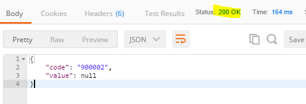
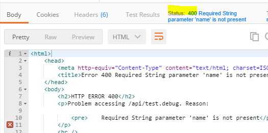
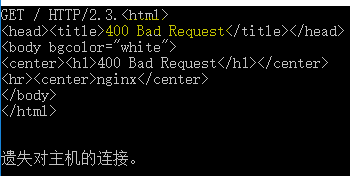
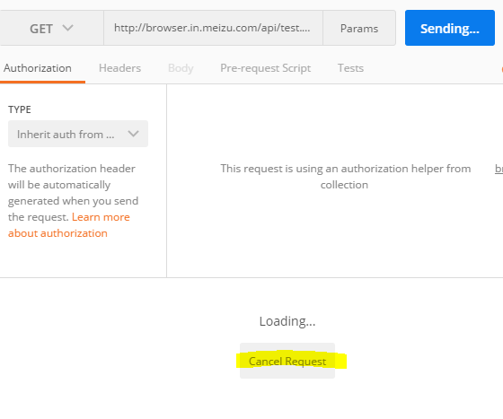
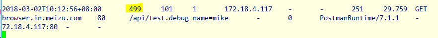
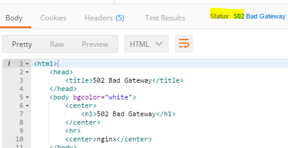
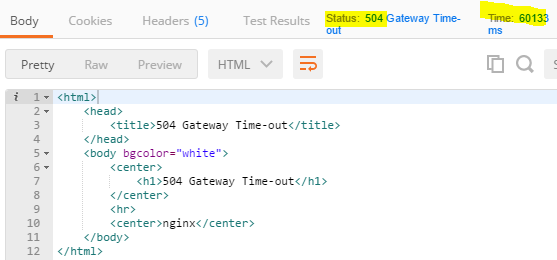
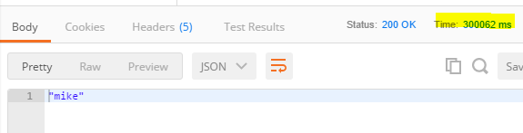

# HTTP 错误码学习

## 常见 http 错误码

服务器巡检时比较常见的 http 错误码

* 400 Bad Request 
* 408 Request Timeout
* 499 client has closed connection
* 502 Bad Gateway
* 504 Gateway Timeout

这些错误码反映了服务器什么样的状态，仅看字面意思还不太容易理解，就动手做个试验吧

## 试验环境

在 linux 主机 172.17.21.76 上运行 nginx，在本机\(windows 10\)上运行 jetty，linux 上的 nginx 反向代理到本机 jetty

## 试验工具

发送 http 请求主要采用 postman，也使用了 telnet 和 python 脚本

## 试验

### 400

错误的请求，比如必须的参数未传递，那么我们来试下

```java
@Controller
@RequestMapping("/api/")
public class TestController {

    @ResponseBody
    @RequestMapping("test.debug")
    public String test(@RequestParam(required = true) String name) {
        return name;
    }

}
```

可以看到 name 参数是必须的，那么不带参数调用一下

```text
http://browser.in.meizu.com/api/test.debug
```

返回 200，如下



怎么返回了 200 而不是预期的 400呢？经过一番检查，原来是有个异常处理程序捕捉到了参数未传递的异常并进行了处理，如下

```java
@Component
public class ExceptionHandler implements HandlerExceptionResolver {

    private static final Logger log = Logger.getLogger(ExceptionHandler.class);


    @Override
    public ModelAndView resolveException(HttpServletRequest request, HttpServletResponse response,
                                         Object handler, Exception ex) {
        response.setContentType("application/json; charset=UTF-8");
        String code = null;
        String message = null;
        if (ex instanceof BizException) {
            BizException exception = (BizException) ex;
            message = exception.getMessage();
            code = Integer.toString(exception.getErrorCode());
        } else if (ex instanceof MissingServletRequestParameterException) {
            code = "900002";
            message = ex.getMessage();
            log.error(message);
        } else {
            code = "403";
            message = ex.getMessage();
            log.error(ex, ex);
        }

        ModelAndView mav = new ModelAndView("error");
        mav.addObject("code", code);
        mav.addObject("message", message);
        mav.addObject("value", message);
        return mav;
    }

}
```

禁用该异常处理以后，重新试验返回了 400，如下



此外，胡乱的发送数据给 nginx 服务器而不按 http 协议规范组织数据，也会得到 400 的返回码，可以用 telnet 试验一下，如下图



在用 telnet 给 nginx 发送数据时，输入 `"HTTP/2.3."`，由于 2.3. 是不存在的版本，nginx 当即返回了 400 错误码

### 408

请求超时，nginx 在规定的时间内无法获取到客户端的请求

这个错误码很奇怪，根据该错误码的含义，使用 telnet 和 python 进行模拟，但无法使 nginx 返回 408 错误码......试验失败了

另外，查看 nginx 日志，发现返回 408 错误码的日志，实际上请求都已经转发给 jetty 并且 jetty 也返回了 200 响应码，如下

```text
2018-03-02T00:00:01+00:00 408 166679257 1 157.37.132.68 - - 10609 0.337 POST HTTP/1.1 hotapps.in.meizu.com 80 /c/oversea/hotapp/appUpdate - - 80 okhttp/3.8.0 - - 127.0.0.1:8080 200 0.007
2018-03-02T00:00:01+00:00 408 166679274 1 103.197.105.253 - - 7328 0.014 POST HTTP/1.1 hotapps.in.meizu.com 80 /c/oversea/hotapp/appUpdate - - 80 okhttp/3.8.0 - - 127.0.0.1:8080 200 0.005
2018-03-02T00:00:01+00:00 408 166679278 1 120.188.35.161 - - 3755 0.034 POST HTTP/1.1 hotapps.in.meizu.com 80 /c/oversea/hotapp/appUpdate - - 758 okhttp/3.8.0 - - 127.0.0.1:8080 200 0.003
2018-03-02T00:00:01+00:00 408 166679282 1 212.90.61.45 - - 4807 0.006 POST HTTP/1.1 hotapps.in.meizu.com 80 /c/oversea/hotapp/appUpdate - - 80 okhttp/3.8.0 - - 127.0.0.1:8080 200 0.003
2018-03-02T00:00:01+00:00 408 166679269 1 94.231.21.3 - - 5324 0.088 POST HTTP/1.1 hotapps.in.meizu.com 80 /c/oversea/hotapp/appUpdate - - 80 okhttp/3.8.0 - - 127.0.0.1:8080 200 0.003
```

所以，这个错误码目前还无法解释

### 499

在 nginx 返回结果之前，客户端断开了连接，nginx 会记录 499 错误码到日志，要重现这个错误码，只需要让接口等待一段比较长的时间，并在请求端主动断开即可，如下

```java
@Controller
@RequestMapping("/api/")
public class TestController {

    @ResponseBody
    @RequestMapping("test.debug")
    public String test(@RequestParam(required = true) String name) {
        try {
            Thread.sleep(300 * 1000);
        } catch (InterruptedException e) {
        }
        return name;
    }
}
```

在 postman 里发起请求，并在等待的过程中点击 cancel 按钮



这时 postman 没有任何返回，但是查看 nginx 的日志，会发现一条 499 的记录，如下



### 502

这个比较好理解，jetty 服务挂了或者没有启动，我们停掉 jetty 就可以得到这个错误码，如下



### 504

这是 jetty 响应超时了，我们让接口等待 300 秒后返回，来测试一下

```java
@Controller
@RequestMapping("/api/")
public class TestController {

    @ResponseBody
    @RequestMapping("test.debug")
    public String test(@RequestParam(required = true) String name) {
        try {
            Thread.sleep(300 * 1000);
        } catch (InterruptedException e) {
        }
        return name;
    }
}
```

可以看到在60秒\(准确的说，60133 ms\)以后，nginx 返回了 504



这是因为 nginx 默认等待 jetty 60 秒，时间到了 jetty 没有响应 nginx 就会自行返回 504；如果想要 nginx 多等一段时间，可以如下配置

```text
proxy_read_timeout 6m;
```

现在再试一下



可以看到，经过 300 秒（300062 ms）的漫长等待，我们得到了 jetty 的响应

## 结论

| 错误码 | 产生原因 | 解决办法 |
| :--- | :--- | :--- |
| 400 | 客户端请求数据格式不对，不符合接口规范 | 和客户端沟通，要求客户端修复；服务端进行容错处理 |
| 408 | 不知道 | 继续研究 |
| 499 | 由于服务器处理太慢，客户端在规定的时间内未接收到响应，主动断开连接；客户端网络被断开了，在移动互联网环境下这还是比较常见的，例如用户移动到 WIFI 覆盖区域以外 | 服务端性能优化；客户端需要稳定高速的网络环境 |
| 502 | 服务器宕机 | 重启服务器 |
| 504 | 服务端响应太慢了 | 优化性能 |


