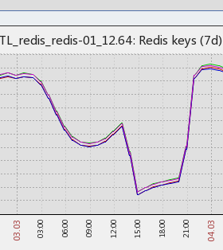
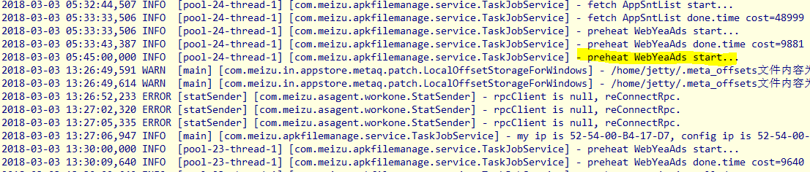
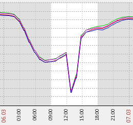
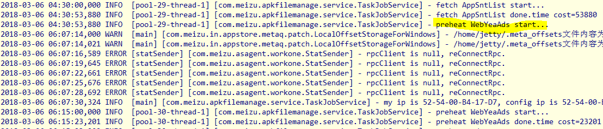
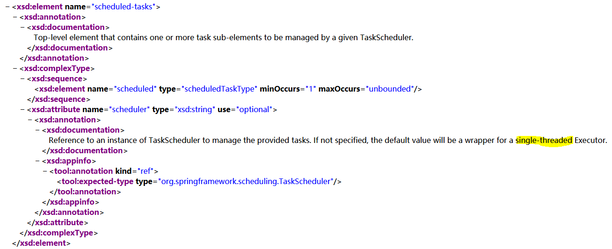

# Spring Task 卡死研究

## 故障现象

### 第一次

3月3日中午收到告警

```text
项目描述:海外应用商店接口[发送时间:2018-03-03 13:08:49]

告警IP:hotapps.in.meizu.com
监控内容
HTTPConnectionPool(host='hotapps.in.meizu.com', port=80): Max retries exceeded with url: /c/oversea/hotapp/switchKey?keyName=gms (Caused by ConnectTimeoutError(, 'Connection to hotapps.in.meizu.com timed out. (connect timeout=30)'))
```

监控平台会定时调用业务接口，根据返回结果来判断业务接口是否正常。这个告警信息显示连接超时，有以下几种可能

* nginx 服务挂了
* nginx 服务没有挂，但非常的慢，导致不能及时和对端完成创建连接的 3 次握手
* 在连接过程中，网络异常：例如网络抖动，网络断开

由于之后一直没有收到告警，判断是网络抖动，没有太关注，直到晚上查看 zabbix，如下图



可以看到 13 点左右 redis 里的 key 数量迅速降低，判断是预热 redis 缓存的 task 没有正常执行，由于我们预热 redis 的 task 主要运行在 138 上，怀疑 138 挂了；但是没有接到更多的告警信息又不支持这个判断，此时是周末，无法远程到 138 上查看日志，为了保险，大概在 21 点左右，远程重启了 138，可以看到 redis 的 key 数量此后逐渐上升

之后查看 138 上的 jetty 日志，如下



task 启动和结束都会打印日志，但是可以看到 13 点 45 分以后就没有日志了（机房时区为 UTC，和北京时间相差 8 小时），直到晚上 21点26分 重启以后才能正常输出日志

### 第二次

时间是3月6日中午，查看 zabbix 发现异常，如下图



一般来说， redis 的 key 数量变动曲线应该是平滑的，这样直线式下降，基本意味着预热 redis 的 task 没有正常执行，查看 jetty 日志验证一下



从日志可以看出来，12 点 30 以后就没有 task 能启动了

## 分析

这 2 次 task 卡死前最后一条日志，都是

```text
preheat WebYeaAds start...
```

WebYeaAds task 通过 http 请求从 webeye 拉取广告列表，更新数据库里的广告信息并刷新 redis 缓存。从日志来看，该 task 正常启动了，但无法结束，结合第一次卡死时有网络抖动的情况，感觉和网络相关，判断是请求 webeye 数据时，http 请求没有设置超时造成的：即程序一直在等待 webeye 返回广告信息。但是为什么这个 task 无法结束会造成整个 task 体系卡死呢？

百度了一下 `"spring task 卡死"`，发现这种情况并不罕见，而且基本都认为是 http 请求未设置超时时间造成的——实际上这是表面原因，并不是本质原因，后面会提到

## 验证

可以简单做个试验来证实一下，http 请求是否能卡死 task

```markup
<!-- 创建 2 个 task： test1,test2 -->
<task:scheduled-tasks>
    <task:scheduled ref="taskJobService" method="test1" cron="0 0/1 * * * ?"/>
    <task:scheduled ref="taskJobService" method="test2" cron="0 0/2 * * * ?"/>
</task:scheduled-tasks>
```

task 代码如下，需要注意的是 HttpClientUtil.httpGet\(\) 方法是没有设置 http 请求超时的

```java
public void test1() {
    logger.info("test1...done");
}

public void test2() {
    logger.info("test2...");
    HttpClientUtil.httpGet("http://browser.in.meizu.com:8080/api/test.debug?name=mike", null);
    logger.info("test2...done");
}
```

test.debug 接口代码如下

```java
@Controller
@RequestMapping("/api/")
public class TestController {

    @ResponseBody
    @RequestMapping("test.debug")
    public String test(@RequestParam(required = true) String name) {
        return name;
    }
}
```

### 立即返回

启动程序后，可以看到日志持续输出

```text
[11:24:00] [INFO ] - test1...done
[11:24:00] [INFO ] - test2...
[11:24:00] [INFO ] - test2...done
[11:25:00] [INFO ] - test1...done
[11:26:00] [INFO ] - test1...done
[11:26:00] [INFO ] - test2...
[11:26:00] [INFO ] - test2...done
[11:27:00] [INFO ] - test1...done
[11:28:00] [INFO ] - test2...
[11:28:00] [INFO ] - test2...done
[11:28:00] [INFO ] - test1...done
```

### 休眠 3 分钟 v1

如果让 test.debug 休眠 3 分钟，task 会怎么进行呢

```java
@Controller
@RequestMapping("/api/")
public class TestController {

    @ResponseBody
    @RequestMapping("test.debug")
    public String test(@RequestParam(required = true) String name) {
        try {
            Thread.sleep(180*1000);
        } catch (InterruptedException e) {
        }
        return name;
    }
}
```

日志输出

```text
[15:15:00] [INFO ] - test1...done
[15:16:00] [INFO ] - test1...done
[15:16:00] [INFO ] - test2...
[15:19:00] [INFO ] - test2...done
[15:19:00] [INFO ] - test1...done
[15:20:00] [INFO ] - test2...
[15:23:00] [INFO ] - test2...done
[15:23:00] [INFO ] - test1...done
```

这个日志很有意思，值得分析一下

* test1 仅在15，19，23分时执行了，按配置应该是每分钟执行
* test2 仅在16，20分执行了，按配置应该是每2分钟执行

初步的结论是：task 的执行是顺序的，一个 task 不执行完，其他 task 到时间了也不能执行

那么，是不是因为其中有个 task 是 http 请求才会导致这种结果呢？再试一下

### 休眠 3 分钟 v2

这次直接让 test2 休眠 3 分钟，代码如下

```java
public void test2() {
    logger.info("test2...");
    try {
        Thread.sleep(180*1000);
    } catch (InterruptedException e) {
    }
    logger.info("test2...done");
}
```

日志输出

```text
[15:30:00] [INFO ] - test2...
[15:33:00] [INFO ] - test2...done
[15:33:00] [INFO ] - test1...done
[15:34:00] [INFO ] - test2...
[15:37:00] [INFO ] - test2...done
[15:37:00] [INFO ] - test1...done
[15:38:00] [INFO ] - test2...
```

这很明显了，task 们是串行的，和 task 是在执行什么任务无关。如果多个 task 要在同一时刻执行，究竟谁先执行，谁后执行，那恐怕要看天意了......

### 单线程验证

理论上来说，task 应该是多线程并行的，但 spring task 框架的表现却是单线程的，接下来在日志里打印出线程信息看下，为了测试方便，就不做休眠了。日志输出如下

```text
[15:48:00] [INFO ] [pool-31-thread-1]- test2...
[15:48:00] [INFO ] [pool-31-thread-1]- test2...done
[15:48:00] [INFO ] [pool-31-thread-1]- test1...done
[15:49:00] [INFO ] [pool-31-thread-1]- test1...done
[15:50:00] [INFO ] [pool-31-thread-1]- test1...done
[15:50:00] [INFO ] [pool-31-thread-1]- test2...
[15:50:00] [INFO ] [pool-31-thread-1]- test2...done
[15:51:00] [INFO ] [pool-31-thread-1]- test1...done
```

还真是单线程~！

## 多线程配置

为毛 spring task 框架使用单线程呢？明明配置了线程池啊

```markup
<?xml version="1.0" encoding="UTF-8"?>
<beans xmlns="http://www.springframework.org/schema/beans"
    xmlns:task="http://www.springframework.org/schema/task" xmlns:xsi="http://www.w3.org/2001/XMLSchema-instance"
    xsi:schemaLocation="http://www.springframework.org/schema/beans 
    http://www.springframework.org/schema/beans/spring-beans-4.0.xsd
    http://www.springframework.org/schema/task 
    http://www.springframework.org/schema/task/spring-task-4.0.xsd">

    <task:scheduler id="scheduler" pool-size="5" />
    <task:annotation-driven executor="executor"
        scheduler="scheduler" />
</beans>
```

看下 [官方文档](http://www.springframework.org/schema/task/spring-task-3.0.xsd) 怎么说



文档说得很清楚，scheduled-tasks 节点的 scheduler 属性如果未指定，则使用一个单线程的执行器，所以我们修改一下配置文件，如下

```markup
<!-- 创建 2 个 task： test1,test2 -->
<task:scheduled-tasks scheduler="scheduler">
    <task:scheduled ref="taskJobService" method="test1" cron="0 0/1 * * * ?"/>
    <task:scheduled ref="taskJobService" method="test2" cron="0 0/2 * * * ?"/>
</task:scheduled-tasks>
```

### 多线程验证

采用休眠 3 分钟的 v1 版本，输出如下

```text
[16:47:00] [INFO ] [scheduler-5]- test1...done
[16:48:00] [INFO ] [scheduler-5]- test1...done
[16:48:00] [INFO ] [scheduler-3]- test2...
[16:49:00] [INFO ] [scheduler-5]- test1...done
[16:50:00] [INFO ] [scheduler-5]- test1...done
[16:51:00] [INFO ] [scheduler-2]- test1...done
[16:51:00] [INFO ] [scheduler-3]- test2...done
[16:52:00] [INFO ] [scheduler-4]- test1...done
[16:52:00] [INFO ] [scheduler-2]- test2...
[16:53:00] [INFO ] [scheduler-4]- test1...done
```

可以看到

* task 是多线程执行的
* 不同的 task 是并行的
* 同一个 task 是串行的

## 结论

上述 2 次 task 卡死的原因有 2 个

* task 被配置为单线程模式
* http 请求未设置超时时间

事实上卡死的说法并不完全正确，实际情况是用于执行 task 的线程无法释放，导致其他 task 被阻塞，这时 jetty 本身是正常的，客户端调用接口不受影响

应该认识到，就算是配置为多线程，依然是存在线程全部被占用无法释放的可能性的

## 思考

用注解的话，是多线程还是单线程呢？

