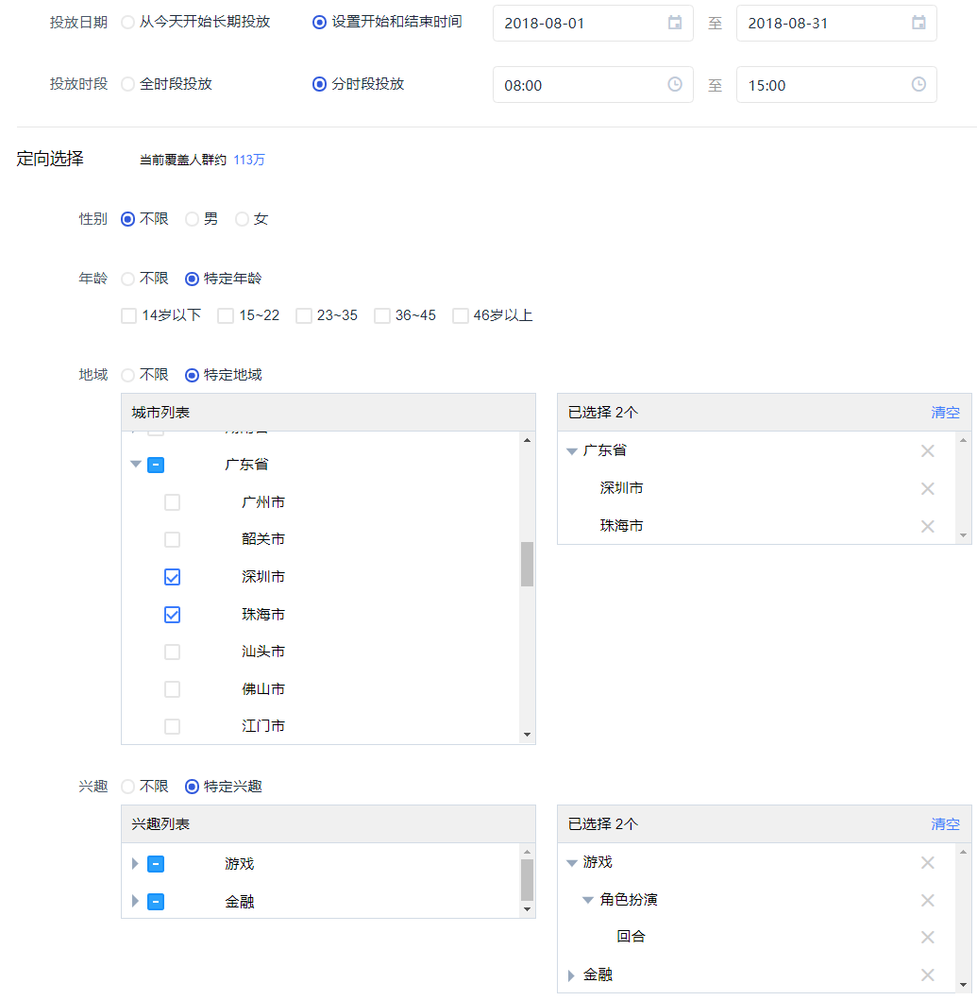
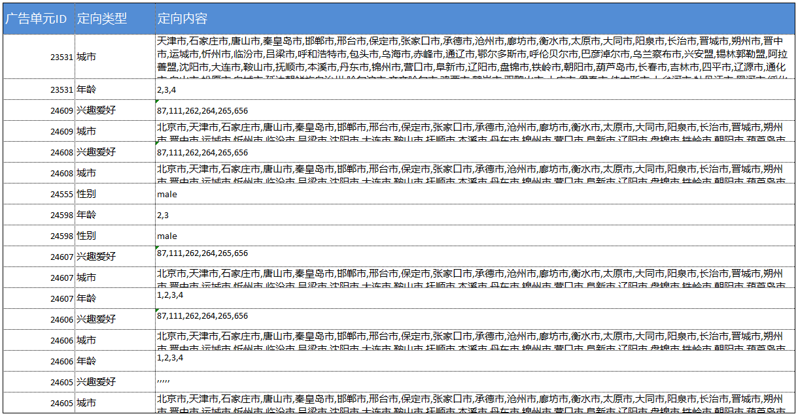

# 用倒排索引构建本地缓存

## 背景

最近在做竞价广告业务，在为用户匹配广告的过程里，有一个定向的步骤，所谓定向是什么意思呢？直接看图吧（点击可看大图）



现在解释一下定向：向特定的用户投放广告就是定向广告，例如上图里可以选择用户的性别、年龄、城市、兴趣作为定向条件进行广告的投放

截图里为什么还包括了投放日期和投放时段的选择呢？主要是因为目前的业务逻辑把这 2 个条件也作为定向逻辑的一部分了，我认为这是不太合理的，所以我打算重构一下，把目前的定向逻辑拆分为 2 部分

1. 广告有效期匹配
2. 广告定向匹配

## 数据模型

考虑一下，上图所示的广告业务的数据模型怎么搭建？或者说，数据库表结构是怎样的？

如果让我来设计的话，我会搞出一个主从关系出来

```text
主表是广告信息表，每一个定向类型都可以建一个从表

也许你觉得性别可以不用建从表：因为用户的性别是单选的——男或女
不过考虑到未来社会对跨性别者的宽容，我相信我们的投放界面会有更多的性别选项，且可以复选
（强行政治正确一把）
```

在这个基础上，可以简化

```text
主表是广告信息表，所有定向条件都保存在同一个表里，通过一个定向类型字段来区分定向条件
```

这样，就和我们现在的表结构基本一致了，即

| 表名 | 说明 |
| :--- | :--- |
| unit | 广告单元信息表 |
| unit\_targeting | 广告单元定向信息表 |

下图展示了部分定向信息



## 定向匹配

假设所有广告都限定了投放城市，现在有个用户来自北京，要返回相应的广告，该怎么做？

### 初级

```sql
select unit_id from unit_targeting where type='城市定向' and content like '%北京%'
```

相信很多初级程序猿是这么做的，在互联网业务高并发的冲击下，这样做会导致性能瓶颈

### 中级

```java
// 先一次性把所有定向条件加载到内存
List<UnitTargeting> targetings = unitTargetingDao.listAll();

......

// 遍历所有定向条件，找出城市类且包含北京的
List<Long> matchs = new LinkedList<>();
for (UnitTargeting targeting : targetings) {
	if (targeting.type == "城市定向" && targeting.content.contains("北京") {
		matchs.add(targeting.id);
	}
}
return matchs;
```

这样操作已经属于比较有点经验和想法的程序猿了，知道数据库操作是互联网后台最大的性能隐患，通过本地缓存来做匹配

### 高级

介绍一种比较高级的本地缓存实现，就是利用倒排索引：即为每个定向选项创建一个单元 id 的列表，示例如下

```java
Map<String, Set<Long>> map = new HashMap<>();

// 创建倒排索引
......
map.put("北京", [1, 2, 3, ...]);
map.put("天津", [7, 8, 9, ...]);
......

// 进行匹配
String target = "北京";
Set<Long> matchs = map.get("北京");
```

在倒排索引建好以后，获取符合某个定向条件的所有广告只需要在 map 里进行 `get()` 操作，这样的性能要远远优于上面的中级方案

贴一段代码供参考

```java
public class UnitInvertedIndexerImpl implements UnitInvertedIndexer {

    private Map<String, Set<Long>> cache = new HashMap<String, Set<Long>>();


    @Override
    public Set<Long> search(String keyword) {
        return cache.get(keyword);
    }


    @Override
    public UnitInvertedIndexer buildIndex(List<AdUnitTargeting> targetings) {
        Map<String, Set<Long>> map = new HashMap<String, Set<Long>>();

        for (AdUnitTargeting targeting : targetings) {
            Set<String> tokens = participle(targeting.getContent());
            if (tokens != null && tokens.size() > 0) {
                for (String token : tokens) {
                    Set<Long> ids = map.get(token);
                    if (ids == null) {
                        ids = new HashSet<Long>();
                        map.put(token, ids);
                    }
                    ids.add(targeting.getUnitId());
                }
            }
        }

        cache = map;

        return this;
    }


    /**
     * <pre>
     * 对定向内容进行分词，得到单个的定向条件，子类可以重写该方法
     * 
     * 默认的分词方法是逗号分隔
     * </pre>
     */
    Set<String> participle(String document) {
        StringTokenizer tokenizer = new StringTokenizer(document, ",");
        Set<String> tokens = new HashSet<>(tokenizer.countTokens());
        while (tokenizer.hasMoreTokens()) {
            tokens.add(tokenizer.nextToken());
        }
        return tokens;
    }

}
```

