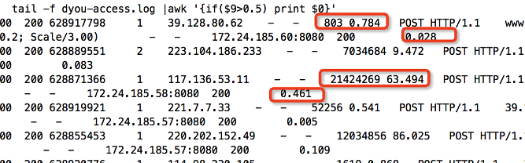

# 从 request\_time 联想到 HTTP 408 错误码

## 背景

之前研究过一番 http 错误码



其中，对 408 错误码未得到有价值的结论，留下了一肚子疑问；最近朋友遇到个奇怪现象，我又对 408 进行了一番研究

## 奇怪现象

先看下图



朋友的原话是

> nginx 的耗时要比反向代理的多的多
>
> 有什么想法

我的第一反应是用户提交数据量太大，例如上传视频，这样 ng 接收上传数据需要大量时间，而后端 jetty/tomcat 的处理仅仅是数据库操作，这样很符合上图 ng 耗时 60 多秒而后端耗时 460 多毫秒的现象

但朋友表示还有其他可能

> 很多请求都是点个赞, 打开视频把播放次数 +1
>
> 这客户端应该不会耗时的

我研究了一下 `$request_time` 这个 ng 内嵌变量，其说明如下

> `$request_time`
>
> request processing time in seconds with a milliseconds resolution \(1.3.9, 1.2.6\); time elapsed since the first bytes were read from the client

那么我觉得可以得出以下公式

```bash
$request_time = 接收数据时间 + $upstream_response_time + 发送数据时间
```

 现在的情况是 `$request_time >> $upstream_response_time`，那么问题肯定是出在 `接收数据`或`发送数据`阶段

## 分析

* 发送数据，是发送到本地缓冲区，还是发送到客户端并接收到 `ACK`？先假定是发送到本地缓冲区吧，那么发送数据时间基本是可以忽略的
* 当用户操作是上传大文件时，接收数据肯定是比较耗时的
* 当用户网速较慢时，接收数据肯定也是比较耗时的

那么朋友的这个日志体现出的 `nginx 的耗时要比反向代理的多的多` 的现象，也就有了解释：用户正处于慢网络（例如 2G 网络）中

## HTTP 408

说到这里，再回头看 `408` 错误码

之前一直认为 `408` 是在 `接收数据` 阶段发生的，但是现在我觉得应该是在整个 `request` 阶段发生，即还应该包括 `$upstream_response_time` 和 `发送数据` 阶段，只有这样才能解释下面的日志

```text
2018-03-02T00:00:01+00:00 408 166679257 1 157.37.132.68 - - 10609 0.337 POST HTTP/1.1 hotapps.in.meizu.com 80 /c/oversea/hotapp/appUpdate - - 80 okhttp/3.8.0 - - 127.0.0.1:8080 200 0.007
2018-03-02T00:00:01+00:00 408 166679274 1 103.197.105.253 - - 7328 0.014 POST HTTP/1.1 hotapps.in.meizu.com 80 /c/oversea/hotapp/appUpdate - - 80 okhttp/3.8.0 - - 127.0.0.1:8080 200 0.005
2018-03-02T00:00:01+00:00 408 166679278 1 120.188.35.161 - - 3755 0.034 POST HTTP/1.1 hotapps.in.meizu.com 80 /c/oversea/hotapp/appUpdate - - 758 okhttp/3.8.0 - - 127.0.0.1:8080 200 0.003
2018-03-02T00:00:01+00:00 408 166679282 1 212.90.61.45 - - 4807 0.006 POST HTTP/1.1 hotapps.in.meizu.com 80 /c/oversea/hotapp/appUpdate - - 80 okhttp/3.8.0 - - 127.0.0.1:8080 200 0.003
2018-03-02T00:00:01+00:00 408 166679269 1 94.231.21.3 - - 5324 0.088 POST HTTP/1.1 hotapps.in.meizu.com 80 /c/oversea/hotapp/appUpdate - - 80 okhttp/3.8.0 - - 127.0.0.1:8080 200 0.003
```

那就是这个 `408` 其实是在发送数据期间发生的，其原因大概是

* 要向客户端发送的数据量太大
* 如果发送数据是发送到客户端的话，那么客户端的网速太慢

基于上述针对这个日志的分析，我有了以下的结论

* `发送数据` 应该是将数据发送到客户端而不仅仅是发送到本地缓冲区；所谓接收数据超时导致 `408` 的说法应该是**错误**的，或者说 ng 并没有这样来实现


