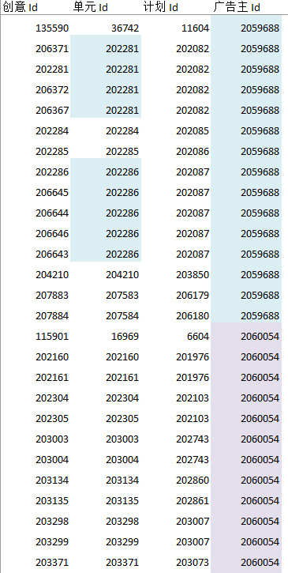
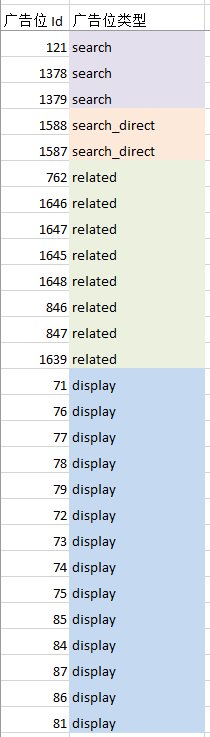

# 动态常量池

## 背景

先看 2 张图

| 广告创意 | 广告位类型 |
| :---: | :---: |
|  |  |

这样的数据结构在我们的程序里大量存在：除了主键以外，其他字段，尤其是外键，存在大量的重复值。

以上图的广告位类型为例，如果从数据库里查询出各个广告位的类型，并缓存起来，随着广告位数量的增多，会浪费大量的内存

## String.intern\(\)

关于 `String.intern()` 就不赘述了，很适合这种需要缓存大量重复值的场景，对于上面的广告位类型，可以如下优化内存的占用

```java
public final class SlotAlgorithmType {

    private Integer slotId;
    private String  algType;
    ......
}


    @Test
    public void test() {
        List<SlotAlgorithmType> list = slotAlgorithmTypeMapper.listAll();
        Map<Integer, SlotAlgorithmType> map = Maps.newHashMapWithExpectedSize(list.size());
        for (SlotAlgorithmType type : list) {
            // 常量化
            type.setAlgType(type.getAlgType().intern());
            map.put(type.getSlotId(), type);
        }
    }
```

## 动态常量池

一方面，仅 `String` 提供了 `intern` 这样的方法，其他类型并没有获得原生的常量池支持；但是，即使是 `int`，`long` 这样的原始类型，如果要用做缓存 key 的话，也是要包装成对象的，就如上图里的广告创意一样，其单元 Id，计划 Id，广告主 Id 也存在大量的重复值

另一方面，对于原生的常量池，并无法有效的控制，比如想要清理常量池里的常量；或者对于常量池的大小进行限制

这样就有必要设计一个通用的常量池了。对此，guava 里倒是有一个现成的实现：`Interners`；当然，guava 的这个实现也有点粗糙，利用 guava 的 `LoadingCache`，实现一个可控的常量池

```java
public final class ConstantPool {

    private ConstantPool() {
    }

    private static final LoadingCache<String, String>   STRING_CACHE  = CacheBuilder.newBuilder().initialCapacity(512)
            .expireAfterAccess(24, TimeUnit.HOURS).build(new CacheLoader<String, String>() {
                                                                                  @Override
                                                                                  public String load(String key) {
                                                                                      return key;
                                                                                  }
                                                                              });

    private static final LoadingCache<Long, Long>       LONG_CACHE    = CacheBuilder.newBuilder().initialCapacity(512)
            .expireAfterAccess(24, TimeUnit.HOURS).build(new CacheLoader<Long, Long>() {
                                                                                  @Override
                                                                                  public Long load(Long key) {
                                                                                      return key;
                                                                                  }
                                                                              });

    private static final LoadingCache<Integer, Integer> INTEGER_CACHE = CacheBuilder.newBuilder().initialCapacity(512)
            .expireAfterAccess(24, TimeUnit.HOURS).build(new CacheLoader<Integer, Integer>() {
                                                                                  @Override
                                                                                  public Integer load(Integer key) {
                                                                                      return key;
                                                                                  }
                                                                              });


    public static final Integer cint(Integer key) {
        return key == null ? null : INTEGER_CACHE.getUnchecked(key);
    }


    public static final Long clong(Long key) {
        return key == null ? null : LONG_CACHE.getUnchecked(key);
    }


    public static final String cstr(String key) {
        return key == null ? null : STRING_CACHE.getUnchecked(key);
    }
}

```

可以自由控制常量池的大小和常量的过期时间

如此，就可以对创意里重复的单元/计划/广告主 Id 进行常量化

```java
import static ConstantPool.cint;
public final class Advertising {

    ......

    /** 属性优化 **/
    public void optimize() {
        ideaId = cint(ideaId);
        unitId = cint(unitId);
        planId = cint(planId);
        userId = cint(userId);
    }
}

    @Test
    public void test() {
        List<Advertising> list = advertisingMapper.listAll();
        Map<Integer, Advertising> map = Maps.newHashMapWithExpectedSize(list.size());
        for (Advertising advertising : list) {
            advertising.optimize();
            map.put(advertising.getIdeaId(), advertising);
        }
    }
```

## 总结

什么情况用到动态常量池呢？

* 需要缓存对象的场景，这些被缓存的对象可能是从数据库里查询得来的，或者是从一些第三方接口获取的
* 被缓存的对象，某些属性有大量的重复值；例如，上面例子里的广告位类型字段
* 或者，某个属性在多个被缓存的对象里存在；例如，创意 Id 本身几乎不会重复，但是有多个场合都需要用创意 Id 作为缓存的 Key来映射不同的对象值

