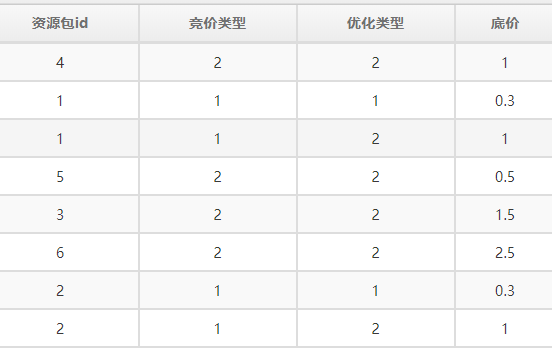

# java 移位运算

### 背景

最近修复了一个移位运算相关的 bug，记录一下心得

#### bug 介绍

话说有如下的业务规则



这个表格定义了不同资源包在不同竞价类型下的底价，实时竞价时会过滤掉出价低于底价的广告

这个底价很少修改，程序会把底价全部加载到内存里并定时刷新，很显然用一个 map 就行了，关键是 map 的 key 该如何设计？由以下几种方案

* 嵌套的 Map，资源包 id 是第一层 map 的 key，竞价类型是第二层 map 的 key，优化类型是第三层 map 的 key，示意 `Map<Integer, Map<Integer, Map<Integer, Float>>>`
* 用 资源包 id，竞价类型，优化类型构造一个唯一的 key
  * `String key = 资源包 id + '_' + 竞价类型 + '_' + 优化类型`
  * 考虑到竞价类型和优化类型取值都不超过 10，也可以构造一个数字 key `int key = 资源包 id * 100 + 竞价类型 * 10 + 优化类型`
  * 考虑到移位运算的效率高，可以通过移位来构造一个数字 key，即 `int key = 资源包 id << 8 | 竞价类型 << 4 | 优化类型`

作为一个高度关注性能的开发人员，选择了通过移位的方式来构造 key 自然是很合理的，事实上程序也一直运行的很 ok——直到我最近把这个 key 的生成方式优化成下面的样子

```java
Long key = new Long(资源包 id << 32 | (竞价类型 << 16) | 优化类型);
```

新版本发布上线后，运营同学很快就发现资源包 id 为 4 的广告的点击/下载数据明显下降，经过好一番调试后，找到了问题：原本资源包 id = 4 时，底价为 1，结果程序从 map 里查到的底价是 2.5，导致出价低于 2.5 的广告被过滤，而这些出价较低的广告点击/下载转化率更高——从运营报表来看就是点击下载数据下降了，而收入的下降没有那么明显

### 分析

首先还是要反思下，运行的好好的代码为什么要优化呢？

```java
int key = 资源包 id << 8 | 竞价类型 << 4 | 优化类型
```

这段代码运行 ok 有个前提：竞价类型和优化类型都不能大于 15，从当前业务上来说这是完全 ok 的，可是万一哪天业务需求发生变更，需要定义更多的竞价类型和优化类型，那就是个隐患啊

所以当我某天无聊的 review 到这段代码时，没有过多思考，就决定为竞价类型和优化类型的取值范围进行扩容，然后写下了优化

```java
Long key = new Long(资源包 id << 32 | (竞价类型 << 16) | 优化类型);
```

那么我们可以看下这段代码的问题，如下

```java
    public static void main(String[] args) {
        System.out.println(new Long(4 << 32 | (2 << 16) | 2));
        System.out.println(new Long(6 << 32 | (2 << 16) | 2));
    }
    
    131078
    131078
```

哎呀，我了个 x，怎么资源包 4 的 key 和资源包 6 的 key 一样呢？

经过一番研究，发现问题出在 `资源包 id << 32` 这段代码上，而真正的关键是 资源包 id 是个 `int` 类型

`int` 类型移位以后还是个 `int`，不可能变成 `long`，那么对它进行 `<< 32` 实际上应该溢出才对，不过 java 不知出于何种考虑，没有产生溢出：它很鸡贼的没有做任何移位操作，或者说当移位数超过了 `int` 实际占据的数量以后，java 会将移位数除以 32，然后实际移位的是该除法的余数——这样就不用担心会溢出了

### 心得

1. 运算结果的数据类型，是运算符左侧数据的数据类型，所以对 `int` 无论怎么移位结果还是 `int`
2. java 虚拟机对 `int` 移位运算进行了特殊处理来避免发生溢出
3. 本次 bug 的修复是回退到了最初的版本，实际上将资源包 id 造型成 long 也是 ok 的，即 

   ```java
   Long key = new Long(((long)资源包 id) << 32 | (竞价类型 << 16) | 优化类型);
   ```


