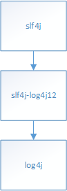
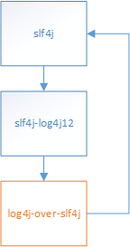

# 日志迁移到 logback

最近把项目的日志框架从 `log4j` 迁移到 `logback`，过程里遇到很多坑，记录下来

## 目标

本次迁移的目标就是用 `slf4j+logback` 的日志框架来取代目前的 `slf4j+log4j`

## 如何迁移

### 基于 slf4j 的无痛迁移

项目本身是采用的 `slf4j+log4j` 日志架构，所以迁移到 `logback` 基本无痛

#### 修改依赖

原本是 `slf4j+log4`，依赖如下

```markup
  <dependency>
	<groupId>org.slf4j</groupId>
	<artifactId>slf4j-api</artifactId>
	<version>1.7.25</version>
  </dependency>
  <dependency>
	<groupId>org.slf4j</groupId>
	<artifactId>slf4j-log4j12</artifactId>
	<version>1.7.25</version>
  </dependency>
  <dependency>
	<groupId>log4j</groupId>
	<artifactId>log4j</artifactId>
	<version>1.2.17</version>
  </dependency>
```

迁移到 `slf4j+logback`，依赖如下

```markup
  <dependency>
	<groupId>org.slf4j</groupId>
	<artifactId>slf4j-api</artifactId>
	<version>1.7.28</version>
  </dependency>
  <dependency>
	<groupId>ch.qos.logback</groupId>
	<artifactId>logback-classic</artifactId>
	<version>1.2.3</version>
  </dependency>
```

#### 修改日志配置

`logback` 的配置文件为 `logback.xml`，替换掉 `log4j.xml`

```markup
<?xml version="1.0" encoding="UTF-8"?>
<configuration debug="true" scan="false">

	<property name="log.path" value="/data/dev/" />
	<property name="app.name" value="dev-api" />

    <appender name="CONSOLE" class="ch.qos.logback.core.ConsoleAppender">
        <encoder>
            <pattern>%date{HH:mm:ss.SSS} [%-5level] [%logger:%L] %mdc{sid:--} - %msg%n</pattern>
            <charset>UTF-8</charset>
        </encoder>
		<filter class="ch.qos.logback.classic.filter.ThresholdFilter">
			<level>DEBUG</level>
		</filter>
    </appender>

	<appender name="FILE" class="ch.qos.logback.core.rolling.RollingFileAppender">
		<file>${log.path}/${app.name}.log</file>
		<rollingPolicy class="ch.qos.logback.core.rolling.TimeBasedRollingPolicy">
			<fileNamePattern>${log.path}/${app.name}.log.%d{yyyy-MM-dd}
			</fileNamePattern>
		</rollingPolicy>
		<encoder>
			<!-- %L not support when use async appender -->
			<pattern>%date{HH:mm:ss.SSS} [%-5level] [%logger] %mdc{sid:--} - %msg%n</pattern>
			<charset>UTF-8</charset>
		</encoder>
		<filter class="ch.qos.logback.classic.filter.ThresholdFilter">
			<level>DEBUG</level>
		</filter>
	</appender>

	<appender name="ASYNC_FILE" class="ch.qos.logback.classic.AsyncAppender">
		<discardingThreshold>0</discardingThreshold>
		<!-- One and only one appender may be attached to AsyncAppender -->
		<appender-ref ref="FILE" />
	</appender>

	<!-- note: in production environment set INFO level -->
	<logger name="zy.dev">
		<level value="INFO" />
	</logger>

	<root level="ERROR">
		<appender-ref ref="ASYNC_FILE" />
		<appender-ref ref="CONSOLE" />
	</root>

</configuration>
```

#### web 项目初始化日志

增加如下依赖

```markup
<dependency>
	<groupId>org.logback-extensions</groupId>
	<artifactId>logback-ext-spring</artifactId>
	<version>0.1.5</version>
</dependency>
```

在 `web.xml` 里增加如下监听器

```markup

	<context-param>
		<param-name>logbackConfigLocation</param-name>
		<param-value>classpath:config/logback.xml</param-value>
	</context-param>
	<listener>
		<listener-class>ch.qos.logback.ext.spring.web.LogbackConfigListener</listener-class>
	</listener>	
```

### 从 log4j 迁移

项目里依赖了其他一些库，可以用 `maven` 命令 `mvn dependency:tree` 来查看下，都有哪些库还用到了 `log4j`，如果这些库也是 `slf4j+log4j` 的架构那就万事大吉，但也有的库直接用的 `log4j`，这样就麻烦了

根据 [slf4j 的文档](https://www.slf4j.org/legacy.html)，使用 `log4j` 桥接器  `log4j-over-slf4j` 来替换 `log4j` 依赖：即在所有依赖到 `log4j` 的库上排除 `log4j` 的依赖，并添加 `log4j-over-slf4j` 依赖，如下

```markup
<dependency>
	<groupId>com.meizu.framework</groupId>
	<artifactId>framework-service</artifactId>
	<version>2.0.0-RC01</version>
	<scope>compile</scope>
	<exclusions>
	<exclusion>
	  <artifactId>log4j</artifactId>
	  <groupId>log4j</groupId>
	</exclusion>
</dependency>

<dependency>
	<groupId>org.slf4j</groupId>
	<artifactId>log4j-over-slf4j</artifactId>
	<version>1.7.28</version>
</dependency>
```

### 其他日志框架\(jul/jcl/log4j2/...\)

和 `log4j` 类似，`slf4j` 还为其他日志框架提供了 `xxx-over-slf4j` 桥接器，比如 `jcl-over-slf4j`，如果用到了对应的日志框架，只需要在依赖里排除该日志框架依赖，并添加对应的桥接器即可

这里要特别提一下 `jul(java.util.logging)`，由于这个日志框架内置在 `jdk` 内，无法通过置换依赖的方式来桥接，所以需要项目自己调用一下桥接器的方法，在项目初始化时执行如下代码即可

```java
SLF4JBridgeHandler.removeHandlersForRootLogger();
SLF4JBridgeHandler.install();
```

也许是因为这个原因，`jul` 的桥接器名字是 `jul-to-slf4j` 而不是 `jul-over-sl4fj`

## 小心死循环

### 起因

使用 `slf4j` 桥接方式时，需要注意避免死循环，以桥接 `log4j` 为例说明

`slf4j+log4j` 要用到 `slf4j-log4j12`，这个库的作用是将 `log4j` 适配到 `slf4j`，其调用逻辑如下图



如果在桥接 `log4j` 时系统里还存在 `slf4j-log4j12` 库，就会导致如下的调用逻辑



可以发现这样会导致死循环，解决的办法很简单：从所有依赖里排除 `slf4j-log4j12` 库

### maven-enforcer-plugin

现在你排除了所有可能导致死循环的依赖，但是某天你引入了一个新的依赖，一时疏忽，没有排查这个新的依赖是否传递了 `slf4j-logj12`，那就存在死循环的风险；另一方面，就算你能保证自己每次都不会疏忽，但是你能保证项目里的其他开发人员也会在引入新依赖时进行检查吗？

这种情况，可以使用 `maven` 插件 `maven-enforcer-plugin` 来帮我们检查，把你想要排除的依赖配置一次即可

```markup
<plugin>
	<groupId>org.apache.maven.plugins</groupId>
	<artifactId>maven-enforcer-plugin</artifactId>
	<version>3.0.0-M2</version>
	<executions>
		<execution>
			<id>enforce</id>
			<goals>
				<goal>enforce</goal>
			</goals>
			<configuration>
				<rules>
					<banDuplicatePomDependencyVersions />
					<requireMavenVersion>
						<version>3.2.5</version>
						<message>maven version must be 3.2.5 or above</message>
					</requireMavenVersion>
					<requireJavaVersion>
						<version>1.7</version>
					</requireJavaVersion>
					<bannedDependencies>
						<!-- avoid dependency conflict -->
						<excludes>
							<exclude>log4j:*</exclude>
							<exclude>org.apache.logging.log4j:*</exclude>
							<exclude>commons-logging:commons-logging</exclude>
							<exclude>org.slf4j:slf4j-log4j12</exclude>
							<exclude>org.slf4j:slf4j-jcl</exclude>
							<exclude>org.slf4j:slf4j-jdk14</exclude>
						</excludes>
						<message>DO NOT use any other logger framework beyond slf4j+logback</message>
					</bannedDependencies>
				</rules>
			</configuration>
		</execution>
	</executions>				
</plugin>			
```

## jcl 的坑

`jcl`，即 `The Apache Commons Logging`，也是广泛应用的日志框架，在迁移的过程中，我们会排除该日志组件并用 `jcl-over-slf4j` 来取代它，并通过 `maven-enforcer-plugin` 来避免将可能导致死循环的依赖打包

问题是这一套看上去无懈可击的流程有漏洞：没有 `jcl`，`maven-assembly-plugin` 这个插件无法工作；而且这个插件会把 `jcl` 强行塞到最终输出的 `zip` 里，并不会触发 `maven-enforcer-plugin` 配置的排除规则

经过一番研究，发现把 `jcl` 的 `scope` 设为 `provided` 可以解决这个问题

```markup
<dependency>
    <groupId>commons-logging</groupId>
    <artifactId>commons-logging</artifactId>
    <version>1.2</version>
    <scope>provided</scope>
</dependency>
```


