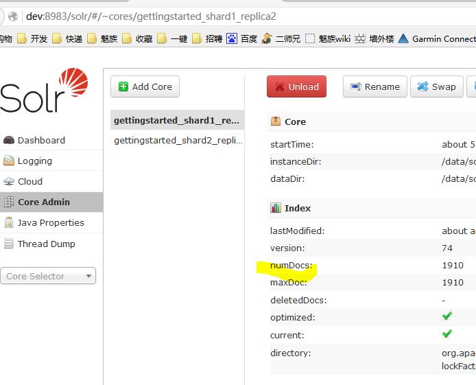
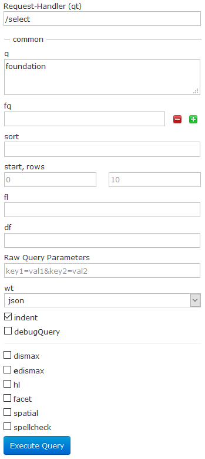

# Quick Start

## 安装

下载 solr 5.3.1

* Q：why 5.3.1? 
* A：solr 官网的 [quick start](https://lucene.apache.org/solr/quickstart.html) 是用 5.3.1 来进行介绍滴

```bash
wget http://archive.apache.org/dist/lucene/solr/5.3.1/solr-5.3.1.zip
unzip solr-5.3.1.zip
cd solr-5.3.1/
bin/solr start -e cloud -noprompt
```

这时就把 solr 给启动了，如果看到如下提示

```bash
NOTE: Please install lsof as this script needs it to determine if Solr is listening on port 8983.
```

那么就安装一下 lsof

```bash
yum -y install lsof
```

现在再启动 solr 就不会提示安装 lsof 了

## 索引数据

solr 安装成功后，bin/post 工具可以将不同类型的文档导入 solr，现在尝试将 docs 目录下的所有 html 文件导入 solr 并创建索引

```bash
bin/post -c gettingstarted docs/
# -c gettingstarted: 指定需要创建索引的集合(collection)为gettingstarted
# docs/: 指定一个相对路径
```

### solr xml

solr 支持对多种格式的结构化数据进行索引，例如：[solr xml](https://cwiki.apache.org/confluence/display/solr/Uploading+Data+with+Index+Handlers#UploadingDatawithIndexHandlers-XMLFormattedIndexUpdates)（传说是某种主流的格式）

solr 安装包含了少量的 solr xml 格式的文件，附带示例数据（主要是些 mocked 科技产品数据），可以使用下面的命令启动 solr 并且索引这些数据

```bash
# 先确保停止solr
bin/solr stop -all
bin/solr start -e techproducts
```

使用 post 工具，将 example/exampledocs/ 下的 solr xml 格式的示例数据索引

```bash
bin/post -c gettingstarted example/exampledocs/*.xml
```

### json

看过了 solr xml 格式，再来看看 json。貌似更主流一些吧

solr 安装也包含了 json 格式数据（solr json，是类似于 solr xml 的 json，大概是 json 的字段都是定义好的），用来演示对 json 的支持，依然使用 post 工具

```bash
bin/post -c gettingstarted example/exampledocs/books.json
```

### csv

把数据导入 solr 的一个方式是经由 csv；照例是使用 post 工具，如下

```bash
bin/post -c gettingstarted example/exampledocs/books.csv
```

### 其他格式

* 数据库：从数据库导入记录，使用 [Data Import Handler \(DIH\)](https://cwiki.apache.org/confluence/display/solr/Uploading+Structured+Data+Store+Data+with+the+Data+Import+Handler) 
* 编程
* 管理后台

## 更新数据

即使索引同一份数据多次，也不会搜索出重复的结果来。这是因为在 schema.xml 中指定了一个唯一键：id

无论何时，向 solr 发起指令去添加一个已存在的、唯一键相同的文档，solr 会自动替换该文档



* numDocs：可搜索的文档数，这个数字可能比 xml，json，csv 文件数要大，这是因为单个文件里可能有多个文档，**多次提交同一个文档，numDocs 并不会增加**
* maxDoc：这个值包含了逻辑上已删除但还没有物理删除的文档，所以该值可能比 numDosc 大

## 删除数据

使用 post 工具来删除数据：提交一个删除命令，指定将要被删除的文档的唯一键的值；或者一个查询，匹配多个结果

```bash
bin/post -c gettingstarted -d "<delete><id>SP2514N</id></delete>"
```

## 搜索

可以用`:`来代替`.`，避免进行 url encode

```bash
curl "http://localhost:8983/solr/gettingstarted/select?q=*%3A*&wt=json&indent=true"
curl "http://localhost:8983/solr/gettingstarted/select?q=*:*&wt=json&indent=true"
```

界面



参数说明（[搜索语法](https://cwiki.apache.org/confluence/display/solr/Query+Syntax+and+Parsing)）（[搜索参数](https://cwiki.apache.org/confluence/display/solr/Common+Query+Parameters)）

* q：搜索关键字，如果关键字是个短语的话需要用引号，例如`q="CAS latency"`，注意：空格会被 url encode 编码成`+`号 
  * `field:value`格式，表示仅在 `filed` 字段里搜索 `value`，例如 `q=name:foundation` 指定只搜索`name` 字段里的 `foundation`
    * `price:[0 TO 400]`，范围搜索，表示搜索 price 在 0 和 400 之间，注意：`TO` 要大写 
  * 默认情况下，搜索多个关键字，使用空格分隔，solr 只需要其中一个包含在文档中，如果需要多个关键字都包含，可以用`+`号，反之用`-`号，注意：`+`号会被 url encode 编码成 `%2B`。示例： 
    * `q=+one +three` 表示文档里同时包含 one 和 three 
    * `q=+two -one` 表示文档里包含 two 但不包含 one 
* start：搜索结果的起始位置（0 表示第一个） 
* rows：每页返回结果数 
* fl：指定返回的字段，多个字段用逗号分隔

搜索结果

```javascript
{
  "responseHeader": {
    "status": 0,
    "QTime": 55,
    "params": {
      "indent": "true",
      "q": "foundation",
      "_": "1454382796684",
      "wt": "json"
    }
  },
  "response": {
    "numFound": 3612,                // 搜索到的结果数
    "start": 0,
    "maxScore": 0.373555,
    "docs": [
      {
        "id": "0553293354",
        "cat": [
          "book"
        ],
        "name": [
          "Foundation"
        ],
        "price": [
          7.99
        ],
        "inStock": [
          true
        ],
        "author": [
          "Isaac Asimov"
        ],
        "series_t": [
          "Foundation Novels"
        ],
        "sequence_i": 1,
        "genre_s": "scifi",
        "_version_": 1524681985891500000
      },
```

## faceting

faceting 是 solr 最受欢迎的特性之一，它可以将搜索结果分组到子集中，并对每个子集进行汇总。有多种 faceting：字段值，数字和日期范围，决策树，及任意查询 faceting

### 字段 facets

除了搜索结果以外，solr查询还能返回包含每个唯一值的文档数


勾选 faceting（`facet=true`），指定用于 facet 的字段（`facet.field=?`），如果只想 facets 而不需要返回内容，设定 `rows=0`

### 范围 facets

对于数字和日期，经常需要按范围进行汇总，一个数字范围的 facets 如下：

使用 price 来 facets

```bash
curl http://localhost:8983/solr/gettingstarted/select?q=*:*&wt=json&indent=on&rows=0 \
                                                     &facet=true \
                                                     &facet.range=price \
                                                     &f.price.facet.range.start=0 \
                                                     &f.price.facet.range.end=600 \
                                                     &f.price.facet.range.gap=50 \
                                                     &facet.range.other=after
```

### Pivot facets

决策树 facet... 允许 2 个或更多字段被嵌入各种可能的组合

在示例的“科技产品数据”里，pivot facets 可以用来查看 book 类别（字段为 cat）下有多少产品有库存或无库存，下面看看查询语句

```bash
curl http://localhost:8983/solr/gettingstarted/select?q=*:*&rows=0&wt=json&indent=on \
                                                  &facet=on&facet.pivot=cat,inStock
```

查询结果，仅截取 `cat=book` 的片段

```javascript
...
"facet_pivot":{
  "cat,inStock":[{
      "field":"cat",
      "value":"book",
      "count":14,
      "pivot":[{
          "field":"inStock",
          "value":true,
          "count":12},
        {
          "field":"inStock",
          "value":false,
          "count":2}]},
...
```

这个结果说明 `cat=book` 的产品有 14 个，其中有库存的 12 个，无库存的 2 个

### 更多faces

[https://cwiki.apache.org/confluence/display/solr/Faceting](https://cwiki.apache.org/confluence/display/solr/Faceting)

## spatial

solr 支持地理空间搜索，包括对给定的地点进行指定距离的范围搜索，按距离排序，......

spatial 查询可以和任何类型的查询结合，例如，在深圳市 10km 内查询 `ipod`

## 总结

一个包含了上面各步骤命令的shell脚本

```bash
date ;
bin/solr start -e cloud -noprompt ;
  open http://localhost:8983/solr ;
  bin/post -c gettingstarted docs/ ;
  open http://localhost:8983/solr/gettingstarted/browse ;
  bin/post -c gettingstarted example/exampledocs/*.xml ;
  bin/post -c gettingstarted example/exampledocs/books.json ;
  bin/post -c gettingstarted example/exampledocs/books.csv ;
  bin/post -c gettingstarted -d "<delete><id>SP2514N</id></delete>" ;
  bin/solr healthcheck -c gettingstarted ;
date ;
```

清理脚本

```bash
bin/solr stop -all
rm -Rf example/cloud/
```

## 进阶

[Solr Reference Guide](https://cwiki.apache.org/confluence/display/solr/Apache+Solr+Reference+Guide)

## 参考指南

[参考指南下载目录](http://archive.apache.org/dist/lucene/solr/ref-guide/)

[参考指南\(pdf\) for 5.3](http://archive.apache.org/dist/lucene/solr/ref-guide/apache-solr-ref-guide-5.3.pdf)

