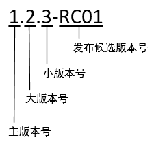

# 服务端版本号规范

## 版本号格式

主版本号.大版本号.小版本号-发布候选版本号，示例如下



## 初始版本号

* 从本文成文之日起，初始版本号为 2.0.0-RC01
* 特殊情况，启用全新的初始版本号

## 版本号变更规则

### 新版本发布上线以后

小版本号 +1，发布候选版本号从 RC01 开始

```text
例如：线上发布了 2.0.1-RC15，那么新的版本号就从 2.0.2-RC01 开始
```

### 测试回归以后

发布候选版本号 +1

```text
例如：测试同学对 2.2.15-RC76 提交了 bug，开发修复以后，发布 2.2.15-RC77 版本
```

### 版本号进位

* 发布候选版本号不进位
* 小版本号满 100 后归零，大版本号 +1
* 大版本号满 100 后归零，主版本号 +1

```text
例如：线上发布了 2.16.99-RC25，那么新的版本号是 2.17.0-RC01
```

## 多人开发时版本号变更技巧

在多人开发时，可能会遇到发布候选版本号重复使用的情况，可以考虑采用错位变更的方式来避免：假设有 n 个人同时开发，每个人固定一个不同的初始的发布候选版本号，并在每次变更发布候选版本号时 +n

例如

* 李果：发布候选版本号从 RC01 开始
* 舒涌：发布候选版本号从 RC02 开始
* 付琪：发布候选版本号从 RC03 开始
* 每次变更发布候选版本号时，+3

以上举例说明，大家自行协商

