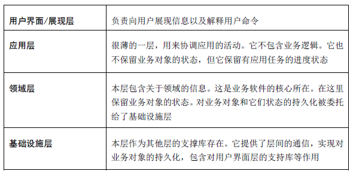
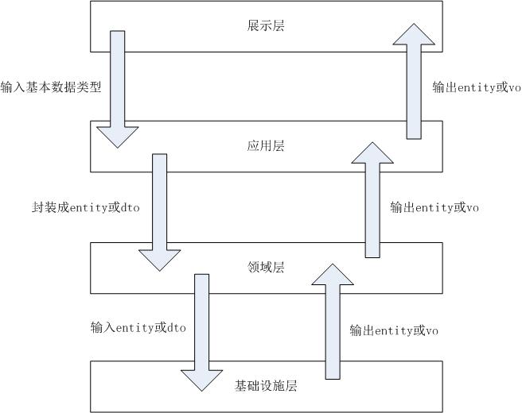

# 服务端开发规范

## 命名

原则

* 见名知意
* 用英语单词或缩写，不要用汉语拼音

### **格式**

#### **包名**

* 全小写
* 不使用下划线

正例

```java
package com.meizu.flymetv
```

反例

```java
package com.meizu.flyme_tv
package com.meizu.flymeTV
```

#### 类名

* 首字母大写
* 驼峰格式：类名称由多个单词组成时，每个单词首字母大写，其余字母小写；单词之间不使用下划线分隔
* 缩写词首字母大写，其余字母小写

正例

```java
import com.meizu.flymetv.common.SqlHelper
import com.meizu.flymetv.persistence.dao.UserDao
```

反例

```java
import com.meizu.flymetv.common.SQLHelper
import com.meizu.flymetv.persistence.dao.UserDAO
```

### **应用分层和包结构**

#### **应用分层**



#### 包结构

```java
// 项目包名
package com.meizu.flymetv.video

// 工具包
package com.meizu.flymetv.video.util

// 工具以外的公共类
package com.meizu.flymetv.video.common


// 应用层
package com.meizu.flymetv.video.app           
package com.meizu.flymetv.video.app.action         // controller  控制器


// 领域层
package com.meizu.flymetv.video.domain
package com.meizu.flymetv.video.domain.constant      // 常量和枚举
package com.meizu.flymetv.video.domain.dto           // data transfer object 数据传输对象
package com.meizu.flymetv.video.domain.entity        // entity 实体
package com.meizu.flymetv.video.domain.vo           // view object 视图对象
package com.meizu.flymetv.video.domain.service       // service 服务


// 缓存：缓存在持久层之上，但不属于领域层
package com.meizu.flymetv.video.cache
package com.meizu.flymetv.video.cache.redis         // redis缓存
package com.meizu.flymetv.video.cache.local         // 本地缓存


// 基础设施：持久层
package com.meizu.flymetv.video.persistence         
package com.meizu.flymetv.video.persistence.mapper  // mapper(mybatis用mapper)
package com.meizu.flymetv.video.persistence.dao     // data access object 数据访问对象


// 基础设施：第三方接口
package com.meizu.flymetv.video.remoting
package com.meizu.flymetv.video.remoting.youku                 // youku接口
package com.meizu.flymetv.video.remoting.youku.api             // youku api接口封装
package com.meizu.flymetv.video.remoting.youku.entity.req      // 请求参数封装
package com.meizu.flymetv.video.remoting.youku.entity.rsp      // 响应参数封装


// 基础设施：metaq消息队列
package com.meizu.flymetv.video.metaq
package com.meizu.flymetv.video.metaq.message       // 消息
package com.meizu.flymetv.video.metaq.producer      // 消息生产者
package com.meizu.flymetv.video.metaq.consumer      // 消息消费者
```

### 类的命名

#### dto,vo,entity 的使用

dto，vo，entity是 3 种基本的对象，大部分业务都可以使用这3种对象来进行参数的传递和结果的输出,其各自的使用场景如下图



说明

* dto，数据传输对象，对用户提交的参数，可以封装成 entity 或者 dto。一般情况下 entity 就可以封装用户提交参数了，但有时候需要创建专门的 dto 来接收用户参数，例如
  * User 对象有个 birthday 的属性，如果要查询 birthday 在 startDate 和 endDate 之间的 User，这时可能就需要创建一个专门的 UserQueryDto，用来传递 startDate 和 endDate 参数
* vo，视图对象，用于处理结果的展示，vo 可以是在持久层直接创建的，也可以是在应用层通过对持久层/服务层输出的 entity 进行二次封装来创建；entity 也可以用于视图层进行结果的展示，但有些场合是需要创建专门的 vo 来展示，例如
  * 在列表页面，往往只需要展示实体的几个最要的属性，其他属性并不展示，此时可以使用专门的 vo 来封装结果
  * 要在一个页面展示某个复杂对象的多个属性，而这多个属性在建模时被切分到多个简单的 entity 中，这时可能需要一个专门的 vo 来聚合这多个简单 entity
* entity，是对业务实体的展示，一般来说是和数据库里的表对应的，其属性和数据库里的字段一一对应

#### 命名

以 Album 对象为例

| 对象 | 命名 | 示例 |
| :--- | :--- | :--- |
| 控制器 | 实体名+Action | AlbumAction |
| 视图对象 | 实体名+操作名+Vo | AlbumQueryVo |
| 实体 | 实体名 | Album |
| 数据传输对象 | 实体名+操作名+Dto | AlbumQueryDto |
| 服务 | 实体名+Service | AlbumService |
| redis缓存 | 实体名+Redis+Repository | AlbumRedisRepository |
| 本地缓存 | 实体名+Local+Repository | AlbumLocalRepository |
| 数据访问对象 | 实体名+Mapper | AlbumMapper |

## bean 和 map

map 是 java 集合框架的一员；bean 一般都是一个对象，有其业务上的含义

### 是集合，不是业务对象

要明确的是，map是 **集合** 类，不应将 map 当作单个对象来使用。这样的场合要用 javabean

* 如果是方法之间传递参数，使用 DTO \(数据传输对象\)
* 如果是向调用者返回结果，使用 DTO 或者 VO \(视图对象\)
* 也可能是个 Entity \(实体对象\)

### 不要把 map 当 bean 来用

为什么不能把 map 当作单个对象来使用呢？看上去不用专门定义一个类，而且想要添加任何的属性都很方便啊？

* 如果拿 map 当对象用，map 基本上只能是 `Map<String, Object>`这种形式，无法做类型检查，map 的使用方必须做强制类型转换，存在类型不匹配的风险
* 使用 map 表示的对象需要增加属性，如果代码里使用这个 map 的地方很多，添加属性时容易遗漏
* 将 map 作为方法的参数或返回值时，无法在编译阶段确定该 map 是否包含必须的属性，只有在运行时才能检查，出错的风险增加
* map 里有哪些属性，只有通过阅读创建 map 的代码来得知，代码可读性差；javabean 直接就知道有哪些属性，还可以添加必要的注释

所以，绝对不允许将 map 当作单个对象使用，map 就是一个集合类

## 面向接口编程

### 继承

* javabean 可以继承
* service 等业务逻辑实现代码，除非特殊需要，并经架构师批准，不得使用继承

### 接口

* 业务逻辑的实现，封装成服务，后缀名包括但不限于 Service/Repository/Api/...，服务须抽象出接口
* 注入依赖时，须声明为接口

## spring 的使用

### 使用注解和自动装配

| 注解 | 适用场景 |
| :--- | :--- |
| @Controller | MVC控制器 |
| @Service | 服务 |
| @Repository | 数据访问对象，对象仓库 |
| @Component | 其他想要被Spring管理的对象 |
| @Resource | 注入依赖（尽量不用@Autowired） |
| @PostConstruct | init-method，实例化一个bean成功后执行 |
| @PreDestroy | destroy-method，销毁bean前执行 |

### beanId 和变量声明

beanId 应该是接口名首字母小写

正例

```java
@Service("albumService")
public class AlbumServiceImpl implements AlbumService{
  ...
}
```

反例

```java
@Service
public class AlbumServiceImpl implements AlbumService{
  ...
}
```

变量声明时，类型应为接口，变量名为接口名首字母小写

正例

```java
@Test
public class AlbumServiceImplTest extends BaseTest {

  @Resource
  private AlbumService albumService;
  ...
}
```

反例

```java
@Test
public class AlbumServiceImplTest extends BaseTest {

  @Autowired
  AlbumServiceImpl albumService ;
  ...
}
```

## 代码质量

* 代码格式化及模板
* eclipse 警告：消除所有警告
* sonar：代码规范遵从度需要达到90%

## 未完待续

to be continued

