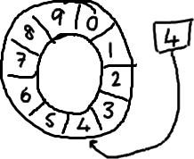

# Disruptor 高性能并发框架

## 简述

1. Disruptor 是一个异步并发处理框架。是由 LMAX 公司开发的一款高效的无锁内存队列。它使用无锁的方式实现了一个环形队列，非常适合于实现生产者和消费者模式，比如事件和消息的发布。
2. Disruptor 最大特点是高性能，其 LMAX 架构可以获得每秒 6 百万订单，用 1 微秒的延迟获得吞吐量为 100K+。

## RingBuffer

RingBuffer 是其核心，生产者向 RingBuffer 中写入元素，消费者从 RingBuffer 中消费元素。 



1. 随着你不停地填充这个 buffer（可能也会有相应的读取），这个序号会一直增长，直到绕过这个环。
2. 槽的个数是 2 的 N 次方更有利于基于二进制的计算机进行计算。（注：2 的 N 次方换成二进制就是1000，100，10，1这样的数字， sequence & （array length－1） = array index，比如一共有 8 槽，3&（8－1）=3，HashMap 就是用这个方式来定位数组元素的，这种方式比取模的速度更快。）
3. 会预先分配内存,可以做到完全的内存复用。在系统的运行过程中，不会有新的空间需要分配或者老的空间需要回收。因此，可以大大减少系统分配空间以及回收空间的额外开销。

## 简单例子

maven引入jar包

```markup
<dependency>
   <groupId>com.lmax</groupId>
   <artifactId>disruptor</artifactId>
   <version>3.2.1</version>
</dependency>
```

创建数据类

```java
//代表数据的类
public class PCData {
    private int value;
    public int getValue() {
        return value;
    }
    public void setValue(int value) {
        this.value = value;
    }
}
```

工厂类，生产 PCData

```java
//产生PCData的工厂类，它会在Disruptor系统初始化时，构造所有的缓冲区中的对象实例（预先分配空间）
public class PCDataFactory implements EventFactory<PCData> {
    @Override
    public PCData newInstance() {
        return new PCData();
    }
}
```

消费者

```java
//消费者实现为WorkHandler接口，是Disruptor框架中的类
public class Consumer implements WorkHandler<PCData>{
    //onEvent()方法是框架的回调用法
    @Override
    public void onEvent(PCData event) throws Exception {
        System.out.println(Thread.currentThread().getId() + ":Event:--" 
    + event.getValue()*event.getValue() + "--");
    }
}
```

生产者

```java
public class Producer {
    //环形缓冲区,装载生产好的数据；
    private final RingBuffer<PCData> ringBuffer;

    public Producer(RingBuffer<PCData> ringBuffer) {
        this.ringBuffer = ringBuffer;
    }

    //将数据推入到缓冲区的方法：将数据装载到ringBuffer
    public void pushData(int value) {
        long sequence = ringBuffer.next();  //获取下一个可用的序列号
        try {
            PCData event = ringBuffer.get(sequence);//通过序列号获取空闲可用的PCData
            event.setValue(value);   //设置数值
        } finally {
            ringBuffer.publish(sequence); //数据发布，只有发布后的数据才会真正被消费者看见
        }
    }
}
```

测试类

```java
public class DisruptorTest {
    @SuppressWarnings("unchecked")
    public static void main(String[] args) throws InterruptedException {
        Executor executor = Executors.newCachedThreadPool(); //创建线程池
        PCDataFactory factory = new PCDataFactory();  
        int bufferSize = 32; //设置缓冲区的大小为32
        //ProducerType.MULTI:创建一个环形缓冲区支持多事件发布到一个环形缓冲区
        Disruptor<PCData> disruptor = new Disruptor<PCData>(factory, bufferSize, executor,
                ProducerType.MULTI,new BlockingWaitStrategy());
        //设置了三个消费者，系统会将每一个消费者实例映射到一个线程中，也就是这里提供了4个消费者线程
        disruptor.handleEventsWithWorkerPool(new Consumer(),new Consumer(),new Consumer());
        disruptor.start(); //启动并初始化disruptor

        RingBuffer<PCData> ringBuffer = disruptor.getRingBuffer(); //获取已经初始化好的ringBuffer
        Producer producer = new Producer(ringBuffer);
        for (int i = 0; i < 20 ; i++ ) {
            producer.pushData(i);  //存入数据
            Thread.sleep(100);
            System.out.println("add data " + i);
        }
    }
}
```

输出结果

```bash
9:Event:--0--
add data 0
10:Event:--1--
add data 1
11:Event:--4--
add data 2
9:Event:--9--
add data 3
...
```

根据 Disruptor 的官方报告，性能要比 BlockingQueue 至少高一个数量级以上。

## 提高消费者的相应时间：选择合适的策略

1. BlockingWaitStrategy：这是默认的策略。使用锁和条件进行数据的监控和线程的唤醒。因为涉及到线程的切换，是最节省 CPU，但在高并发下性能表现最糟糕的一种等待策略。
2. SleepingWaitStrategy：会自旋等待数据，如果不成功，才让出 cpu，最终进行线程休眠，以确保不占用太多的 CPU 数据，因此可能产生比较高的平均延时。比较适合对延时要求不高的场合，好处是对生产者线程的影响最小。典型的应用场景是异步日志。
3. YieldingWaitStrategy：用于低延时的场合。消费者线程不断循环监控缓冲区变化，在循环内部，会使用 `Thread.yield()` 让出 cpu 给别的线程执行时间。
4. BusySpinWaitStrategy：开启的是一个死循环监控，消费者线程会尽最大努力监控缓冲区变化，因此， CPU 负担比较大

