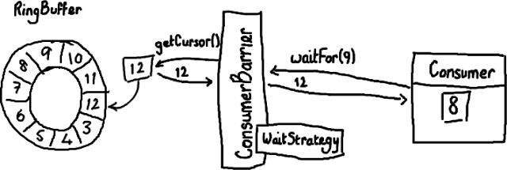
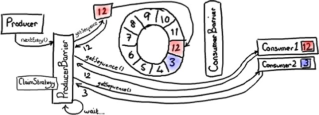
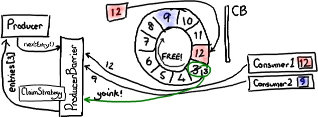
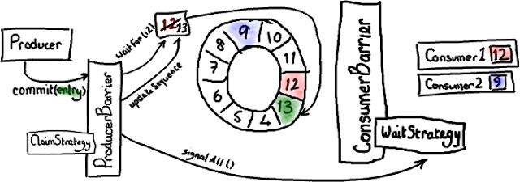

# Disruptor 中 RingBuffer 的读写

## 简述

* RingBuffer 是整个模式（Disruptor）的核心
* 下面是 RingBuffer 的源码

```java
public final class RingBuffer<E> implements Cursored, DataProvider<E> {

    private final int indexMask;
    //indexMask = bufferSize - 1,用于数组映射索引:映射后的索引号 = 实际索引号 & (bufferSize - 1)
    private final Object[] entries;   //缓冲区用数组实现
    private final int bufferSize;     //数组的大小
    private final Sequencer sequencer;
    //Sequencer接口包括MultiProducerSequencer和SingleProducerSequencer两种实现。根据名称可以看出，           
    //MultiProducerSequencer主要是多个生产者线程使用，SingleProducerSequencer是单个生产者线程使用。
    //RingBuffer使用了一个类似于代理的模式，调用自身的sequencer来完成部分功能。
    ......

    //在初始化ringbuffer的时候，会进行填充数组
    private void fill(EventFactory<E> eventFactory) {
        for (int i = 0; i < entries.length; i++){
            entries[i] = eventFactory.newInstance();
        }
    }
}
```

## 从 Ringbuffer 读取

ConsumerBarrier与消费者



* 假设 RingBuffer 中已经装载了数据；
* 消费者 Consumer 刚好消费完 8 号数据，然后通过中间对象 ConsumerBarrier 进行申请 9 号数据，调用 `waitFor(9)` 进行等待；
* 中间对象 ConsumerBarrier 会去 RingBuffer 获取目前的游标最大序号;

  ```java
  final long availableSeq = consumerBarrier.waitFor(nextSequence);
  ```

* ConsumerBarrier 返回 RingBuffer 的最大可访问序号——在上面的例子中是 12。ConsumerBarrier 有一个 WaitStrategy 方法来决定它如何等待这个序号\(几种不同等待策略：BlockingWaitStrategy、 TimeoutBlockingWaitStrategy、 SleepingWaitStrategy\)。返回 12 是因为 9、 10、 11 的序号已经被其他消费者申请了。
* 接下来，消费者会一直原地停留，等待更多数据被写入 RingBuffer。并且，一旦数据写入后消费者会收到通知——节点 9， 10， 11 和 12 已写入。现在序号 12 到了，消费者可以让 ConsumerBarrier 去拿序号节点里的数据了。
* 拿到了数据后，消费者\(Consumer\)会更新自己的标识\(cursor\)。

## 写入 Ringbuffer

在后台，由 ProducerBarrier 负责所有的交互细节来从 RingBuffer 中找到下一个节点，然后才允许生产者向它写入数据。



1、消费者 1 读到 12 号数据，消费者仍然停留在 3 号数据；

2、生产者想要写入 RingBuffer 中序号 3 占据的节点，因为它是 RingBuffer 当前游标的下一个节点。但是 ProducerBarrier 现在不能写入，因为有一个消费者正在占用它。所以，ProducerBarrier 停下来自旋 \(spins\)，等待，直到那个消费者离开。



3、当消费者 2 挪动到序号 9 时， ProducerBarier 会看到检测到序号 3 已经可以用。它会抢占这个节点，更新成下一个序号（13），然后把 序号返回给生产者。生产者可以接着往 里写入数据。



4、当生产者结束写入数据后，它会要求 ProducerBarrier 提交。ProducerBarrier 先等待 RingBuffer 的游标追上当前的位置 12 号。然后更新游标到序号 13。接下来， ProducerBarrier 会通知消费者 RingBuffer 有变化，让他们进行消费 \(如果还有一个生产者 2，在生产者 1 之前就完成了任务，通知 ProducerBarrier 要放到 14，这是，会进入等待，等待生产者 1 完成，游标到达 13 号，通知消费者，这时才会完成生产者 2 的请求，将游标移动到 14\)

