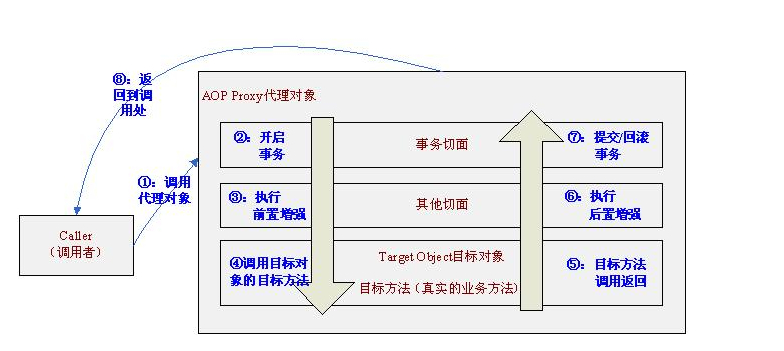

# Spring AOP 同类调用失效问题

## 概述

在使用自定义注解形式的 `@redis` 做缓存时，`@redis` 失效，分析原因。


请参考 [Spring AOP 实战经验](../2016/spring-aop-shi-zhan-jing-yan.md)


## 实例

应用商店中根据 imeiSnCode 来查询安装列表，代码如下

```java
@Service("installedRecordService")
public class InstalledRecordServiceImpl implements InstalledRecordService {

    @Resource
    private InstalledRecordMapper installedRecordMapper;

    @Override
     public   void  getInstalledApks() {
        List<String> imeiSnCodes = installedRecordMapper.queryImeiCode();
        if (imeiSnCodes != null && imeiSnCodes.size()> 0) {
          for(int i=0;i<imeiSnCodes.size();i++){
             getInstalledApk(imeiSnCodes.get(i));

        }
      }
    }


    @Redis(value=RedisKeys.INSTALLED_APK)
    public  List<InstalledRecord> getInstalledApk(final String code) {
            return installedRecordMapper.listByImeiSnCode(code);
    }
}
```

但是发现缓存不成功。下面是 Aop 的原理



也就是说我们首先调用的是 AOP 代理对象而不是目标对象。但是我们使用 `this.getInstalledApk(imeiSnCodes.get(i))` 时，`this` 表示的是当前的对象，而不是代理对象，因此注解失效。

## 解决方法

### 解决方法 1

将 `getInstalledApks()` 方法放在另外的一个类中进行调用，就不会出现这种问题了。代码省略。

### 解决方法 2

暴露 AOP 代理对象：

```markup
<aop:aspectj-autoproxy  expose-proxy="true"/>
```

仍然在同一个类中调用代码，但是改为如下的形式：

```java
@Service("installedRecordService")
public class InstalledRecordServiceImpl implements InstalledRecordService {

    @Resource
    private InstalledRecordMapper installedRecordMapper;

    @Override
     public   void  getInstalledApks() {
        List<String> imeiSnCodes = installedRecordMapper.queryImeiCode();
        if (imeiSnCodes != null && imeiSnCodes.size()> 0) {
          for(int i=0;i<imeiSnCodes.size();i++){
          //获取当前代理对象，进行调用
           ((InstalledRecordService) AopContext.currentProxy()).getInstalledApk(imeiSnCodes.get(i));
        }
      }
    }
}
```

原理：AopContext 的实现

```java
public abstract class AopContext {

    private static final ThreadLocal<Object> currentProxy = new NamedThreadLocal<Object>("Current AOP proxy");

    public static Object currentProxy() throws IllegalStateException {
        Object proxy = currentProxy.get();
        if (proxy == null) {
            throw new IllegalStateException(
                    "Cannot find current proxy: Set 'exposeProxy' property on Advised to 'true' to make it available.");
        }
        return proxy;
    }

    static Object setCurrentProxy(Object proxy) {
        Object old = currentProxy.get();
        if (proxy != null) {
            currentProxy.set(proxy);
        }
        else {
            currentProxy.remove();
        }
        return old;
    }
}
```

* 在进入代理对象之后通过 `AopContext.serCurrentProxy(proxy)` 暴露当前代理对象到 ThreadLocal，并保存上次 ThreadLocal 绑定的代理对象为 oldProxy 
* 接下来我们可以通过 `AopContext.currentProxy()` 获取当前代理对象
* 在退出代理对象之前要重新将 ThreadLocal绑定的代理对象设置为上一次的代理对象，即`AopContext.serCurrentProxy(oldProxy)`

### 解决方法 3

往实现类中注入自身。 仍然在同一个类中调用代码，但是改为如下的形式：

```java
@Service("installedRecordService")
public class InstalledRecordServiceImpl implements InstalledRecordService{
    //注入自身
    @Resource    
    private InstalledRecordService installedRecordService;
    @Resource
    private InstalledRecordMapper installedRecordMapper;

    @Override
    public   void  getInstalledApks() {
        List<String> imeiSnCodes = installedRecordMapper.queryImeiCode();
        if (imeiSnCodes != null && imeiSnCodes.size()> 0) {
          for(int i=0;i<imeiSnCodes.size();i++){
            installedRecordService.getInstalledApk(imeiSnCodes.get(i));

        }
    }
}
```

## 综述

在一个类内部调用时，被调用方法的 AOP 声明将不起作用。Spring 事务管理注解 `@Transactional` 也一样。

## Spring AOP 漏网之鱼

对于基于接口动态代理的 AOP 事务增强来说，由于接口的方法都必然是 public 的，这就要求实现类的实现方法也必须是 public 的（不能是 protected、private 等），同时不能使用 static 的修饰符。所以，可以实施接口动态代理的方法只能是使用 public 或 public final 修饰符的方法，其他方法不可能被动态代理，相应的也就不能实施 AOP 增强，换句话说，即不能进行 Spring 事务增强了。

基于 CGLib 字节码动态代理的方案是通过扩展被增强类，动态创建其子类的方式进行 AOP 增强植入的。由于使用 final、static、private 修饰符的方法都不能被子类覆盖，相应的，这些方法将无法实施 AOP 增强。所以方法签名必须特别注意这些修饰符的使用，以免使方法不小心成为事务管理的漏网之鱼。

该例中的方法符合上述条件，但注解仍然失效，主要原因是在于同一类中的方法互相调用，调用者指向当前对象，所以无论是接口代理还是 cglib 代理都无法织入增强实现。

