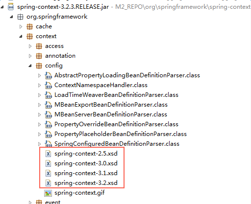
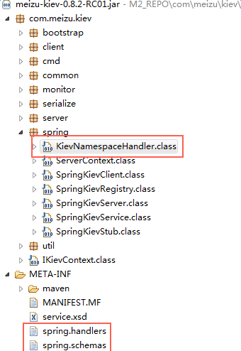

# Spring XML 配置文件加载机制

## 项目启动不成功？

前些天在进行项目部署时发现启动不成功，看了日志是 applicationContext.xml 配置文件解析 namespace 时失败。 因此对 spring 的 xml 加载机制做一下分享。

我们项目中的配置文件有如下配置：

```markup
<beans xmlns:xsi="http://www.w3.org/2001/XMLSchema-instance"
  xmlns="http://www.springframework.org/schema/beans"
  xmlns:tx="http://www.springframework.org/schema/tx" 
  xmlns:kiev="http://www.meizu.com/kiev/schema/service"
  xmlns:context="http://www.springframework.org/schema/context"
  xmlns:task="http://www.springframework.org/schema/task"
  xsi:schemaLocation="
    http://www.springframework.org/schema/beans 
    http://www.springframework.org/schema/beans/spring-beans.xsd
    http://www.springframework.org/schema/tx 
    http://www.springframework.org/schema/tx/spring-tx.xsd
    http://www.meizu.com/kiev/schema/service 
    http://www.meizu.com/kiev/schema/service.xsd
    http://www.springframework.org/schema/context 
    http://www.springframework.org/schema/context/spring-context.xsd
    http://www.springframework.org/schema/task 
    http://www.springframework.org/schema/task/spring-task-4.0.xsd">
```

从中我们看下这个配置

```markup
http://www.springframework.org/schema/context 
http://www.springframework.org/schema/context/spring-context.xsd
```

其实我们也可以这样写

```markup
http://www.springframework.org/schema/context 
http://www.springframework.org/schema/context/spring-context-4.0.xsd
```

其中的区别也看到了，就是一个有版本号，一个没有，这其中有什么区别？

## xml 文件解释

xml 的 schema 里有 namespace，可以给它起个别名。比如常见的 spring 的 namespace：

```java
xmlns:tx="http://www.springframework.org/schema/tx" 
xmlns:kiev="http://www.meizu.com/kiev/schema/service"
```

xsi:schemaLocation 配置的是 namespace 与 xsd 地址的映射，所以 xsi:schemaLocation 的配置都是成对出现。 前面的是 namespace 的 URI，后面的是 xsd 文件的 URI。

```markup
http://www.springframework.org/schema/task 
http://www.springframework.org/schema/task/spring-task-4.0.xsd
```

## spring 如何加载 xml

从 xsd 的 URI 可以看出这是一个网络连接地址，需要连接网络才能访问。 但是在断网的情况下我们依然可以正常访问，因为 Spring 会默认先从本地加载 xsd 文件。 打开 spring-context-3.2.0.RELEASE.jar，可以看到里面有两个特别的文件：

spring.handler

```markup
http\://www.springframework.org/schema/context=org.springframework.context.config.ContextNamespaceHandler
http\://www.springframework.org/schema/jee=org.springframework.ejb.config.JeeNamespaceHandler
http\://www.springframework.org/schema/lang=org.springframework.scripting.config.LangNamespaceHandler
http\://www.springframework.org/schema/task=org.springframework.scheduling.config.TaskNamespaceHandler
http\://www.springframework.org/schema/cache=org.springframework.cache.config.CacheNamespaceHandler
```

spring.schema

```markup
http\://www.springframework.org/schema/context/spring-context-2.5.xsd=org/springframework/context/config/spring-context-2.5.xsd
http\://www.springframework.org/schema/context/spring-context-3.0.xsd=org/springframework/context/config/spring-context-3.0.xsd
http\://www.springframework.org/schema/context/spring-context-3.1.xsd=org/springframework/context/config/spring-context-3.1.xsd
http\://www.springframework.org/schema/context/spring-context-3.2.xsd=org/springframework/context/config/spring-context-3.2.xsd
http\://www.springframework.org/schema/context/spring-context.xsd=org/springframework/context/config/spring-context-3.2.xsd
http\://www.springframework.org/schema/jee/spring-jee-2.0.xsd=org/springframework/ejb/config/spring-jee-2.0.xsd
http\://www.springframework.org/schema/jee/spring-jee-2.5.xsd=org/springframework/ejb/config/spring-jee-2.5.xsd
http\://www.springframework.org/schema/jee/spring-jee-3.0.xsd=org/springframework/ejb/config/spring-jee-3.0.xsd
http\://www.springframework.org/schema/jee/spring-jee-3.1.xsd=org/springframework/ejb/config/spring-jee-3.1.xsd
http\://www.springframework.org/schema/jee/spring-jee-3.2.xsd=org/springframework/ejb/config/spring-jee-3.2.xsd
http\://www.springframework.org/schema/jee/spring-jee.xsd=org/springframework/ejb/config/spring-jee-3.2.xsd
http\://www.springframework.org/schema/lang/spring-lang-2.0.xsd=org/springframework/scripting/config/spring-lang-2.0.xsd
http\://www.springframework.org/schema/lang/spring-lang-2.5.xsd=org/springframework/scripting/config/spring-lang-2.5.xsd
http\://www.springframework.org/schema/lang/spring-lang-3.0.xsd=org/springframework/scripting/config/spring-lang-3.0.xsd
http\://www.springframework.org/schema/lang/spring-lang-3.1.xsd=org/springframework/scripting/config/spring-lang-3.1.xsd
http\://www.springframework.org/schema/lang/spring-lang-3.2.xsd=org/springframework/scripting/config/spring-lang-3.2.xsd
http\://www.springframework.org/schema/lang/spring-lang.xsd=org/springframework/scripting/config/spring-lang-3.2.xsd
http\://www.springframework.org/schema/task/spring-task-3.0.xsd=org/springframework/scheduling/config/spring-task-3.0.xsd
http\://www.springframework.org/schema/task/spring-task-3.1.xsd=org/springframework/scheduling/config/spring-task-3.1.xsd
http\://www.springframework.org/schema/task/spring-task-3.2.xsd=org/springframework/scheduling/config/spring-task-3.2.xsd
http\://www.springframework.org/schema/task/spring-task.xsd=org/springframework/scheduling/config/spring-task-3.2.xsd
http\://www.springframework.org/schema/cache/spring-cache-3.1.xsd=org/springframework/cache/config/spring-cache-3.1.xsd
http\://www.springframework.org/schema/cache/spring-cache-3.2.xsd=org/springframework/cache/config/spring-cache-3.2.xsd
http\://www.springframework.org/schema/cache/spring-cache.xsd=org/springframework/cache/config/spring-cache-3.2.xsd
```

再看 xsd 文件



很明显，spring 把 xsd 文件都放在了本地，而且以前的版本也在里面。 而没有配置版本号呢？我们也可以看到其实使用了当前的版本：

```markup
http\://www.springframework.org/schema/context/spring-context.xsd=org/springframework/context/config/spring-context-3.2.xsd
```

## 建议

我们经常对所引用的版本号不太在意，有时候从别的地方拷贝过来就直接使用了，这就有可能带来问题。 比较好的做法就是不写版本号，这样比较安全。

## 自定义 xsd

其实写一个自己的 xsd 很简单。首先实现自己的 NamespaceHandler，再配置 spring.handler 和 spring.schema 就可以了。 魅族有个自己的项目叫 Kiev，看下这个项目的 jar 包：



## 引申

之前项目中有出现某个 bean 加载不到，或者事务失效的情况。这些主要是因为 spring 与 spring mvc 容器之间可见性的问题导致的。 Spring 容器作为父容器是看不到 spring mvc 子容器加载的配置的。由于个人喜好问题，父子容器的加载每个项目配置也都不一样。为了省事，减少麻烦，可以只加载子容器而不加载父容器，这样就可以解决可见性问题，避免父容器的配置被子容器覆盖而导致相关问题。

可是有特殊情况，如 Shiro 的配置必须由父容器来进行加载，这样还是不能逃避这个问题。

原因： 子容器加载了父容器的 `@Service`，而事务或者一些属性注入是在父容器中进行的，这样子容器加载的 `@Service` 就覆盖了父容器中已经增强过了的 bean。此时的 bean 是原生态的，因此会导致事务及属性注入的失效。 怎么办： 那就是各做各事，父容器不加载 Controller，子容器只加载 Controller，不多做事情。这里又体现了少做事情的好处了。 具体配置如下：applicationContext.xml

```markup
<context:component-scan base-package="com.meizu.tv.app.*">     
    <context:exclude-filter type="annotation" 
      expression="org.springframework.stereotype.Controller"/>     
</context:component-scan>
```

springmvc-servlet.xml

```markup
<context:component-scan base-package="com.meizu.tv.app.*" 
  use-default-filters="false">     
    <context:include-filter type="annotation" 
      expression="org.springframework.stereotype.Controller"/>     
</context:component-scan>
```

这里最后一个注意点是第 2 行的 `use-default-filters="false"`，这个值默认为 true 的。如果不改成 false，容器还会加载 Controller 的相关子注解 `@Service`、`@Reposity`

