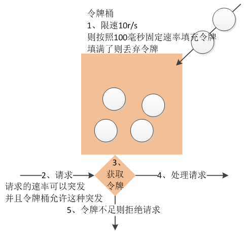
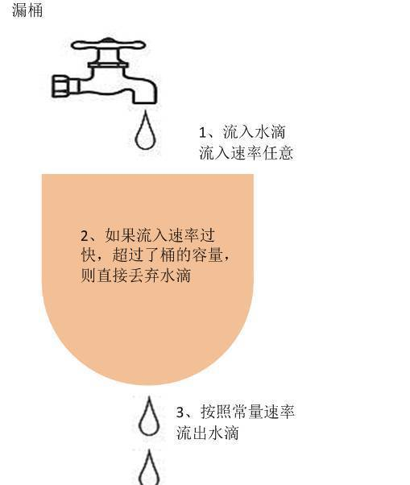

# 由支付防重想到的处理方法

## 背景

昨天的代码评审，有一处支付“防重”功能：用户一分钟之内只能创建一个订单。从而联想到一种互联网项目中比较常用的“限流”功能。 限流可以是应用级的一个限流，也可以是针对某一个具体接口的限流。 应用级别的限流可以通过Nginx、web容器、数据库本身就拥有的某些配置选项来进行。这里主要讨论的是接口的限流。

## 实现方式

### 就一天时间，粗暴简单点的方法

原子类型的计数方式，如ActomicLong。预定一个数值，请求总数多余这个数值则采取一些拒绝措施。

```java
try {
  if(atomic.incrementAndGet() > 限流数) {
      //拒绝请求
  }
  //处理请求
} finally {
  atomic.decrementAndGet();
}
```

计数器做法最为简单，但在一些特殊场景也会比较有效。比如通常的抢购、秒杀业务，超过一个阈值就通知客户无货，或者等待。而有些开发平台，比如百度云，会限制用户的一个访问量，用计数器的方法也是可以的。

Guava是个好东西

```java
LoadingCache<Long, AtomicLong> counter =
      CacheBuilder.newBuilder()
              .expireAfterWrite(2, TimeUnit.SECONDS)
              .build(new CacheLoader<Long, AtomicLong>() {
                  @Override
                  public AtomicLong load(Long seconds) throws Exception {
                      return new AtomicLong(0);
                  }
              });
long limit = 1000;
while(true) {
  //得到当前秒
  long currentSeconds = System.currentTimeMillis() / 1000;
  if(counter.get(currentSeconds).incrementAndGet() > limit) {
      System.out.println("限流了:" + currentSeconds);
      continue;
  }
  //业务处理
}
```

此处取当前的秒作为key，过期时间为2秒，如果请求数在这2秒内大于了限流数，则就拒绝之后的服务了。  
Guava的cache多被用来存放缓存，因为其功能比较强大,包括并发问题，缓存失效机制，内存不够用时缓存释放，缓存的命中率，缓存的移除等都被google考虑到了。

```java
 LoadingCache<Integer,AtomicLong> alCache
    //CacheBuilder的构造函数是私有的，只能通过其静态方法newBuilder()来获得CacheBuilder的实例
    = CacheBuilder.newBuilder()
    //设置并发级别为8，并发级别是指可以同时写缓存的线程数
    .concurrencyLevel(8)
    //设置写缓存后8秒钟过期
    .expireAfterWrite(8, TimeUnit.SECONDS)
    //设置缓存容器的初始容量为10
    .initialCapacity(10)
    //设置缓存最大容量为100，超过100之后就会按照LRU最近虽少使用算法来移除缓存项
    .maximumSize(100)
    //设置要统计缓存的命中率
    .recordStats()
    //设置缓存的移除通知
    .removalListener(new RemovalListener<Object, Object>() {
        @Override
        public void onRemoval(RemovalNotification<Object, Object> notification) {
            System.out.println(notification.getKey() + " was removed, cause is " + notification.getCause());
        }
    })
    //build方法中可以指定CacheLoader，在缓存不存在时通过CacheLoader的实现自动加载缓存
    .build();

//统计命中率
System.out.println(alCache.stats().toString());
```

这种方法可以用来限制某个服务每秒、每分钟、每小时的访问量。 但是以上这两种方法的使用无法解决请求“平滑”的问题，还是会允许一定的突发请求，造成TPS曲线忽高忽低的现象。

### 令牌桶、漏桶

目前的限流保护中比较重要的两种算法就是这两个“桶”了。 这两种算法主要是用来平衡请求的一个速率，让突发请求按照我要求的速度来访问。

#### 令牌桶

令牌桶算法是一个存放固定容量令牌的桶，按照固定速率往桶里添加令牌。令牌桶算法的描述如下： 假设限制2r/s，则按照500毫秒的固定速率往桶中添加令牌； 桶中最多存放b个令牌，当桶满时，新添加的令牌被丢弃或拒绝； 当一个n个字节大小的数据包到达，将从桶中删除n个令牌，接着数据包被发送到网络上； 如果桶中的令牌不足n个，则不会删除令牌，且该数据包将被限流（要么丢弃，要么缓冲区等待）。



#### 漏桶

漏桶作为计量工具（The Leaky Bucket Algorithm as a Meter）时，可以用于流量整形（Traffic Shaping）和流量控制（TrafficPolicing），漏桶算法的描述如下： 一个固定容量的漏桶，按照常量固定速率流出水滴； 如果桶是空的，则不需流出水滴； 可以以任意速率流入水滴到漏桶； 如果流入水滴超出了桶的容量，则流入的水滴溢出了（被丢弃），而漏桶容量是不变的。



#### 两只桶的区别

令牌桶里面装载的是令牌，然后让令牌去关联到数据发送，常规漏桶里面装载的是数据，令牌桶允许用户的正常的持续突发量，就是一次就将桶里的令牌全部用尽的方式来支持续突发，而常规的漏桶则不允许用户任何突发行。因此令牌桶对于用户来讲比较友好，基本上都是使用令牌桶来进行限流操作。

#### 实现方式

魅族内部已经有系统使用了令牌桶的方式进行了限流保护， [Push平台基于令牌桶的流量控制实现](http://wiki.meizu.com/index.php?title=Push平台基于令牌桶的流量控制实现)。

然后Guava又来了（以后要好好分析下Guava的包！），Google提供了现成的API，让我们能够非常方便的使用令牌桶算法来进行限流保护。 Guava RateLimiter提供了令牌桶算法实现：平滑突发限流 \(SmoothBursty\) 和平滑预热限流 \(SmoothWarmingUp\)实现。

SmoothBursty

```java
RateLimiter limiter = RateLimiter.create(5);
System.out.println(limiter.acquire());
System.out.println(limiter.acquire());
System.out.println(limiter.acquire());
System.out.println(limiter.acquire());
System.out.println(limiter.acquire());
System.out.println(limiter.acquire());
```

输出

```text
0.0
0.199505
0.198057
0.20024
0.20025
```

* RateLimiter.create\(5\)表示桶容量为5且每秒新增5个令牌，即每隔200毫秒新增一个令牌；
* limiter.acquire\(\)表示消费一个令牌，如果当前桶中有足够令牌则成功（返回值为0），如果桶中没有令牌则暂停一段时间，比如发令牌间隔是200毫秒，则等待200毫秒后再去消费令牌（如上测试用例返回的为0.198239，差不多等待了200毫秒桶中才有令牌可用），这种实现将突发请求速率平均为了固定请求速率。

